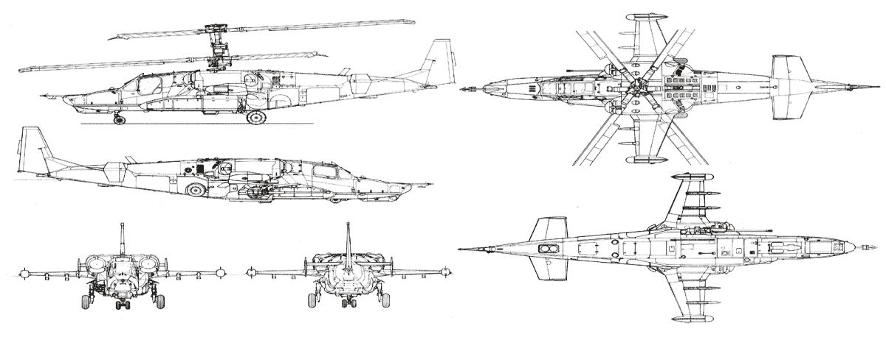
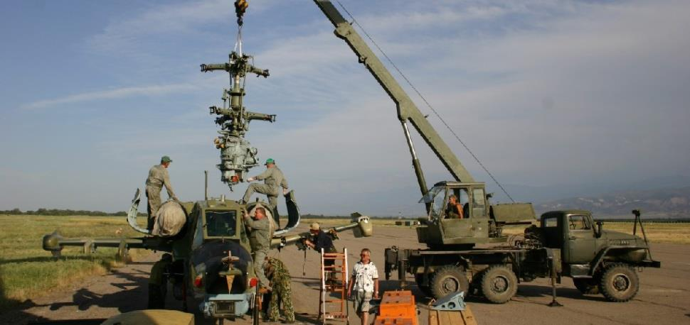
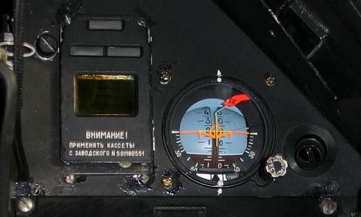
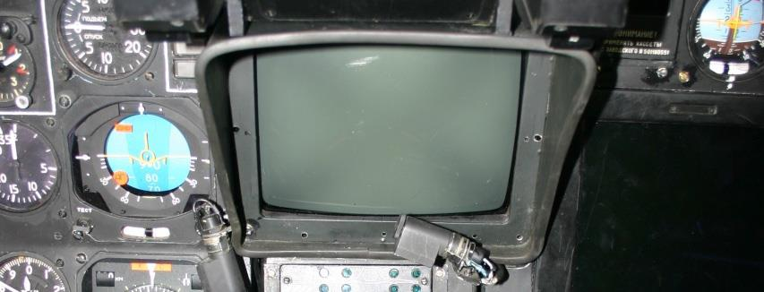
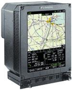
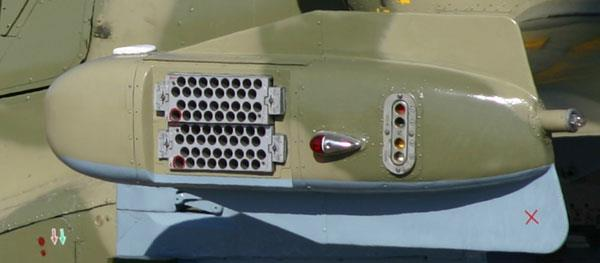

# Конструкция вертолёта Ка-50

## Общая компоновка

Вертолёт Ка-50 является одноместным двухдвигательным вертолётом соосной
схемы с трехопорным убирающимся шасси.





Фюзеляж вертолёта представляет собой единую неразъемную конструкцию, состоя
щую из отдельных отсеков. Два технологических разъема условно делят его на пе
реднюю, заднюю и хвостовую части. Основными конструкционными материалами
фюзеляжа являются алюминиевые сплавы и полимерные композиты (органопла
стик, органоуглепластик и сотовый наполнитель). Силовой набор фюзеляжа образо
ван шпангоутами, лонжеронами, силовыми и несиловыми панелями, стрингерами,
усилениями проемов двери и люков, балками и работающей обшивкой. На силовой
контур «навешены» панели, образующие внешние обводы.

Крыло вертолёта обеспечивает разгрузку несущего винта на больших скоростях по
лета и служит для подвески авиационных средств поражения или топливных баков,
а на концах крыла - контейнеров с кассетными устройствами ложных тепловых це
лей УВ-26.

Оперение включает стабилизатор, киль, руль направления большой площади с
аэродинамической компенсацией и два боковых киля.
Шасси вертолёта - колесное
убирающееся, имеет одну
переднюю и две основные
опоры. Колея шасси 2600
мм, база 4911 мм. Размер
шин колес передней опоры
400х150 мм, давление в
пневматиках 8+0,5 кгс/см2.
Основные опоры имеют оди
нарные тормозные колеса с
шинами размера 700х250
мм, давление в пневматиках
6,5+0,5 кгс/м2. Опоры шасси
убираются назад по полету в
ниши фюзеляжа, стойки ос
новных опор закрываются
створками.


## Силовая установка и несущая система

Силовая установка состоит из двух турбовальных двигателей ТВ3-117ВМА, транс
миссии, а также систем и устройств, обеспечивающих работу двигателей и безопас
ность полета вертолёта.


Двигатель турбовальный со свободной турбиной, воздушной системой запуска от
турбопривода. Крутящий момент от свободной турбины передается на промежуточ
ный редуктор, а с него - на главный. Мощность каждого двигателя на взлетном ре
жиме 2200 л.с. при удельном расходе топлива 230 г/(л.с.*ч). Габариты двигателя
2055х650х728 мм.

Отсеки основных двигателей и двигателя вспомогательной силовой установки отде
лены от смежных отсеков противопожарными перегородками. Двигатели оборудо
ваны пылезащитными устройствами центробежного типа (ПЗУ), а также экранно-вы
хлопными устройствами (ЭВУ), экранирующими горячие детали двигателей и сме
шивающими атмосферный воздух с выхлопными газами для снижения заметности
вертолёта в ИК-диапазоне.

Трансмиссия включает главный и два промежуточных редуктора и предназначена
для передачи мощности основных двигателей на несущие винты с изменением ча
стоты вращения. Для раздельного запуска двигателей, полета на одном работаю
щем двигателе или в режиме авторотации в главном редукторе предусмотрены
муфты свободного хода, посредством которых один или оба двигателя отключаются
от главного редуктора.




На главном редукторе имеются передняя и задняя коробки приводов, на которых
установлены агрегаты вертолётных систем и тормоз несущего винта.

Бортовая вспомогательная силовая установка (ВСУ) служит источником сжатого
воздуха для турбопривода и системы запуска основных двигателей ТВ3-117ВМА.
Она включает в себя газотурбинный двигатель АИ-9В и воздухопровод.
Несущая система состоит из двух соосных трехлопастных несущих винтов и агрега
тов управления лопастями винтов. Верхний винт вращается по часовой стрелке,
нижний – против часовой стрелки. Втулки несущих винтов безшарнирные, лопасти
крепятся к ним с помощью торсионов.

Лонжероны лопастей представляют собой пустотелые балки переменного сечения с
промежуточной стенкой. Материал – стеклоуглепластик. К задней части лонжерона
приклеена хвостовая секция, обшивка и торцевые нервюры которой выполнены из
оргалита, а сотовый наполнитель из полимерсотопластика. Законцовка лопасти
стреловидная, с углом стреловидности 33°.

Топливная система вертолёта включает два основных и четыре подвесных топлив
ных бака. Из переднего бака топливо подается в левый двигатель, из заднего бака
– в правый двигатель и ВСУ. Основные топливные баки изготовлены из керосино
стойкой резины и ткани. Днища и стенки баков на две трети высоты
протектированы слоем натурального каучука. Для предотвращения взрыва топлива
в случае поражения баков они заполнены пенополиуретановым эластичным откры
топористым наполнителем.


## Общее оборудование

Гидравлическая система включает в себя общую и основную гидросистемы. Общая
гидросистема используется для подачи рабочей жидкости в тормозные камеры ко
лес основных опор шасси, гидроцилиндры уборки-выпуска шасси и агрегаты управ
ления пушечной установкой.

Система управления вертолётом включает системы продольного, поперечного, пу
тевого управления и управления общим шагом винтов. Гидравлические рулевые
приводы объединены в блок рулевых приводов, которые могут работать не только в
режиме необратимой си
стемы ручного управления,
но и в режиме комбиниро
ванного управления, то есть
сочетания ручного управле
ния со стабилизацией от ав
топилота вертолёта.
Система электроснабжения
вертолёта использует трех
фазный переменный ток 115
В/400 Гц. Мощность двух ге
нераторов – 80 кВт, преоб
разователя – 500 Вт. Си
        стема снабжения вертолёта
        постоянным током 27 В
двухканальная, работает че
рез выпрямительные устрой
ства. Электроснабжение вертолёта может осуществляться также и от наземного ис
точника переменного тока 115 В/400 Гц.




Система сигнализации включает систему аварийной и уведомляющей сигнализации
(САС) и систему экранного контроля и предупреждения «Экран».

Бортовое устройство регистрации полетных данных «Тестер-У3» серии 3 предназна
чено для записи и сохранения в случае летного происшествия информации о работе
систем и параметрах полета вертолёта за последние 3 часа. Регистрируется запись
38 аналоговых и 63 разовых сигналов. Для обеспечения сохранности магнитная
лента помещена в теплоударопрочный герметичный контейнер («черный ящик»).
Легкосъемное кислородное оборудование ККО-ВК-ЛП обеспечивает снабжение лет
чика кислородом на высотах до 6 км. В комплект входят блок кислородного питания
и кислородная маска со шлангом, а также летный противогаз. Емкость баллона 2 л,
продолжительность использования 1,5 часа.

Противообледенительная система служит для предотвращения обледенения наибо
лее важных агрегатов вертолёта. Для обогрева воздухозаборников и пылезащитных
устройств двигателей используется горячий воздух, отбираемый за компрессорами
основных двигателей. Обогрев лопастей несущих винтов, лобового стекла, прием
ников воздушного давления, датчиков углов атаки и скольжения, часов и визуаль
ного указателя обледенения - электрический. Кроме того, лобовое стекло кабины и
защитное стекло комплекса «Шквал-В» оборудовано системами омывания и стекло
очистителями.

Система аварийного покидания предназначена для спасения летчика в аварийной
ситуации как катапультированием, так и с помощью парашюта. Система аварийного
покидания включает в себя ракетно-парашютную систему К-37-800, систему от
стрела лопастей несущих винтов, систему открытия верхней створки фонаря и си
стему управления.


## Радиооборудование

Радиосвязное оборудование включает различные УКВ радиостанции: Р-800Л1, пред
назначенную для командно-стартовой связи с наземными командными пунктами и
экипажами летательных аппаратов в воздухе и аппаратурой телекодовой связи для
обеспечения закрытой радиосвязи, Р-828 для телефонной связи с пунктами управ
ления сухопутных войск, а также вертолётное переговорное устройство СПУ-9, маг
нитофон П-503Б, и аппаратуру речевого оповещения «Алмаз-УП-48» для выдачи
летчику 11 речевых сообщений об аварийных ситуациях в полете.

Вертолёт также оборудован ответчиком системы госопознавания «свой-чужой», ра
диокомпасом АРК-22 и радиовысотомером А-036А.


Прицельно-пилотажно-навигационный комплекс ПрПНК «Рубикон» (К-041) пред
ставляет собой комплекс, предназначенный для решения боевых, навигационных и
пилотажных задач. Основу комплекса составляет цифровая вычислительная си
стема, включающая пять ЦВМ: четыре ЦВМ 20-751 (боевую, навигационную, си
стемы отображения информации, системы внешнего целеуказания) и одну ЦВМ 80
30201 (системы управления оружием), а также устройство ввода-вывода УВВ 20М
800.

Прицельный комплекс И-251В «Шквал-В» представляет собой телевизионную аппа
ратуру, сопряженную с лазерным дальномером-целеуказателем и аппаратурой
наведения ракет по лазерному лучу. Он снабжен системой стабилизации поля зре
ния и устройством автоматического сопровождения цели, основанным на принципе
запоминания образа цели. Телевизионная аппаратура комплекса имеет широкое и
узкое поля зрения, углы отклонения линии визирования: по азимуту ±35°, по углу
места от +15° до -80°.




Телевизионный индикатор ИТ-23МВ предназначен для воспроизведения монохром
ного изображения, передаваемого ТВ-системой комплекса «Шквал-В». На этот же
индикатор выдается информация от систем внешнего целеуказания (ВЦУ).
Система отображения информации «Ранет» предназначена для индикации на фоне
лобового стекла необходимой прицельно-пилотажной и навигационной информа
ции, совмещенной с фоном закабинного пространства, а также формирования сиг
налов знакографической информации для индикатора ИТ-23МВ. Поле зрения инди
катора на фоне лобового стекла (ИЛС-31) составляет 24°.

Комплексная авиационная бортовая радиотехническая интегрированная система
(КАБРИС) осуществляет: подготовку и планирование полета, картографическое
обеспечение на всех этапах полета, обработку информации от сопрягаемых систем,
выдачу информации в сопрягаемые системы, а также выполнение штурманских рас
четов как перед полетом, так и в полете.



Изделие АБРИС обеспечивает:

- подготовку плана полета (программирование и хранение информации о промежу
точных пунктах маршрута, аэродромах, радиомаяках, возможность изучения местно
сти по маршруту полета и др.);
- возможность оперативного изменения плана полета в процессе полета;
- непрерывное определение координат местоположения летательного аппарата
(ЛА) с помощью встроенного СНС (GPS/GLONASS) приемника, отображение положе
ния ЛА на электронной карте (в масштабе, удобном для оператора) с индикацией
бокового уклонения от линии заданного пути (ЛЗП) и другой необходимой информа
ции;
- отображение электронных карт местности на
цветном дисплее;
- хранение и возможность многократного об
новления (перезагрузки) электронных карт,
аэронавигационных и других баз данных;
- отображение на дисплее аэронавигационной
информации и плана полета (в том числе на
фоне электронной карты), необходимых для
решения задач самолетовождения на различ
ных этапах полета;
- прием информации от автономных баромет
рических датчиков высоты и необходимую об
работку барометрической высоты для потреб
ностей встроенного СНС (GPS/GLONASS) при
емника;
- прием и обработку информации от сопрягае
мых систем, а также выдачу информации в со
прягаемые системы.

Нашлемная система целеуказания «Обзор-800» служит для выдачи управляющих
сигналов комплексу «Шквал-В», а также, в перспективе, ИК головкам самонаведе
ния ракет «воздух-воздух». Целеуказание осуществляется поворотом головы лет
чика в пределах ±60° по горизонтали и -20° … +45° по вертикали.

Пилотажно-навигационный комплекс ПНК-800 «Радиан» является функциональной
подсистемой комплекса «Рубикон». Он объединяет информационный комплекс вер
тикали и курса (ИКВК) Ц-061К, информационный комплекс высотно-скоростных па
раметров ИКВСП-В1-2, доплеровский измеритель скорости и сноса ДИСС-32-28.

## Бортовой комплекс обороны (БКО)



Аппаратура лазерной раз
ведки Л-140 «Отклик» пред
назначена для обнаружения
и идентификации лазерных
средств наведения и дально
метрии противника. Устрой
ство выброса ложных тепло
вых целей УВ-26 представ
ляет собой контейнеры с
кассетами 26-мм помеховых
патронов, размещенные на
           концах консолей.
сигнальных ракет

## Тактико-технические характеристики

```
Первый полет, год                       1982
Экипаж                                  1
Двигатели
    Тип                                 ТВ3-117ВМА
    Взлетная мощность, л.с.             2х2200
Геометрические размеры, м:
    Длина с вращающимися винтами        15.6
    Размах крыла                        7.34
    Высота                              4.9
    Диаметр винтов                      14.45
Масса вертолёта, кг:
    Нормальная взлетная                 9800
    Максимальная взлетная               10800
Емкость топливных баков, кг:
    Основных                            1450
    Подвесных (дополнительных)          4х440
Скорость полета, км/ч:
    Максимальная                        300
    Крейсерская                         255
Потолок, м:
    Статический                         4000
    Динамический                        5500
Скороподъемность, м/с / на высоте, м    10 / 2500
Максимальная перегрузка                 3.5
Дальность полета, км:
    В основном варианте                 450
    В перегоночном варианте             1100
Вооружение:
    ПТУР, количество / тип              12 / «Вихрь»
    Дальность пуска, км                 8
Пушка
    Тип                                 2А42
    Калибр, мм                          30
    Боекомплект, патроны                460
    Масса снаряда, кг                   0.39
    Начальная скорость снаряда, м/с     980
НАР
    Тип / калибр, мм / количество       С-8 / 80 /80
    Тип / калибр, мм / количество       С-13 / 122 / 20
УРВВ
    Тип / количество, шт                «Игла» / 2 x 2
    Дальность пуска, км                 6
```

{!docs/ka50/abbr.md!}
