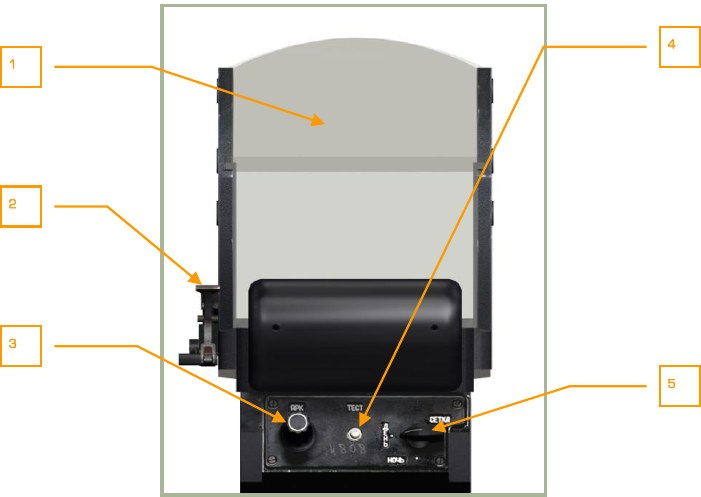
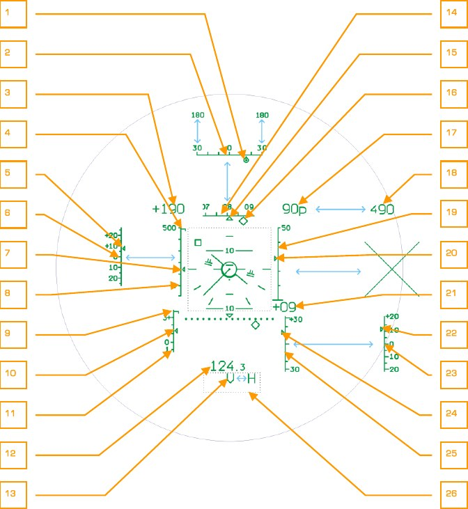
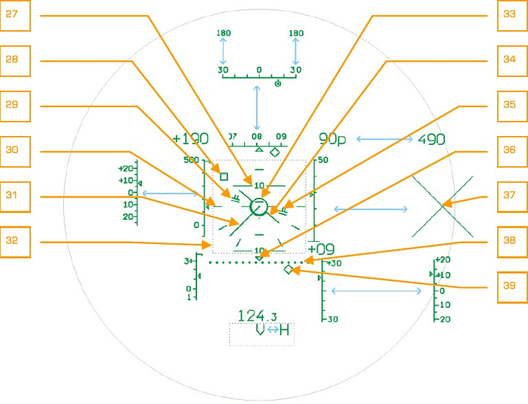
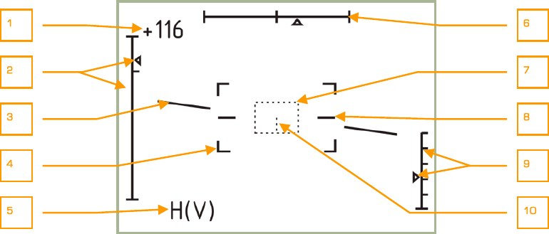
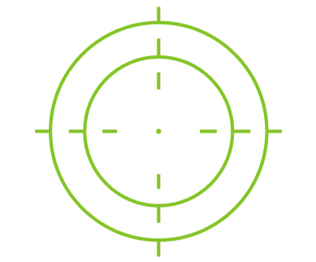
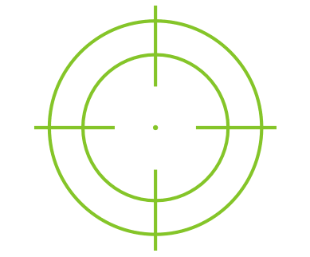
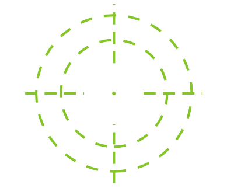

# Система отображения информации

Система отображения информации (СОИ) предназначена для отображения на полупрозрачном отражателе индикатора на лобовом стекле (ИЛС) прицельной и пилотажно-навигационной информации во всех режимах работы ПрПНК, а также символьной прицельной и пилотажно-навигационной информации на ИТ-23МВ.

Режимы работы канала ИЛС: функциональный, ручной, СЕТКА.

Выбор режима (функциональный или ручной) происходит по сигналу ПрПНК автоматически. Переход в режим СЕТКА осуществляется только вручную, установкой переключателя НОЧЬ-ДЕНЬ-СЕТКА на ИЛС в положение СЕТКА.

В состав системы входят:

- Коллиматорный индикатор ИЛС на лобовом стекле, предназначенный для
отображения информации во всех режимах работы СОИ.
- Генератор символов телевизионный, предназначенный для формирования
сигнала телевизионного изображения ИТ-23МВ в соответствии с программой БЦВМ.

Управление работой СОИ осуществляется органами управления, расположенными
на пультах ПВР, ПУР и коллиматорного индикатора.

1.   Отражатели коллиматорного индикатора.
2.   Рычаг подъема светофильтра [[RShift + H]].
3.   Ручка потенциометра регулировки яркости индикации. Влево - [[RAlt + RShift + H]], вправо - [[RCtrl + RShift + H]].
4.   Кнопка включения ТЕСТ-КОНТРОЛЯ [[RAlt + RCtrl + RShift + H]].
5.   Переключатель режимов отображения индикации [[RShift + 8]].

    ДЕНЬ – нормальное изображение индикации.

    НОЧЬ – включение ночного светофильтра.
    
    СЕТКА – включение прицельной сетки.

Включение СОИ обеспечивается при включении ПрПНК выключателем К-041 на
ПВР. Управление режимами работы производится переключателем ОГР ИНФ –
ПОЛН на ПУР [[RCtrl + S]]. В режиме ОГР ИНФ выводится только боевая (ограниченная) информация, при этом крен, тангаж, вертикальная скорость и индекс ЛА на
ИЛС и ИТ не индицируются.

В ИЛС предусмотрена ручная регулировка яркости изображения соответствующим
регулятором на панели ИЛС.

## Вид пилотажно-навигационной информации на ИЛС

1.    Символ курсового угла цели (КУЦ).
2.    Шкала курсового угла цели.
3.    Значение путевой скорости.
4.    Индекс максимально допустимой скорости.
5.    Индекс отклонения от заданной приборной скорости.
6.    Шкала отклонения от заданной приборной скорости.
7.    Индекс приборной скорости.
8.    Шкала приборной скорости.
9.    Индекс максимально допустимой нормальной перегрузки.
10. Индекс нормальной перегрузки.
11. Шкала нормальной перегрузки.
12. Значение дальности.
13. Символ разовых команд.
14. Шкала курса.
15. Отсчетный неподвижный индекс курса.
16. Заданный курс.
17. Радиовысота геометрическая (заменяется на барометрическую выше 300
м).
18. Барометрическая высота (заменяется на геометрическую ниже 300 м).
19. Шкала геометрической высоты (индицируется при радиовысоте ниже 50
м).
20. Индекс геометрической высоты.
21. Значение вертикальной скорости.
22. Индекс отклонения от заданного значения геометрической высоты.
23. Шкала отклонения от заданного значения геометрической высоты.
24. Индекс вертикальной скорости.
25. Шкала вертикальной скорости.
26. Условная граница поля разовых команд (не индицируется).
27. Шкала тангажа.
28. Символ отклонения от заданной позиции на висении (заданная точка висения).
29. Директор управления по крену и тангажу (развернут на угол пропорционально команде по крену и тангажу).
30. Шкала крена (разметка через 30°).
31. Символ вектора путевой скорости (индицируется при скорости менее 50
км/ч).
32. Электронное окно (не индицируется).
33. Неподвижная зона ограничения удержания символа отклонения от заданной позиции на висении.
34. Символ ЛА (подвижный по крену).
35. Директор управления по высоте.
36. Отсчетный неподвижный символ отклонения от линии заданного пути.
37. Запрещающий крест.
38. Шкала отклонения от линии заданного пути.
39. Индекс отклонения от линии заданного пути.

**Перечень и содержание символов разовых команд на ИЛС**

№№  | Символ      | Описание
----|------------------|-----------------------------
1.  |  Н               |  Опасное сближение с землей
2.  |  V               |  Превышение максимально допустимой скорости
3.  |  ОТ              |  Выполнение записи координат оперативной точки
4.  |  РЕЗ-Н           |  Решение навигационных задач БЦВМ
5.  |  ИД              |  Работает лазерный дальномер
6.  |  ТА              |  Сопровождение цели телеавтоматом
7.  |  П               |  Перерыв оптической связи с целью
8.  |  С               |  Символ разрешения пуска (стрельбы)
9.  |  ИУ              |  Работает лазерный канал управления ракетой
10. |  ПАУЗА           |  Символ времени запрета включения лазерного дальномера (нажатия кнопки  АЗ) в режиме ПМ
11. |  РУ-ТА           |  Резервное управление телеавтоматом
12. |  ТА-ИД           |  Работает лазерный дальномер при автосопровождении цели
13. |  ТА-ИУ           |  Работает лазерный канал управления ракетой при автосопровождении цели
14. |  ТРЕНАЖ          |  Включен режим тренажа
15. |  КОРР            |  Выполнение коррекции координат по И-251 (нажатие кнопки ЦУ)
16. |  КУРС НВ      |  Ошибочный ввод стояночного курса (режим ЗК) или магнитного склонения (режим МК) при коррекции курса
17. |  ИКВ  ЭВ      |  Процесс экстренной подготовки ИКВ
18. |  ИКВ  УВ      |  Процесс ускоренной подготовки ИКВ
19. |  ИКВ  НВ      |  Процесс нормальной подготовки ИКВ
20. |  ИКВ  ТВ      |  Процесс гирокомпасирования при положении гироплатформы на 0°
21. |  ИКВ  ВГП     |   Процесс гирокомпасирования при положении гироплатформы на 180° (символ мигает)

!!! info "Индикация пилотажно-навигационных параметров на ИЛС"
    **Крен γ:**

      - Режим работы ПНК:
          - стабилизация и управление;
          - маршрут (стабилизация Н~г~, Нбар, ЗК, ЛЗП, скорость приборная);
          - висение;
          - снижение.
      - Индикация:
          - Вращение символа 34. По часовой стрелке – правый крен.
          - Цена деления шкалы - 30°.

    **Тангаж Θ:**

      - Режим работы ПНК:
          - Все режимы
      - Индикация:
          - Движение шкалы 27. Вверх – пикирование.
          - Цена деления – 5°.

    **Текущий курс Ψ**:

      - Режим работы ПНК:
          - Все режимы
      - Индикация:
          - Перемещение шкалы 14 относительно неподвижного индекса 15. Влево – правый разворот.
          - Индицируется отрезок шкалы курсов ±15° относительно текущего значения.
          - Цена деления – 5°.

    **Истинная (геометрическая, радио) высота H~Г~:**

      - Режим работы ПНК:
          - Все режимы
      - Индикация:
          - До Н~г~ менее 50 м – перемещение индекса 20 по шкале 19.
          - Вверх – увеличение высоты. Диапазон шкалы 0…50 м. Цена деления - 10 м.
          - Показания счетчика 17. При Н~г~ от 50 до 300 м – показания счетчика 17, при этом шкала 19 и индекс 20 не индицируются.
          - При Н~г~ более 300 м – показания Нбар на счетчике 18, при этом счет- чик 17 не индицируется.

    **Барометрическая высота H~БАР~:**

      - Режим работы ПНК:
          - Все режимы
      - Индикация:
          - Счетчик 18 при Н~г~ более 300 м или при отказе радиовысотомера.

    **Отклонение от заданной геометрической (истинной) высоты ΔН~Г~:**

      - Режим работы ПНК:
          - Стабилизация и управление: маршрут, стабилизация Н~Г~; висение.
      - Индикация:
          - Перемещение индекса 22 по шкале 23.
          - Вверх – увеличение фактической истинной высоты относительно заданной.
          - Диапазон ±30 м, цена деления - 5 м. Шкала 23 при включении указанных режимов индицируется вместо шкалы 25.

    **Вертикальная скорость V~γ~**

      - Режим работы ПНК:
          - Стабилизация и управление: снижение.
      - Индикация:
          - Перемещение индекса 24 по шкале 25. Вверх – набор высоты. Счетчик (указатель) вертикальной скорости 21.

    **Вертикальная перегрузка n~γ~**

      - Режим работы ПНК:
          - Стабилизация и управление: маршрут, стабилизация Н~г~; снижение.
      - Индикация:
          - Перемещение индекса 10 по шкале 11. Вверх – положительное значение перегрузки. Диапазон шкалы -1…+3 g. Цена деления - 1.

    **Приборная скорость V~пр~**

      - Режим работы ПНК:
          - Все режимы, кроме стабилизации V~пр~ (при этом индицируется шкала и индекс ΔVпр)
      - Индикация:
          - Перемещение индекса 7 по шкале 8.
          - Вверх – увеличение скорости. Диапазон шкалы – 100…500 км/ч. Цена деления - 100 км/ч.

    **Отклонение от заданной приборной скорости ΔV~пр~**

      - Режим работы ПНК:
          - Маршрут, стабилизация V~пр~.
      - Индикация:
          - Перемещение индекса 5 по шкале 6.
          - Вверх – уменьшение фактической V~пр~ относительно заданной. Шкала 6 при включении указанного режима индицируется вместо шкалы 8. Диапазон ±20 км/ч, цена деления - 5 км/ч.

    **Путевая скорость W**

      - Режим работы ПНК:
          - Все режимы
      - Индикация:
          - Счетчик 3.
          - При скорости менее 50 км/ч – вектор 31.

    **Отклонение от точки висения**

      - Режим работы ПНК:
          - Висение, снижение
      - Индикация:
          - Перемещение символа 28 относительно зоны 33.
          - Вправо – отклонение от точки висения влево. Вверх – отклонение вертолёта назад.

    **Отклонение от ЛЗП**

      - Режим работы ПНК:
          - Маршрут, ЛЗП
      - Индикация:
          - Перемещение индекса 39 по шкале 38.
          - Вправо – отклонение от ЛЗП влево. Цена деления - 40 м.

    **Заданный курс ЗК**

      - Режим работы ПНК:
          - Стабилизация и управление; маршрут, стабилизация ЗК, ЛЗП.
      - Индикация:
          - Перемещение индекса 16 по шкале 14.

    **Курсовой угол цели КУЦ**

      - Режим работы ПНК:
          - Стабилизация и управление; режим ВЫХОД; боевой режим (после нажатия кнопки ЦУ до снятия задачи кнопкой СБРОС или ЦУ).
      - Индикация:
          - При включении режима ВЫХОД.
          - Индицируется отрезок шкалы курсовых углов 2 в диапазоне ±30° вместо шкалы курсов 14. КУЦ отсчитывается символом 1 по шкале 2. Перемещение символа 1 вправо – доворот вправо. Цена деления - 10°.

    **Директорное управление по крену**

      - Режим работы ПНК:
          - Маршрут, стабилизация ЗК, ЛЗП: висение; снижение.
      - Индикация:
          - Вращение символов 29 относительно символа вертолёта 34. По часовой стрелке – ручку ППУ вправо.

    **Директорное управление по тангажу**

      - Режим работы ПНК:
          - Маршрут, стабилизация V~пр~: висение; снижение.
      - Индикация:
          - Вращение символов 29 относительно символа вертолёта 34.
          - Вверх – ручку ППУ на себя.

    **Директорное управление по высоте**

      - Режим работы ПНК:
          - Маршрут, стабилизация Н~г~: висение; снижение.
      - Индикация:
          - Появление и увеличение (уменьшение) высоты штрихов символов 35 над или под штрихами символа 29.
          - Символ 35 выше символа 29 – РОШ вверх до их исчезновения.

    **Опасное сближение с землей**

      - Режим работы ПНК:
          - Все режимы
      - Индикация:
          - В условном поле 26 мигает символ H.

    **Достижение максимально допустимой скорости полета V~max доп~**

      - Режим работы ПНК:
          - Все режимы
      - Индикация:
          - В условном поле 26 мигает символ V.

Индикация на ИЛС в прицельных режимах работы ПрПНК в зависимости от вида
применяемого оружия и режима ведения огня показана в соответствующих разделах главы Боевое применение.

## Круглосуточный автоматический прицельный комплекс КАПК И-251

КАПК предназначен для обнаружения целей с помощью оптико-телевизионной системы, обеспечивающей 7х или 23х кратное увеличение изображения днем при визуальной видимости, и выработки параметров для выполнения автоматизированного прицеливания и боевого применения оружия вертолёта.

КАПК в составе ПрПНК обеспечивает:

- Обнаружение цели на телевизионном индикаторе (ИТ), автоматическое,
программное или ручное (с помощью кнюппеля) сопровождение ее при
прицеливании по наземным подвижным и неподвижным целям, в том
числе малоразмерным типа «танк».
- Наведение ПТУР «Вихрь» на подвижную и неподвижную цель.
- Прицельную стрельбу из пушки (НППУ) в подвижном и неподвижном режимах ее применения.
- Прицеливание и пуск НАР.
- Измерение дальности, курсового угла и угла места цели (ориентира).
- Формирование и выдачу в вычислительные средства ПрПНК информации
об угловых координатах цели (ориентира) и замеряемой дальности до нее
для воспроизведения на телевизионном индикаторе (ИТ) информации,
обеспечивающей решение задач автоматизированного прицеливания при
боевом применении всех видов оружия, а также коррекции счисления координат вертолёта или определения координат цели (ориентира).
- Воспроизведение на телевизионном индикаторе (ИТ) изображения местности (целей) в укрупненном масштабе с 7х или 23х кратным увеличением с
наложением на него прицельной информации.

Система - оптико-телевизионная, обеспечивающая формирование и воспроизведение на экране индикатора телевизионного (ИТ), расположенного в кабине летчика,
изображения цели и окружающей ее местности. Система имеет сменное поле зрения: широкое (2,7 х 3,6)° с 7-ми кратным увеличением, и узкое (0,7 х 0,9)° с 23-х
кратным увеличением.

Выбор широкого поля зрения (ШПЗ) или узкого поля зрения (УПЗ) производится переключателем ШПЗ-УПЗ [[+]], [[-]] на ручке общего шага.

На изображение местности (целей) на экране ИТ накладывается электронная графическая информация, обеспечивающая прицеливание и пилотирование вертолёта.

Регулировка качества изображения на ИТ производится рукоятками ЯРКОСТЬ ([[RAlt + RCtrl + ] ]] и [[RAlt + RCtrl + [ ]] ) и КОНТРАСТ ([[ RCtrl + RShift + [ ]] и [[RCtrl + RShift + ] ]] ) на ПУР, выбор цвета графической информации (символов), черный или белый –
переключателем ФОН БЕЛЫЙ – ЧЕРНЫЙ [[RCtrl + RShift + B]] на ПУР.

1.   Значение скорости вертолёта
2.   Шкала и индекс вертикальных углов линии визирования +15°…-80°.
3.   Линия авиагоризонта.
4.   Границы узкого поля зрения (0,7 х 0,9) °.
5.   Мигающие символы «H», «V» - опасное сближение с землей, превышение
максимально допустимой скорости.
6.   Шкала и индекс курсовых углов линии визирования.
7.   Прицельная рамка.
8.   Линии нулевого крена.
9.   Шкала и индекс геометрической высоты (индицируются ниже 50 м.).
10. Центральная метка прицельной рамки. Индицируется, начиная с четвертого размера прицельной рамки и более.

Для компенсации наклона изображения на ИТ, вызываемого эволюциями вертолёта
по крену и тангажу, имеется стабилизирующее устройство.

Система стабилизации и наведения предназначена для наведения оптико-телевизионной оси КАПК на цель (ориентир) и гиростабилизации ее направления на цель в
пространстве при эволюциях вертолёта.

Оптико-телевизионная ось может управляться от системы внешнего целеуказания,
нашлемной системы целеуказания, кнюппеля на ручке ППУ и от телевизионного автомата.

Оптическая ось системы соответствует центру экрана ИТ, согласована с положением метки визирования на ИЛС и может управляться в пределах углов прокачки:
по курсу ±35°, вверх 15°, вниз 80°.

В походном положении оптическая ось оптико-телевизионной системы заарретирована и направлена вдоль СГФ.

Для расширения возможности поиска цели имеется режим СКАНИРОВАНИЕ, который
обеспечивает сканирование линии визирования и, соответственно, поля зрения оптико-телевизионной системы в пределах ±10° относительно ее положения до включения сканирования с регулируемой скоростью от 0,25 до 3°/с.
Разарретирование, наведение оптической оси и ее гиростабилизация происходит
при нажатии кнопки ЦУ [[O]] на ручке ППУ. Если курсовой угол цели более ±35° (от
НСЦ или ВЦУ), после разарретирования оптическая ось отклоняется до предела
±35°, выполняется автоматизированный доворот на цель (АДВ) или вручную. При
уменьшении курсового угла на цель менее ±35° оптическая ось И-251 начинает отслеживать курсовой угол цели от НСЦ (ВЦУ). Первоначальное (грубое) наведение
оптико-телевизионной оси производится путем совмещения метки визирования на
ИЛС с целью (кнюппелем на ручке ППУ, НСЦ или ВЦУ), обнаружения цели на экране
в ШПЗ и, затем, опознавания в УПЗ.

При нажатии на кнопку СБРОС [[BACKSPCE]] система стабилизации и наведения приводится по углам в нулевое положение и арретируется.
Автомат телевизионный (АТ) обеспечивает автоматическое сопровождение (АС) подвижных и неподвижных целей прицельной рамкой на ИТ.
После обнаружения и опознавания цели на ИТ летчик кнюппелем помещает цель в
центр экрана и обрамляет ее прицельной рамкой (размер которой изменяется переключателем «РАМКА больше – меньше» [[ [ ]], [[ ] ]] на ручке общего шага от минимального до максимального в зависимости от дальности и размеров цели), уточняет положение цели в подобранной рамке и переводит систему в режим автосопровождения, нажав и отпустив кнопку АВТ ЗАХВ [[Enter]] на ручке общего шага (РОШ), при
этом линия визирования (оптическая ось) при сближении с целью автоматически
следит за ней до окончания процесса боевого применения.

Это достигается аппаратурой слежения путем сравнения положения «эталонного»
образа цели, запомненного аппаратурой в момент включения АС, и текущего. Разность положений эталонной и текущей цели в прицельной рамке определяется аппаратурой и автоматически отрабатывается до их совмещения, управляя при этом и
линией визирования.

В процессе слежения размер прицельной рамки меняется автоматически. Включение автосопровождения происходит после обрамления цели рамкой соответствующего размера и готовности аппаратуры к автозахвату (символ ТГ на ИТ), после чего
необходимо нажать кнопку АВТ ЗАХВ на РОШ (включается лазерный дальномер
«Причал», на ИЛС появляется символ ИД) и отпустить ее.

При отпускании кнопки АЗ включается режим АС и на ИТ вместо символа ТГ (телеавтомат готов) появляется символ ТА.

В процессе автосопровождения цели на экране ИТ наблюдаются некоторые периодические смещения прицельной рамки относительно центра экрана, обусловленные
флюктуациями изображения цели, при этом линия визирования цели остается совмещенной с центром экрана ИТ и является осредненным значением, соответствующим наиболее точному направлению на цель.

В режиме АС для исключения срыва автосопровождения при непроизвольном нажатии на кнюппель управления, линии визирования от кнюппеля блокируется.

В режиме АС летчик может подкорректировать положение цели в прицельной рамке
только при нажатой кнопке АВТ ЗАХВ (отключение АС и подключение кнюппеля).
Для этого нажать и удерживать кнопку АВТ ЗАХВ, уточнить кнюппелем положение
цели в прицельной рамке и отпустить кнопку АВТ ЗАХВ – режим автосопровождения
при этом восстанавливается.

В режиме АС возможны перерывы видимости цели (затенение рельефом, деревьями, зданиями), которые приводят к потере видеосигнала от цели. При этом на ИТ
символ ТА заменяется на символ П (память). Телеавтомат запоминает предыдущее
положение линии визирования, параметры ее изменения и производит пролонгацию траектории движения с теми же параметрами не более 3 секунд. При появлении видимости цели за это время автосопровождение восстанавливается и продолжается.

При перерыве оптической видимости цели более 3-х секунд АС прекращается (символ ТА исчезает) и система переходит в режим программного слежения, получая
данные из ЦВМ на основе дальности до цели, ее угловых координат и параметров
движения вертолёта.

Режим программного слежения (ПКС) включается всякий раз при первом нажатии
кнопки АВТ ЗАХВ на РОШ и получении при этом замеренной дальности до цели и
корректируется (суммирование параметров программного и автоматического слежения) при включении режима АС. При отключении АС программное слежение снимается. В режиме ПКС возможно ручное управление линией визирования от кнюппеля
без повторного нажатия и удержания кнопки АВТ ЗАХВ, при этом скорость перемещения ЛВ от кнюппеля суммируется со скоростью ее программного изменения и
летчик ощущает это по разной эффективности управления ЛВ в разных направлениях ее движения.
Выключаются режимы слежения автомата телевизионного нажатием кнопки-табло
СБРОС на ПВР.

Лазерный дальномер (ЛД) «Причал» в составе КАПК обеспечивает измерение
наклонной дальности до наземных целей.

Направление лазерного луча в пространстве совмещено с направлением линии визирования оптико-телевизионной оси прицела.
При установке переключателя АС-ПМ [[P]] на ПВР в положение АС, а также при установке галетного переключателя на ПВР в положение ППУ лазерный дальномер
включается по первому нажатию кнопки АВТ ЗАХВ и выключается через 3 с.
Также ЛД включается при взятии цели на автосопровождение (символ ТА) на время
3 секунды или 8 секунд в зависимости от дальности цели и скорости сближения с
ней.

При установке переключателя АС-ПМ в положение ПМ дальномер включается по
каждому нажатию кнопки АВТ ЗАХВ и выключается по ее отпусканию, при этом после отпускания кнопки АВТ ЗАХВ на ИЛС индицируется сигнал ПАУЗА и время,
оставшееся до конца паузы (возможность нового включения ЛД). В течение паузы
включение ЛД блокируется (время паузы примерно равно времени предшествующего излучения).

В процессе излучения на ИЛС индицируется символ ИД (измерение дальности).

Система лазерно-лучевого канала управления (ЛЛКУ) обеспечивает в пространстве
формирование зоны информационного поля, направленного своей осью (центром
зоны) по линии визирования вертолёт-цель для телеуправления в ней ПТУР. Зона
представляет собой пространство радиусом около 7 м вокруг линии визирования,
начинающееся на расстоянии 100 м от вертолёта и заканчивающееся на цели, которое формируется посредством сканирования по курсу и тангажу двух лазерных лучей. В это пространство в зависимости от величины и удаления от ее оси (линии визирования) передаются кодовые сигналы телеуправления ПТУР для вывода траектории ее полета на линию визирования и последующего удержания ПТУР на линии
визирования. Для обеспечения постоянных линейных размеров зоны управления по
всей дальности полета ПТУР после пуска ракеты углы излучения лазерных лучей,
по мере удаления, программно уменьшаются с помощью объектива, управляемого
программным механизмом.

При одиночном пуске ПТУР при нажатии на гашетку ручки ППУ [[RAlt + Space]] запускается сканирующее устройство. В момент схода ПТУР запускается программный
механизм, включающий излучение (теленаведение). По окончании теленаведения
(конец программы) или при нажатии на кнопку СБРОС [[Backspace]] на ПВР программный механизм выключает излучение и возвращается в начальное положение. При
парном (залповом) пуске после схода первой ракеты включается только излучение,
а запуск программного механизма происходит при сходе второй ракеты.

Аппаратура ручного управления угловым перемещением оптико-телевизионной оси
КАПК обеспечивает летчику совмещение линии визирования на цель с оптико-телевизионной системой И-251. Управление осуществляется с помощью кнюппеля
МЕТКА на ручке ППУ [[;]], [[,]], [[.]], [[/]].

Диапазон измерения дальности ЛД - 10…0,6 км.

Допустимые при сопровождении цели крены в режиме АС ±45°, по угловым скоростям тангажа и рысканья ±20°/с.

## Нашлемная система целеуказания

Нашлемная система целеуказания (НСЦ) предназначена для определения угловых
координат линии визирования визуально наблюдаемой цели (сопровождаемой с помощью разворотов головы летчика) и выдачи сигналов целеуказания в ПрПНК для
наведения оптико-телевизионной системы И-251В на цель. НСЦ выдает в И-251 сигналы, пропорциональные угловым координатам линии визирования в системе координат вертолёта.

С использованием НСЦ в ПрПНК решается задача выполнения режима предварительного наведения вертолёта на цель, обеспечивающего боевое применение ПТУР,
стрельбу из НППУ, прицеливание и пуск НАР.

В состав НСЦ входят:

- Нашлемное визирное устройство НВУ-2М на защитном шлеме летчика (три
излучателя и визирное устройство для формирования и ввода в поле зрения летчика прицельной марки (ПМ).
- Сканирующее устройство рядом с ИЛС для определения положения излучателей нашлемного визирующего устройства (НВУ).
НСЦ взаимодействует с пультами ПрПНК. В НСЦ от ПрПНК подаются разовые команды: встроенный контроль (ВСК), шлем (Ш), захват цели (ЗЦ), пуск разрешен
(ПР). При поступлении команды «Ш» НСЦ выдает сигналы курсового угла и угла места цели и разовые команды НСЦ и ДОВОРОТ.

Управление работой НСЦ осуществляется органами управления, расположенными
на пультах ПрПНК. Включение НСЦ обеспечивается при включении ПрПНК выключателем К-041 [[LShift + D]] на ПВР и включении выключателя ОБЗ [[H]] для выдачи
признака работы в НСЦ. Регулировка яркости индикации, выводимой в поле зрения
летчика, производится ручкой ЯРКОСТЬ [[RAlt + RCtrl + RShift + [ ]] и [[RAlt + RCtrl + RShift + ] ]] на ПУР. Кнопка ЦЕЛЬ УКАЗ [[O]] на ручке ППУ обеспечивает выдачу целеуказания (курсовой угол и угол места) из НСЦ в ПрПНК для наведения И-251В на
цель.

Индикация разовых команд и сигналов, поступающих в НСЦ из ПрПНК, осуществляется в нашлемном визирном устройстве и выводится в поле зрения летчика.

### Индикация разовых команд

#### РАБОТА

Индикация: две постоянных концентрических окружности. Индицируется при включенных И-251 и НСЦ с выполнением условий:

-   Включен режим АС.
-   Нет выхода НВУ за пределы прокачки И-251.
-   Нет ТА.
-   Не нажата кнопка ЦУ.

#### ОШ

Отработка ШКВАЛА. Индикация: две постоянных концентрических окружности и мигающее прицельное перекрестие. Индицируется при включенных И-251 и НСЦ с выполнением условий:

-   Включен режим АС.
-   Нет выхода НВУ за пределы прокачки И-251.
-   Нет ТА.
-   Нажата кнопка ЦУ и угол рассогласования оси НВУ и И-251 более 2°.

Шквал разарретирован и следит за ЛВ НВУ. При отпускании ЦУ в режиме ОШ И-251
арретируется по текущему углу на момент отпускания ЦУ, без стабилизации и замера дальности.

#### ОШВ/ЗАХВАТ

Отработка ШКВАЛА выполнена / И-251 в режиме автосопровождения. Индикация:
две постоянных концентрических окружности и постоянное прицельное перекрестие.

Индицируется при включенных И-251 и НСЦ, с выполнением одного из двух вариантов условий.

Условия 1:

- Включен режим АС.
- Нет выхода НВУ за пределы прокачки И-251.
- Нажата кнопка ЦУ и угол рассогласования оси НВУ и И-251 менее 2°.

Шквал разарретирован и следит за ЛВ НВУ. При отпускании кнопки ЦУ в режиме
ОШВ И-251 переходит в ТГ с замером дальности по текущим углам на момент отпускания ЦУ.

Условия 2:

- Включен режим АС.
- Нет выхода НВУ за пределы прокачки И-251.
- Есть ТА.

#### ПУСК РАЗРЕШЕН

Индикация: постоянное прицельное перекрестие. Индицируется при включенных И251 и НСЦ с выполнением условий:

- Включен режим АС.
- Нет выхода НВУ за пределы прокачки И-251.
- Выдается признак ПР.

Признак ПР может перекрываться всеми командами, кроме:

-   РАБОТА.
-   ОШВ по ТА (второй вариант).

#### ВЫХОД НВУ

Индикация: две мигающих концентрических окружности. Индицируется при включенных И-251 и НСЦ, с выполнением условий:
-   Включен режим АС.
-   ЛВ НВУ вышла за пределы прокачки И-251 (по вертикали или по горизонтали). Визирование целей, курсовые углы которых более ±30°.
-   Не нажата кнопка ЦУ.

#### ДОВОРОТ

Индикация: две мигающих концентрических окружности и мигающее прицельное
перекрестие. Индицируется при включенных И-251 и НСЦ, с выполнением условий:

-   Включен режим АС.
-   ЛВ НВУ вышла за пределы прокачки И-251 по горизонтали.
-   Нажата кнопка ЦУ.

При этом координатор И-251 встает на упоры, автопилот выполняет доворот при
включенном режиме АДВ.

#### НЕТ СИГНАЛА НВУ

Индикация отсутствует.

Индикация исчезает при включенных И-251 и НСЦ с выполнением любого из условий:
-   НВУ на шлеме летчика вышло за пределы рабочей зоны датчиков НВУ.
-   НВУ на шлеме летчика повернуто более чем на 60° в любом направлении
от центра ИЛС.
-   Включен режим ПМ.

ТЕСТ - ИСПРАВНОСТЬ. Индикация: постоянное прицельное перекрестие.

ТЕСТ - НЕТ ИСПРАВНОСТИ. Индикация: мигающие концентрические окружности.

{!docs/ka50/abbr.md!}
{!dev-docs/ka50/abbr.md!}
