# Предполетная подготовка

Указания по подготовке и проверке даются исходя из следующих условий:

-   Вертолёт снаряжен и заправлен топливом согласно заданию на полет.
-   Вертолёт обесточен, на ПрПНК выполнена подготовка согласно заданию
на полет, в ПНК введены исходные данные (по умолчанию подготовка выполнена, данные введены).
-   В АБРИС загружен маршрут и план полета из редактора миссий (по умолчанию загружен).

## Включение и проверки систем

Основной вариант процедуры подготовки и запуска подразумевает использование
аэродромного источника питания.

В случае отсутствия аэродромного источника возможно выполнение процедур с использование только бортовых аккумуляторных батарей (с ограничениями):

-   Включить выключатели аккумуляторных батарей АКК1 ([[LCtrl + LAlt + LShift + E]] крышка, [[LCtrl + LShift + E]] выключатель) и АКК2 ([[LCtrl + LAlt+ LShift + W]] крышка, [[LCtrl + LShift + W]] выключатель).
-   Проверить установку выключателя ПРЕОБР [[LCtrl + LShift + I]] в положение
АВТ.
-   Включить выключатель АВСК [[LCtrl + LAlt + Z]].
Подключение аэродромного источника электроснабжения постоянным и переменным током:
-   Включить выключатель постоянного тока = ТОК АЭР ПИТ ([[LCtrl + LAlt + LShift + Q]] крышка, [[LCtrl + LShift + Q]] выключатель).
-   Включить выключатель переменного тока ~ ТОК АЭР ПИТ [[ LCtrl + LShift + R]].
Включить и проверить работоспособность системы ЭКРАН, для чего:
-   Включить выключатель ВМГ ГИДРО ЭКРАН [[LCtrl + LShift + N]] на пульте
контроля (выключатель вниз), при этом на УСТ кратковременно высветится и выключится сигнал ОТКАЗ.
-   Нажать и отпустить кнопку ЦСО [[M]], при этом на УСТ высветится сигнал
САМОКОНТ, который должен смениться на сигнал ЭКРАН ГОДЕН через 5
секунд при исправной системе.

В случае если ЦСО сигнализирует отказ и находится в мигающем режиме,
то следует первым нажатием снять отказ, а вторым нажатием провести самоконтроль системы ЭКРАН.
Проверить систему аварийной сигнализации (САС) и светотехническое оборудование, для чего:

- На левой приборной доске нажать кнопку КОНТРОЛЬ СИГНАЛИЗАЦИИ
[[LShift + L]], при этом должны высветиться все табло САС.
- Отпустить кнопку КОНТРОЛЬ СИГНАЛИЗАЦИИ, все табло перейдут в исходное состояние (свечение или отсутствие свечения).
- Перед ночным полетом включить осветительное оборудование приборных
досок, пультов и приборов: (на задней панели за левым плечом) ПЛАФОН
кабины [[K]], (на пульте правом боковом) ПОДСВЕТ ПУЛЬТЫ [[RCtrl + K]] и
ПОДСТВЕТ АГР ПКП [[RAlt + RShift + K]]. Включить АНО КОД (верхний
пульт) [[RAlt + L]], контурные огни КОНТУР ОГНИ [[RAlt + J]], строевые огни
СТРОЕВ ОГНИ [[RCtrl + J]], проблесковый маяк ПРОБЛЕСК МАЯК [[RShift + J]],
фары ПОСАД ФАРЫ (центральный пульт) [[RShift + L]] в положение УПР.
СВЕТ.

В случае использования очков ночного видения ОВН-1, перед взлетом включить
адаптивное синее освещение кабины ПОДСВЕТ ПРИБОРЫ [[RShift + K]] и выключить
белое освещение ПОДСВЕТ ПУЛЬТЫ и ПОДСВЕТ АГР ПКП.

## Включение АБРИС

Включить выключатель питания АБРИС [[RShift + 0]].

## Подготовка ПрПНК

Основные элементы предполетной подготовки ПНК:
1.   Ввод исходных данных. По умолчанию исходные данные введены из
файла миссии.
2.   Контроль введения данных (по обстановке).
3.   Выставка ИКВ. По умолчанию происходит точная выставка (ТВ).
4.   Коррекция курса (при необходиости).

После включения ПрПНК происходит самотестирование и запуск подсистем ПрПНК.

Время готовности к работе ДИСС составляет около 150 секунд. До этого момента путевая скорость на ИЛС не отображается.

Если предполетная подготовка ПрПНК проводится одновременно с выставкой ИКВ,
то перед включением ИКВ следует сначала на ПВИ задать, если требуется, нажатием одной из кнопок, нормальную (НВ) или точную с гирокомпасированием (ТВ)
выставку ИКВ, (ускоренная выставка не задается).

!!! note
    В общем случае, если не требуется редактирование плана полета, заданного в миссии, следует перейти к следующему пункту подготовки – Выставка ИКВ.

Процедура редактирования плана полета (маршрута) представлена ниже.

При необходимости отредактировать существующий или ввести в ПНК новый план
полета, необходимо первоначально составить его в АБРИС.

## Ввод координат навигационных точек в ПНК

1.   На АБРИС загрузить требуемый план полета, который необходимо запрограммировать в ПНК и перейти в режим ШБЖ для считывания координат
ППМ.
2.   Галетный переключатель ПВИ (влево - [[RAlt + V]] или вправо - [[RAlt + B]])
установить в положение ВВОД.
3.   На ПВИ включить подрежим ВВОД ППМ (АЭР, ОТ, ОР) нажатием кнопки
ППМ (АЭР, ОТ, ОР), при этом включается ее подсвет, на одиночном индикационном окне (ОИТ НОТ) индицируется число ранее запрограммированных точек.
4.   Нажать (включить) кнопку с цифрой, соответствующей номеру ППМ (АЭР,
ОТ, ОР), при этом номер ППМ индицируется на одиночном индикационном
табло ППМ (ОИТ ППМ), а номер АЭР, ОТ, ОР на ОИТ НОТ.
5.   На ПВИ произвести ввод координат первой точки с помощью кнопок
набора числовой информации.
    - Ввести знак географической широты с помощью кнопки 0 «+»
или 1 «-» (вся территория, смоделированная в игре, имеет положительный знак широты и долготы). Знак «+» при наборе не
отображается.
    - Последовательно ввести цифры географической широты с точностью до десятых секунд. Значение широты индицируется на ВИТ.
    - Ввести знак «+» географической долготы с помощью кнопки 0.
Знак «+» при наборе не отображается.
    - Последовательно ввести цифры географической долготы с точностью до десятых секунд. Значение широты индицируется на
НИТ.
6.   После набора значений широты и долготы загорается подсветка кнопки
ВВОД.
7.   Убедиться в правильности набора и нажать кнопку ВВОД [[RAlt + I]].
8.   При ошибке набора нажать кнопку СБРОС [[RAlt + O]] и повторить действия
по вводу координат данной точки.
9.   Отключить подрежим ВВОД ППМ (АЭР, ОТ, ОР) повторным нажатием
кнопки ППМ (АЭР, ОТ, ОР), при этом отключается ее подсвет.
10. В указанном порядке, считывая данные с АБРИС, произвести ввод координат всех требуемых ППМ, АЭР, ОТ и ОР.

!!! note
    В АБРИС координаты любой точки поверхности можно получить, используя курсор в режиме ИНФО (НАВ→КАРТА→ИНФО).

Далее, необходимо установить очередность пролета точек по нижеописанной процедуре.

## Смена очередности пролета ППМ

В случае необходимости смены очередности пролета ППМ, формировании нового
маршрута или при добавлении нового ППМ в текущий маршрут необходимо выполнить следующие действия:

1.   Галетный переключатель на ПВИ установить в положение РАБ.
2.   Переключатель ЗК-ЛЗП на ППР (правый пульт) установить в положение
ЗК.
3.   Нажать кнопку-табло ППМ на ПВИ.
4.   Нажать на наборном поле ПВИ кнопку с цифрой номера ППМ, выбранного
в качестве первого (исходный пункт маршрута - ИПМ). При этом в ОИТ
ППМ высвечивается номер запрограммированного ППМ и координаты.
5.   Нажать кнопку ВВОД, исходный ППМ (ИПМ) записывается в ПНК.
6.   Аналогичным способом (пункты 4-5) произвести ввод последующих ППМ в
порядке очередности. При выборе последующих ППМ, в ОИТ выводятся
номера точек, координаты не выводятся.
7.   По окончании ввода конечного ППМ (КПМ) выключить кнопку ППМ. Порядок пролета запоминается в ЦВМ-Н.

## Выставка ИКВ

ИКВ предназначена для определения:

- Истинного (при гирокомпасировании) или гироскопического (ортодромического) курса;
- Углов крена и тангажа вертолета;
- Составляющих абсолютного ускорения по продольной, поперечной и вертикальной осям вертолета;
- Продольной и поперечной составляющих инерциальной скорости.

Включить выключатель К-041 (на ПВР) [[LShift + D]].

Принять решение какой вид выставки ИКВ использовать при запуске системы.

Предусмотрены следующие виды подготовки (выставки) ИКВ.

На земле:

- Ускоренная (происходит автоматически после включения ИКВ на основании запомненных в ЦВМ параметров нормальной или точной с гирокомпасированием выставки ИКВ);
- Нормальная (кнопка НВ на ПВИ);
- Точная с гирокомпасированием (кнопка ТВ на ПВИ).

В полете:

-    Ускоренная выставка в режиме повторного запуска (кнопка ПЗ). Повторный запуск происходит относительно истинной вертикали в горизонтальном (в течение не менее 2 мин) полете с учетом координат места вертолета, получаемых в соответствующем режиме счисления из ЦВМ-Н.

Время, затрачиваемое на соответствующую подготовку ИКВ и выходная информация после их проведения приведены в таблице:

Ускоренная:

- Время: 3 мин
- Выдаваемая информация: Крен, тангаж, истинный курс (ИК) из памяти ЦВМ-Н или гирокурс 0°

Нормальная:

- Время: 15 мин
- Выдаваемая информация: Крен, тангаж, истинный курс (ИК) из памяти ЦВМ-Н или гирокурс 0 ° , измеренные составляющие абсолютной инерциальной скорости

Точная (с гирокомпасированием):

- Время: 20 мин
- Выдаваемая информация: Крен, тангаж, истинный курс (ИК), измеренные составляющие абсолютной инерциальной скорости

### Ускоренная выставка ИКВ

Ускоренную выставку ИКВ производить в следующем порядке.

До включения ИКВ на ПВИ установить галетный переключатель в положение РАБ
(влево - [[RAlt + V]] или вправо - [[RAlt + B]]). На ППК (пульт контроля) включить выключатели ИКВ [[RCtrl + RAlt + I]] и ОБОГРЕВ ИКВ [[RShift + RAlt + I]] (обогрев включать независимо от температуры наружного воздуха при каждом включении ИКВ),
на боковом пульте включить питание резервного авиагоризонта РЕЗЕРВ АГ [[RShift + N]], при этом:

- На ИЛС индицируется символ ИКВ/УВ (если с момента включения выключателя К-041 прошло 3 мин и ручка ЯРКОСТЬ на ИЛС - в рабочем положении);
- На ПНП убираются бленкеры К и Г.

По окончании ускоренной подготовки ИКВ (примерно через 3 мин) на ИЛС
гаснет символ ИКВ/УВ, ИКВ переходит в рабочий режим, при этом:

- На ПНП убирается бленкер КС, индицируется значение курса, запомненного ЦВМ при выключении ПНК;
- На ИКП убирается бленкер АГ, индицируются стояночные крен и тангаж
вертолета.

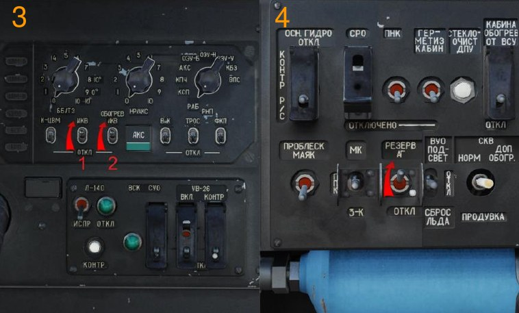

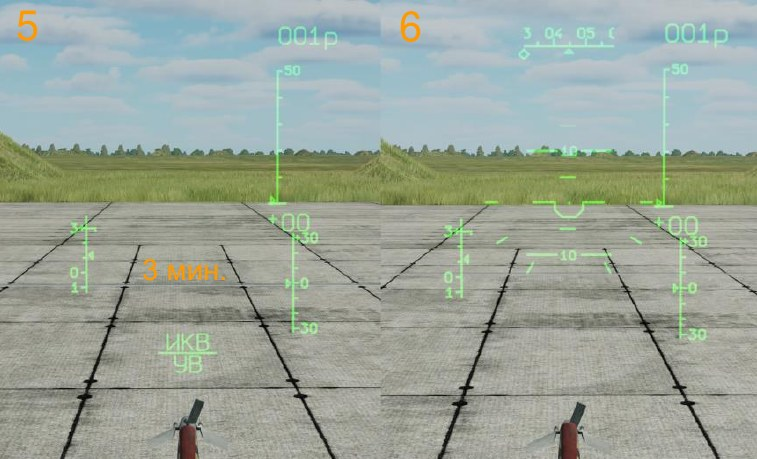

Процедуры ускоренной и нормальной выставки требуют произвести коррекцию индицируемого курса на ПНП.

### Нормальная выставка ИКВ

Нормальную выставку ИКВ производить до запуска двигателей вертолета в следующем порядке.

!!! warning "ПРЕДУПРЕЖДЕНИЕ"
    Запуск нормальной и точной выставок ИКВ при работающих
    двигателях, а также прерывание этих выставок раньше необходимого времени не
    обеспечит правильное счисление координат места вертолёта. В дальнейшем это повлечёт некорректные показания скорости, координат и их передачу звену, а также
    ошибочную работу автопилота по маршруту.

До включения ИКВ на ПВИ установить галетный переключатель в положение РАБ
(влево - [[RAlt + V]] или вправо - [[RAlt + B]]) и нажать кнопку-табло НВ [[RAlt + Y]], при
этом включается ее подсвет. На ППК (пульт контроля) включить выключатели ИКВ
[[RCtrl + RAlt + I]] и ОБОГРЕВ ИКВ [[RShift + RAlt + I]], на боковом пульте включить
питание резервного авиагоризонта РЕЗЕРВ АГ [[RShift + N]], при этом:

- На ИЛС индицируется символ ИКВ/УВ;
- На ПНП убираются бленкеры К и Г.

Примерно через 3 мин после включения ИКВ символ ИКВ/УВ на ИЛС заменяется
на мигающий символ ИКВ/УВ.

Примерно через 9 мин мигающий символ ИКВ/УВ заменяется на символ ИКВ/НВ.
Рассчитываются значения методических погрешностей и угловых скоростей
дрейфов гироскопов.

Примерно через 15 мин на ПВИ включается мигающий подсвет кнопки-табло НВ
(окончание нормальной подготовки). Отключить кнопку-табло НВ [[RAlt + Y]], гаснет
ее подсвет, ИКВ переходит в рабочий режим, при этом:

- На ИЛС гаснет символ ИКВ/НВ;
- На ПНП убирается бленкер КС, индицируется значение курса, запомненного ЦВМ при выключении ПНК;
- На ИКП убирается бленкер АГ, индицируются стояночные крен и тангаж
вертолета.
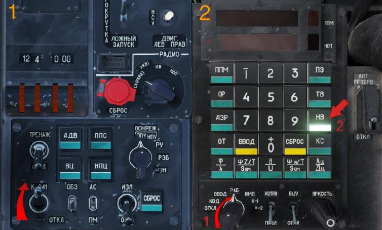

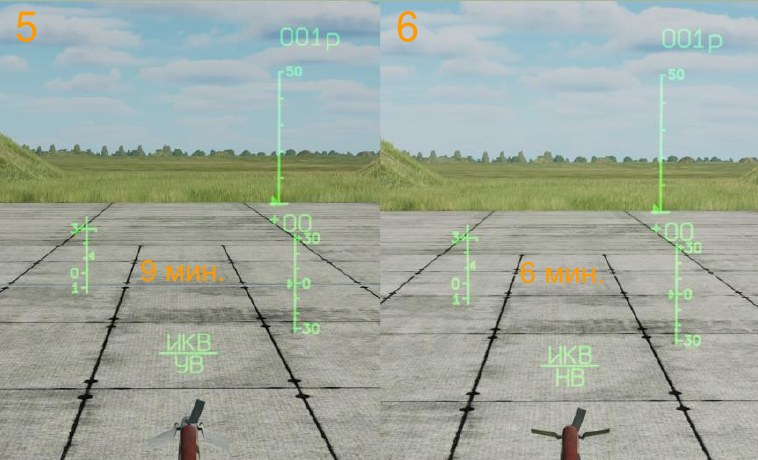

Процедуры ускоренной и нормальной выставки требуют произвести коррекцию индицируемого курса на ПНП.

### Точная выставка ИКВ

Точную выставку ИКВ производить до запуска двигателей вертолета в следующем
порядке.

До включения ИКВ на ПВИ установить галетный переключатель в положение РАБ
(влево - [[RAlt + V]] или вправо - [[RAlt + B]]) и нажать кнопку-табло ТВ [[RAlt + R]] на
ПВИ, при этом включается ее подсвет.

!!! warning "ПРЕДУПРЕЖДЕНИЕ"
    Не допускается включение кнопки-табло ТВ на ПВИ при включенной ИКВ.

На ППК (пульт контроля) включить выключатели ИКВ [[RCtrl + RAlt + I]] и ОБОГРЕВ
ИКВ [[RShift + RAlt + I]], на боковом пульте включить питание резервного авиагоризонта РЕЗЕРВ АГ [[RShift + N]], при этом:

- На ИЛС индицируется символ ИКВ/УВ;
- На ПНП убираются бленкеры К и Г, шкала текущего курса разворачивается на значение примерно 180°.

Примерно через 3 мин после включения ИКВ символ ИКВ/УВ заменяется на мигающий символ ИКВ/ВГП.

Примерно через 12 мин на ИЛС мигающий символ ИКВ/ВГП заменяется на символ
ИКВ/ТВ, происходит гирокомпасирование, шкала текущего курса ПНП устанавливается на значение истинного курса вертолета. Рассчитываются значения методических погрешностей и угловых скоростей дрейфов гироскопов.

Примерно через 20 мин на ПВИ включается мигающий подсвет кнопки-табло ТВ
(окончание процесса выставки истинного курса - гирокомпасирования) после
чего нажать (отключить) кнопку-табло ТВ [[RAlt + R]] на ПВИ, гаснет ее подсвет, ИКВ
переходит в рабочий режим, при этом:

- На ИЛС гаснет символ ИКВ/ТВ;
- На ПНП убирается бленкер КС, индицируется значение истинного курса
вертолета;
- На ИКП убирается бленкер АГ, индицируются стояночные крен и тангаж
вертолета.

После точной выставки коррекции курса не требуется.

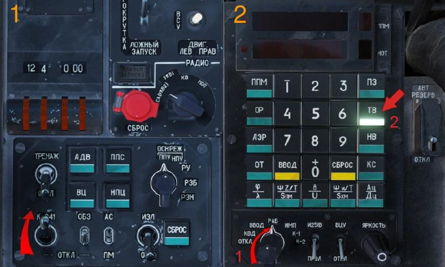
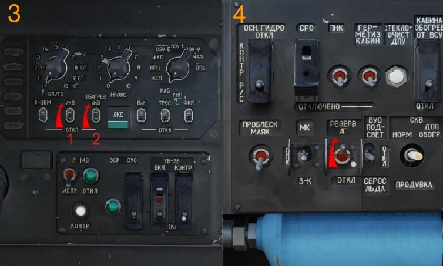
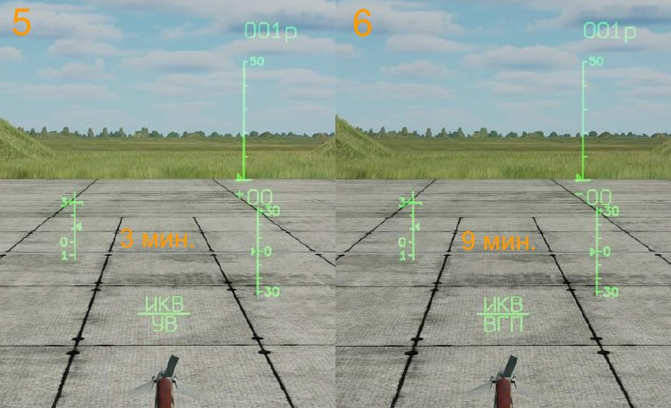
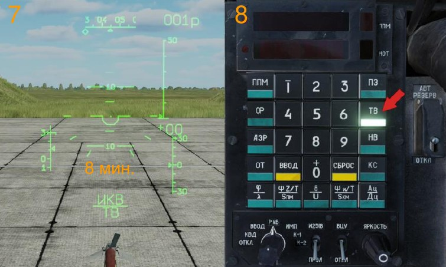

Процедуры нормальной и точной выставки могут быть принудительно завершены,
если уже был закончен первый этап ускоренной выставки (УВ). Для этого нужно
нажать на подсвеченную в данный момент кнопку – НВ или ТВ. Точность гиростабилизированной платформы зависит от выбранного режима выравнивания для ИКВ.

До завершения процедуры выставки ИКВ, блокируется возможность активации каналов автопилота КРЕН и ТАНГАЖ.

### Повторный запуск ИКВ

Режим является аварийным и используется для повторного запуска инерциальной
курсовертикали после кратковременного отключения электропитания при появлении бленкера КС на ПНП, мигающем символе ОТКАЗ/ИКВ на ИЛС и мигающем подсвете кнопки-табло ПЗ (повторный запуск) на ПВИ.

При выполнении режима должен быть обеспечен прямолинейный горизонтальный
равномерный полет вертолета в течение не менее 2 мин. Выполняется ускоренная
подготовка ИКВ.

Повторный запуск ИКВ включается нажатием кнопки-табло ПЗ на ПВИ.

Режим отключается автоматически после завершения УВ.

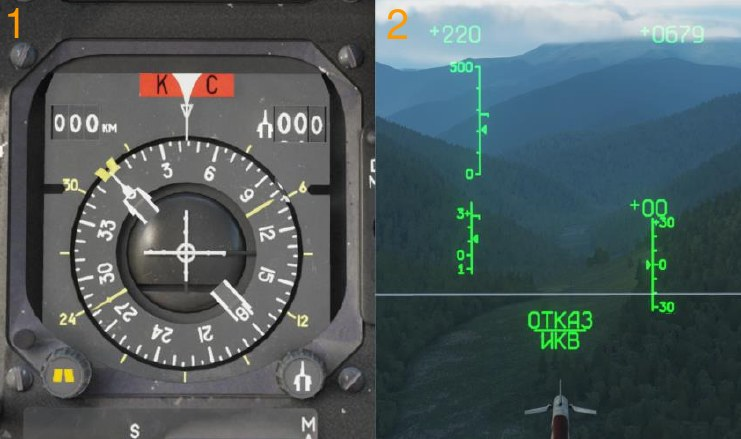
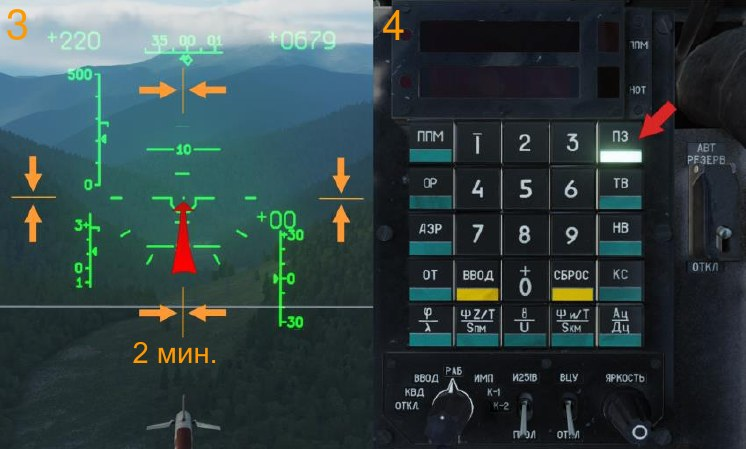
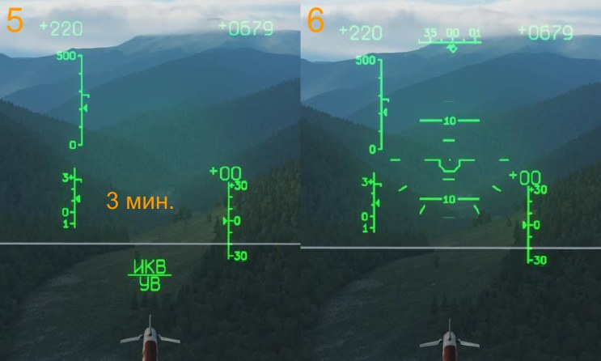

## Коррекция курса

Коррекция курса проводится, при необходимости, летчиком после окончания цикла
ускоренной выставки (не ранее, чем через 2 мин после включения ИКВ) во время
подготовок ускоренной (УВ) и нормальной (НВ) выставок.

Предусмотрены следующие способы коррекции курса:

-   Коррекция по известному истинному курсу вертолета;
-   Коррекция по данным магнитного датчика ИД-6.

На стоянке вертолёта возможна коррекция курса по ЗК и МК.

В полёте возможна только коррекция по МК.

### Коррекция курса по ЗК

Порядок коррекции:

-   При известном стояночном курсе на ЗМС рукояткой выставить значение с
стояночного истинного курса вертолета;
-   Переключатель ЗК-ГПК-МК на правом боковом пульте установить в положение ЗК, при этом шкала курсов ПНП развернется на значение истинного
курса (повторит значение, выставленное на ЗМС);
-   Переключатель ЗК-ГПК-МК установить в положение ГПК;
-   Произвести сопоставление курсов ПНП с магнитным компасом КИ-13;
-   На ЗМС установить величину магнитного склонения (на случай коррекции
в полете по МК).

Стояночный курс вертолёта и величину магнитного склонения можно узнать при замере инструментом "Линейка" на аэродроме или ФАРП, вид карты F10. Так же величина магнитного склонения указана на виде компаса (компасной розы) с истинным
и магнитным севером.

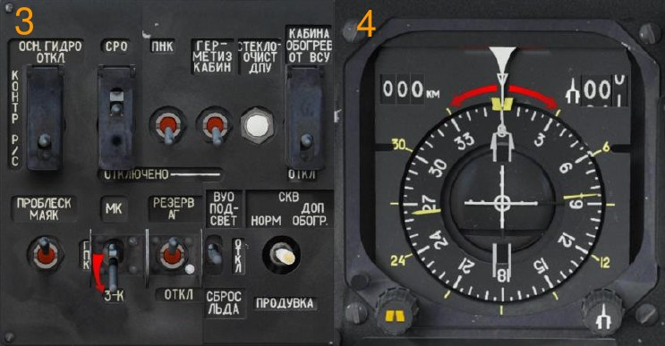
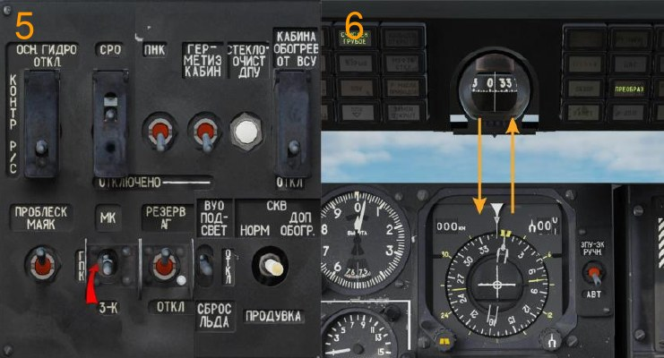
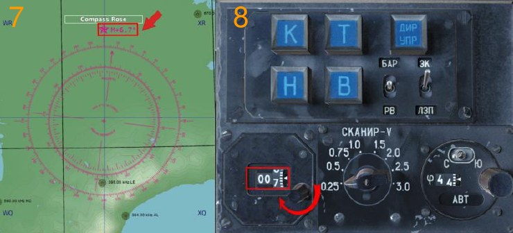

### Коррекция курса по МК

Порядок коррекции:

-   Для получения истинного курса на ЗМС выставить величину магнитногосклонения места вертолета;
-   Переключатель ЗК-ГПК-МК установить в положение МК, при этом шкала
курсов ПНП развернется на значение курса с магнитного датчика ИД-6, исправленное на величину магнитного склонения с ЗМС, т.е. на истинный
курс;
-   Переключатель ЗК-ГПК-МК установить в положение ГПК;
-   Произвести сопоставление курсов ПНП с магнитным компасом КИ-13.
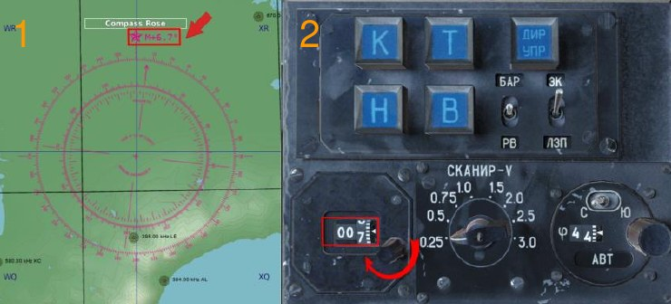

!!! note "Примечание"
    На земле при проведении коррекции по МК возможна ошибочная выставка курса из-за непредвиденного влияния на ИД - 6 различных металлических изделий вблизи вертолета, в т.ч. и в грунте на стоянке.

При коррекции (выставке) курса на стоянке к нулевому значению добавится величина курса, выставленного на ЗМС (режим ЗК) или суммарная величина значения с
ЗМС (магнитного склонения) и значения магнитного курса с ИД-6 (режим МК). В
дальнейшем при движении вертолета при рулении и в полете в режиме ГПК к стояночным показаниям курса на ПНП будут добавляться и суммироваться углы разворота вертолета относительно направления продольной оси вертолета на стоянке,
т.е. отслеживаться текущий курс.

Для получения инерциальных скоростей и при гирокомпасировании требуется высокая точность первоначальной выставки гироплатформы в плоскость горизонта с
определением и учетом собственных уходов гироплатформы и угловой скорости
вращения Земли на данной широте. Это достигается только при выполнении нормальной и точной выставке ИКВ, когда вступают в работу цифровые интеграторы.

При ускоренной выставке происходит только коррекция гироплатформы по горизонту и курсу, определение инерциальных скоростей не производится.

## Включение системы управления оружием

Включить выключатель СУО [[LCtrl + LAlt + LShift + D]], [[LAlt + LShift + D]] на боковом
пульте.

## Включение и проверка АРК

Убедиться, что переключатель каналов АРК [[LCtrl + =]], [[LCtrl + -]] установлен в положение, соответствующее частотам ДПРС и БПРС аэродрома вылета, по таблице
КАНАЛЫ АРК закрепленной на правой двери кабины. По умолчанию в АРК введены
следующие аэродромы: Краснодар, Майкоп, Крымск, Анапа, Сочи, Нальчик, МинВоды.

- Переключатель ПРИВОД РС: БЛИЖН – АВТ – ДАЛЬН (центральный пульт,
панель управления освещением и речевым информатором) [[LAlt + =]] установить в положение БЛИЖН (по умолчанию АВТ).
- Переключатель КОМП – АНТ (на пульте АРК) [[LCtrl + LAlt + [ ]] установить в
положение АНТ и прослушать позывные БПРС (раз в 15 секунд).
- Переключатель КОМП – АНТ установить в положение КОМП и убедиться,
что стрелка КУР на ПНП указывает направление на БПРС.
- Аналогичным образом проверить настройку АРК на ДПРС, установив переключатель БЛИЖН – АВТ – ДАЛЬН в положение ДАЛЬН.
После проверки установить переключатель БЛИЖН – АВТ – ДАЛЬН в положение
АВТ или ДАЛЬН.

## Подготовка программы выброса ЛТЦ на УВ-26

Подготовка и проверка УВ-26 производится при наличии наземного электропитания,
либо при задействованных генераторах после запуска двигателей. Аппаратура УВ26 не работает от аккумуляторов.
Набрать, в соответствии с заданием на полет и предполагаемым типом угроз, программу выброса УВ-26, для чего:

- Включить выключатель УВ-26 (пульт контроля, нижняя панель) [[LAlt + LShift + C]] [[LCtrl + LShift + C]].
- Переключатель НАЛИЧ – ПРОГР (верхняя панель) [[RCtrl + ]] установить в
положение ПРОГР.
- Кнопкой СЕРИЯ [[RShift + Insert]] набрать количество залпов.
- Кнопкой ЗАЛП [[RCtrl + Insert]] набрать количество патронов в залпе.
- Кнопкой ИНТЕРВАЛ [[RAlt + Insert]] задать интервал между залпами.
- Установить переключатель НАЛИЧ – ПРОГР в положение НАЛИЧ для контроля остатка ЛТЦ.

## Запуск и опробование двигателей

### Подготовка к запуску

Закрыть дверь кабины [[RCtrl + C]].

Проверка указателя температуры выходящих газов двигателей.

Над указателем температуры выходящих газов нажать кнопку НЕ РАБОТ [[LAlt + P]],
при этом стрелки указателя температуры должны установиться на отметке шкал более 800 °C.

Проверка аппаратуры системы пожаротушения.

- Переключатель ОГНЕТУШ – ОТКЛ – КОНТР [[LCtrl + LAlt + LShift + Z]] [[LCtrl + LShift + Z]] (пульт правый боковой) установить в положение КОНТР.
- Включить выключатель СИГНАЛИЗ [[RAlt + RShift + Z]].
- Переключатель КОНТР IГР – IIГР – IIIГР установить в положение IГР
(кликнуть левой кнопкой мыши по надписи IГР под переключателем). При
исправности системы высветятся табло ПОЖАР ЛЕВ ДВИГ, ПОЖАР ПРАВ
ДВИГ, ПОЖАР ГИДРО, ПОЖАР ВЕНТИЛ, ПОЖАР ВСУ (пульт правый боковой), а на приборной доске высветится ЦСО и табло ПОЖАР.
- Отпустить переключатель КОНТР ДАТЧИКОВ в нейтральное положение.
- Выключить и вновь включить выключатель СИГНАЛИЗАЦИЯ, при этом все
световые табло должны погаснуть.
- Произвести аналогичным образом проверку II и III групп датчиков. Переключатель КОНТР IГР – IIГР – IIIГР устанавливать в соответствующее положение левым кликом мыши по надписям над переключателем.
- Установить переключатель ОГНЕТУШ – ОТКЛ – КОНТР в положение
ОГНЕТУШ.
- Переключатель БАЛЛОНЫ [[RAlt + RCtrl + RShift + Z]] [[RCtrl + RShift + Z]]
установить в положение АВТ (первый баллон). При исправности системы
светосигнальные табло «1» и «2» над переключателем БАЛЛОНЫ не светятся.

Включить УКВ радиостанцию Р-800 выключателем УКВ-2 [[LCtrl + LAlt + P]] (правый
боковой пульт) для связи с руководителем полетов и вертолётами звена.
Проверить исправность речевого информатора, нажав кнопку ПРОВЕРКА – РЕЧЬ
[[RAlt + RCtrl + V]] (пульт контроля), при этом должно быть подано сообщение: «Речевой информатор исправен».

Получив разрешение на запуск, убедиться, что в зоне вращения несущих винтов нет
людей и посторонних предметов. В условиях недостаточной видимости включить
переключатели КОД АНО [[RAlt + L]] (верхний пульт) и КОНТУРНЫЕ ОГНИ [[RAlt + J]]
(правый боковой пульт).

Включить выключатель ТОПЛИВОМЕР [[LCtrl + LShift + H]] (правый боковой пульт).

### Запуск ВСУ

Процедура запуска ВСУ.

- Открыть перекрывной кран ВСУ [[RAlt + RCtrl + RShift + L]] [[RCtrl + RShift + L]], при этом на панели ВСУ загорается светосигнальное табло КРАН ВСУ
ОТКРЫТ.
- Включить подкачивающие насосы переднего и заднего баков выключателями НАСОСЫ БАКОВ – ПЕРЕД [[LCtrl + LShift + A]], НАСОСЫ БАКОВ – ЗАДН
[[LCtrl + LShift + D]], при этом на САС верхнего пульта загораются табло зеленого цвета уведомляющих сигналов БАК ПЕРЕДНИЙ и БАК ЗАДНИЙ.
- Установить переключатель режима работы ЗАПУСК – ПРОКРУТКА –
ЛОЖНЫЙ ЗАПУСК [[LAlt + E]] в положение ЗАПУСК (панель управления запуском двигателей на левом пульте).
- Установить переключатель двигателей ВСУ – ДВИГ ЛЕВ – ДВИГ ПРАВ –
ТУРБОПРИВОД [[E]] в положение ВСУ (панель управления запуском двигателей на левом пульте).
- Нажать кнопку ЗАПУСК [[Home]].
- Выход двигателя на режим холостого хода происходит автоматически и
контролируется по загоранию табло зеленого цвета ВСУ ВКЛЮЧЕНА (на
панели ВСУ).

В процессе запуска контролировать параметры работы ВСУ:

- Заброс температуры выходящих газов (по термометру панели ВСУ) не более 850 С°.
- Время выхода на режим холостого хода (по загоранию табло ВСУ
ВКЛЮЧЕНА) – не более 24 секунд.
После выхода ВСУ на режим холостого хода убедиться, что:
- На панели ВСУ высветилось табло зеленого цвета ВСУ ВКЛЮЧЕНА.
- Температура выходящих газов не более 720 С°.
- Включено табло зеленого цвета Р масла ВСУ (нормальное давление масла
ВСУ).

Прогрев ВСУ на режиме холостого хода (без отбора воздуха) производится в течение 1 минуты, после чего, убедившись в ее нормальной работе, следует приступить
к запуску основных двигателей.

### Запуск двигателей

Запуск двигателей производится при работающей ВСУ.

Процедура запуска двигателей:

- Растормозить несущие винты, установив рычаг тормоза винтов [[RShift + R]]
в положение РАСТОРМОЖЕНО (передвинуть вниз).
- Открыть перекрывной кран [[RAlt + RCtrl + RShift+ J]] [[RCtrl + RShift + J]]
левого двигателя, при этом гаснет табло желтого цвета уведомляющей
сигнализации КРАН ЛЕВ ЗАКРЫТ.
- Проконтролировать включение подкачивающих насосов переднего и заднего баков по высвечиванию табло зеленого цвета уведомляющей сигнализации БАК ПЕРЕДНИЙ и БАК ЗАДНИЙ.
- Включить выключатель электронного регулятора левого двигателя [RAlt +
RCtrl + Home] [[RCtrl + Home]] ЭРД ЛЕВ.
- Проконтролировать установку переключателя режима работы ЗАПУСК –
ПРОКРУТКА – ЛОЖНЫЙ ЗАПУСК [[LAlt + E]] в положение ЗАПУСК (панель
управления запуском двигателей на левом пульте).
- Установить переключатель двигателей ВСУ – ДВИГ ЛЕВ – ДВИГ ПРАВ –
ТУРБОПРИВОД [[E]] в положение запускаемого двигателя ДВИГ ЛЕВ.
- Нажать на 1-2 с кнопку ЗАПУСК [[Home]].
- Перевести рычаг стоп-крана левого двигателя [[RCtrl + Page Up]] в положение ОТКРЫТО, при этом двигатель автоматически выходит на режим малого газа за время не более 60 с.

При достижении нормального давления масла в коробках приводов загорается
табло зеленого цвета уведомляющих сигналов Р масла ПРИВОДОВ.

!!! attention "Внимание!"
	Запрещается запуск двигателей при выключенных подкачивающих топливных насосах.

В процессе запуска контролировать:

- Непрерывность нарастания частоты вращения турбокомпрессора (отсутствие зависания частоты вращения).
- Рост температуры газов.
- Начало страгивания несущих винтов должно произойти при частоте вращения турбокомпрессора не более 25 % (контролировать путем наблюдения за лопастями).
- Отключение воздушного стартера. Происходит при частоте вращения турбокомпрессора (60…65) %, при этом гаснет табло КЛАПАН ЗАПУСКА (панель управления запуском двигателей на левом пульте).
- Рост давления рабочей жидкости в гидросистемах по указателям давления
на пульте контроля.

После запуска двигателя проконтролировать частоту вращения несущих винтов на
малом газе.

Запустить правый двигатель в той же последовательности, что и первый.

!!! attention "Внимание!"
	Запрещается устанавливать переключатель двигателей в положение запуска второго двигателя до выхода первого двигателя на частоту вращения малого газа. Работа при частоте вращения несущих винтов в диапазоне 54…62 % запрещается.

После запуска двух двигателей проконтролировать частоту вращения несущих винтов на малом газе, при этом не допускается уменьшение частоты вращения несущих
винтов ниже 62 %. Это требование выполнять перемещением РРУД вверх, в сторону
положения АВТОМАТ, обеспечив частоту вращение винтов 62…70 %.

Выключить ВСУ нажатием кнопки ОСТАНОВ ВСУ [[End]] и закрыть перекрывной кран
ВСУ [[RAlt + RCtrl + RShift + L]] [[RCtrl + RShift + L]]. При этом должны погаснуть табло
уведомляющей сигнализации ВСУ ВКЛЮЧЕНА, КРАН ВСУ ОТКРЫТ и Р масла ВСУ.

Прогрев двигателей вести на режиме малого газа до достижения температуры
масла на выходе из двигателей не менее +30 °С и на входе в редукторы не менее 15 °С.
Перевод РРУД в положение АВТОМАТ производить только после прогрева двигателей.

### Нештатные ситуации при запуске ВСУ

Запуск прекратить в случаях:

- Через 9 секунд после нажатия кнопки старта не начался рост температуры.
- Замечены отклонения от нормы в работе ВСУ.
- Произошло самопроизвольное выключение ВСУ.

В случае прекращения запуска из-за отсутствия роста температуры газов или при
самопроизвольном выключении, перед последующим запуском произвести холодную прокрутку.

Двигатель ВСУ АИ-9К останавливается автоматически при превышении максимально
допустимой частоты вращения турбины, при этом на пульте ВСУ включается табло
уведомляющей сигнализации ОСТАНОВ ВСУ по n.

### Ложный запуск и холодная прокрутка ВСУ

Ложный запуск ВСУ производится для проверки систем ВСУ без зажигания.

Для ложного запуска:

- Проверить включение источников электроэнергии.
- Открыть перекрывной кран ВСУ, включить подкачивающий насос заднего
бака.
- Установить переключатель режима работы в положение ЛОЖНЫЙ
ЗАПУСК, а переключатель двигателей панели запуска в положение – ВСУ.
- Нажать кнопку ЗАПУСК.
- Через 15 секунд после начала запуска нажать на кнопку ОСТАНОВ ВСУ.

После проведения ложного запуска для удаления топлива из камеры сгорания необходимо произвести холодную прокрутку.

Холодная прокрутка ВСУ производится для продувки камер сгорания от топлива после неудавшегося запуска или после ложного запуска.

Для холодной прокрутки:

- Проверить включение источников электроэнергии.
- Открыть перекрывной кран ВСУ.
- Включить подкачивающий насос заднего бака.
- Установить переключатель режима работы двигателей на панели запуска
в положение ПРОКРУТКА, а переключатель двигателей в положение ВСУ.
- Нажать кнопку ЗАПУСК.
- Через 15 секунд нажать на кнопку ОСТАНОВ ВСУ.

Длительность ложного запуска и холодной прокрутки должна составлять не более
15 секунд, для чего на 15-ой секунде после нажатия на кнопку запуска необходимо
нажать и отпустить кнопку ОСТАНОВ ВСУ для прекращения подачи топлива.

### Нештатные ситуации при запуске двигателей

Запуск двигателя прекратить закрытием СТОП-КРАНА с последующим нажатием
кнопки прекращения запуска СТОП ЗАПУСК в следующих случаях:

- Не начинают вращаться несущие винты при достижении частоты вращения турбокомпрессора 25 %.
- Не растет температура газов и частота вращения турбокомпрессора (нет
воспламенения топлива).
- Температура газов возрастает больше максимально допустимой.
- Зависание частоты вращения турбокомпрессора продолжительностью
свыше 3 секунд.
- Двигатель не вышел на частоту вращения малого газа через 60 секунд после начала запуска.
- Давление масла на входе в двигатель, вышедшего на режим малого газа
менее 2 кг/см2.
- Нет давления рабочей жидкости в гидросистемах.
- При выходе турбокомпрессора на частоту вращения 66-67 % не погасло
табло КЛАПАН ЗАПУСКА на панели запуска.

Повторный запуск двигателя после неудавшегося запуска разрешается производить
после полной остановки турбокомпрессора и устранения причин неудавшегося запуска. Перед повторным запуском выполнить холодную прокрутку.

### Ложный запуск и холодная прокрутка двигателей

Ложный запуск основных двигателей производится для проверки работы систем,
участвующих в запуске, в том же порядке, как и обычный, но без поджига топлива.

Для ложного запуска:

- Затормозить несущие винты.
- Включить подкачивающий насос топливной системы запускаемого двигателя, открыть перекрывной кран и СТОП-КРАН запускаемого двигателя.
- Установить переключатель режима работы панели запуска в положение
ЛОЖНЫЙ ЗАПУСК.
-   Установить переключатель двигателей панели запуска в положение запускаемого двигателя (левый или правый).
-   Нажать кнопку ЗАПУСК.

В процессе ложного запуска контролировать:

-   Давление масла в двигателе должно быть не менее 0,5 кг/см2.
-   Частота вращения ротора турбокомпрессора не должна быть менее 20 %.

После проведения ложного запуска необходимо провести холодную прокрутку.
Холодная прокрутка основного двигателя производится аналогично ложному запуску, но с закрытым СТОП-КРАНОМ для продувки камеры сгорания от топлива, попавшего в камеру при ложном запуске, или после неудавшегося запуска.

Для холодной прокрутки:

-   Затормозить несущие винты.
-   Открыть перекрывной кран, включить подкачивающий насос запускаемого
двигателя. СТОП-КРАН запускаемого двигателя должен быть закрыт (опущен вниз).
-   Установить переключатель режима работы панели запуска в положение
ПРОКРУТКА.
-   Установить переключатель двигателей панели запуска в положение запускаемого двигателя (левый или правый).
-   Нажать кнопку ЗАПУСК.

В процессе холодной прокрутки контролировать:

-   Давление масла в двигателе должно быть не менее 0,5 кг/см2.
-   Частота вращения ротора турбокомпрессора не должна быть менее 20 %.

### Предполетное опробование

Опробование двигателей производить после прогрева на режиме малого газа.

#### Проверка работоспособности ПЗУ двигателей

Проверку ПОС производить при температуре наружного воздуха менее 5 °С.
Установить рычаг общего шага до упора вниз (минимальный шаг). Установить РРУД
в положение АВТОМАТ (нажать два раза [[Page Up]] из положения МАЛЫЙ ГАЗ). Установить выключатель ПОС ДВИГ – ОТКЛ – ПЗУ [[LAlt + I]] в положение ПОС ДВИГ, при
этом на верхнем пульте должны загореться табло уведомляющей сигнализации ПОС
ЛЕВ ДВИГ и ПОС ПРАВ ДВИГ. Температура газов перед турбиной не должна увеличиться более чем на 60 °С, увеличение частоты вращения турбокомпрессоров возможно не более чем на 2 %.

Выключить ПОС двигателей, при этом табло погаснут.

Проверить работоспособность ПЗУ двигателей.
Выключатель ПОС ДВИГ – ОТКЛ – ПЗУ [[LAlt + I]] установить в положение ПЗУ. При
этом должны загореться табло ПЗУ ЛЕВ ДВИГ и ПЗУ ПРАВ ДВИГ. Температура газов
перед турбиной не должна увеличиться более чем на 30 °С, увеличение частоты
вращения турбокомпрессоров возможно не более чем на 0,5 %.

Выключить ПЗУ двигателей, при этом табло погаснут.

#### Проверка работы контура ТК и СТ ЭРД

Проверить работу контура турбокомпрессора электронных регуляторов двигателей
(ТК ЭРД), для чего:

- Открыть колпачок и установить переключатель КОНТР. ЭРД ТК [RCtrl +
RShift + End] [[RAlt + RShift + End]] в положение ТК.
- РРУ проверяемого двигателя установить на верхний упор (максимал).
- Увеличить общий шаг для уменьшения частоты вращения несущих винтов
до 86…87 %, при этом на верхнем пульте загорается светосигнальное
табло желтого цвета ОГРАН РЕЖ ЛЕВ или ОГРАН РЕЖ ПРАВ.
- Частота вращения турбокомпрессора должна установиться на 4 % меньше
расчетного максимального значения.

Установить переключатель КОНТРОЛЬ ЭРД ТК в положение РАБОТА и закрыть колпачком, при этом табло ОГРАН РЕЖ ЛЕВ или ОГРАН РЕЖ ПРАВ погаснут.

!!! attention "Внимание!"
	Не увеличивать режим работы двигателя до отрыва вертолёта от земли.

Проверить работу контура свободной турбины электронных регуляторов двигателей
(СТ ЭРД), для чего:

- РРУ двигателей установить в положение МАЛЫЙ ГАЗ.
- Откинуть колпачок и установить переключатель КОНТР. ЭРД [[LCtrl + LShift + End]] [[LCtrl + LAlt + End]] в положение СТ-1.
- РРУ двигателей из положения МАЛ ГАЗ увеличить обороты до срабатывания аварийных табло превышения оборотов двигателей «n ст ПРЕД ЛЕВ
ДВИГ» и «n ст ПРЕД ПРАВ ДВИГ». Срабатывание аварийных табло должно
происходить при частоте вращения несущих винтов около 86 %.

    Одновременно выдаются речевые сообщения «Раскрутка турбины левого
двигателя» и «Раскрутка турбины правого двигателя».

- Перемещением РРУД уменьшить частоту вращения несущих винтов на 5…7
%, при этом табло должно продолжать гореть.
- Переключатель КОНТР. ЭРД установить в положение РАБОТА, табло
должно погаснуть.
- РРУ двигателей установить в положение МАЛЫЙ ГАЗ.
- Переключатель КОНТР. ЭРД установить в положение СТ-2 и выполнить все
проверки аналогично описанной выше процедуре.

После проверки переключатель КОНТР. ЭРД установить в положение РАБОТА (среднее положение) и закрыть колпачком.
Кнопки РТ-12-6 ЛЕВ и ПРАВ снижают порог контроля регуляторов температуры для
проверки работоспособности работы ЭРД. При нажатии автоматически отключаются
контуры ТК ЭРД, при этом, если температура газов была не менее 850 °С, а частота
вращения составляла не менее 87 %, то температура газов снизится на 30 °С или
более, а частота вращения турбокомпрессора упадет до 84 % от максимального
значения.

#### Проверка диапазона перенастройки НВ

Проверить диапазон перенастройки частоты вращения НВ, для чего при положении
рычага ОШ на нижнем упоре и РРУ обоих двигателей в положении АВТОМАТ перевести переключатель перенастройки на рукоятке ОШ из положения НОМИНАЛ в положение НИЗК [[RAlt + Num-]]. Убедиться, что после этого равновесная частота вращения уменьшается примерно на 5 %.

После проверки установить переключатель частоты вращения НВ в положение
НОМИНАЛ [[RAlt + Num+]]. При этом частота вращения возрастает до номинального
уровня.

#### Проверка работы органов управления и гидросистем

- Поочередно отклоняя ручку ППУ, педали и рычаг ОШ (не более 1/3 хода)
убедиться в работоспособности органов управления.
- По показаниям манометров гидросистем убедиться, что при перемещении
органов управления, давление в гидросистемах составляет 65…80 кг/см2.
- Отключить основную гидросистему, для чего установить переключатель
ГИДРОСИСТ ОСН ОТКЛ [[LCtrl + LAlt+ LShift + H]] [[LAlt + LShift + H]] в положение ОСН ОТКЛ (вверх). При этом загораются табло зеленого цвета
КЛАПАН 1 ГИДРО и КЛАПАН 2 ГИДРО уведомляющей сигнализации, а на
табло УСТ высвечивается тест ОСНОВНАЯ ГИДРО.
- Установить переключатель ГИДРОСИСТ ОСН ОТКЛ в положение ВЫКЛ.
При этом погаснут указанные табло.
- Проверить давление в аварийном гидроаккумуляторе, которое должно
быть таким же, как и в основной гидросистеме.

#### Отключение аэродромного источника питания

- При установленных РРУ двигателей в положение АВТОМАТ включить генераторы ТОК ГЕН. ПРАВ и ТОК ГЕН. ЛЕВ [[LCtrl + LShift + U]] [[LCtrl + LShift + Y]] (на пульте правом боковом).

Указанный порядок действий до отключения аэродромного источника питания обязателен, чтобы не допустить перерыва в электроснабжении ИКВ переменным током.

- Выключить выключатели АЭР ПИТ, =ТОК АЭР ПИТ. Дать команду наземной
службе на отключение кабеля наземного электропитания (галетный переключатель панели Радио должен находиться в положении НОП). Проконтролировать отключение по докладу наземного персонала.
- Установить переключатель ПРЕОБР АВТ – ОТКЛ – РУЧН в положение АВТ,
при этом табло ПРЕОБРАЗ должно отключиться.

{!docs/ka50/abbr.md!}
