# Выполнение полетов

## Общие указания

Ниже даны указания и рекомендации по выполнению всех видов и элементов полета при исправной работе систем и оборудования.

При изложении указаний и рекомендаций приведены только основные действия
летчика. Особое внимание обращено на выполнение элементов полета и контроль
параметров, при отклонении от которых возможен выход за пределы установленных
ограничений.

Все полеты на вертолёте выполняются с включенным автопилотом, что облегчает
пилотирование на всех режимах полета. Тем не менее, полеты могут выполняться
также и без включенного автопилота в случае отказа или в учебных целях. Вертолёт в пилотировании без автопилота достаточно прост и доступен для полетов.

Основной способ пилотирования вертолёта по приборам – по авиагоризонту и индикации ИЛС.

Изменения высоты полета следует производить рычагом ОШ, ручкой ППУ удерживая неизменным тангаж (по ИКП или ИЛС), соответствующий заданной скорости.

Изменение скорости полета следует производить изменением тангажа.

## Подготовка к выруливанию и руление

Убедиться по приборам в нормальной работе двигателей, несущей системы, агрегатов и систем вертолёта, в отсутствии свечения аварийных табло САС и сигналов на
УСТ системы ЭКРАН. Уведомляющие сигналы должны информировать о нормальной
работе систем.

Ручки раздельного управления двигателями должны находиться в положении
АВТОМАТ.

В случае взлета с ВПП базового аэродрома запросить и получить у РП разрешение
на выруливание.

Включить на пульте ППР каналы автопилота:

- К – крен [[LShift + B]].
- Т – тангаж [[LShift + P]].
- Н – направление [[LShift + H]].

Включить выключатели системы аварийного покидания. Для этого открыть крышку
выключателей (красно-черная зебра) [[RAlt + RCtrl + RShift + E]] и включить три выключателя АВАР ПОКИДАН ([[RAlt + RShift + E]] [[RAlt + RShift + R]] [[RAlt + RShift + T]]).

Разарретировать резервный авиагоризонт.

### Выруливание

Для выполнения руления:

-  Убедиться что на пути руления нет препятствий и посторонних предметов,
растормозить колеса шасси.
-  Увеличить общий шаг НВ на четверть хода и плавным отклонением ручки
ППУ «от себя» начать движение.

Скорость руления регулировать отклонением ручки ППУ, рычагом ОШ и тормозами
колес, ориентируясь по земле.

Руление производить по твердой поверхности со скоростью до 15 км/ч и при скорости ветра не более 20 м/с.

Для останова вертолёта при рулении необходимо ручку ППУ установить нейтрально
и уменьшить общий шаг, применяя тормоза. При отказе тормозов или в случае экстренного торможения допускается производить торможение отклонением ручки
ППУ «на себя» с увеличением общего шага вплоть до зависания. При этом необходимо контролировать вертолёт ручкой ППУ во избежание опрокидывания на хвост.

В условиях ограниченной видимости следует включить контурные огни, АНО, проблесковый маяк.

### Руление

Развороты на рулении выполнять плавным одновременным отклонением педали и
ручки ППУ в сторону разворота, не допуская кренения в сторону разворота более 5°
и разворотов на повышенной скорости.

!!! attention "Внимание!"
	Запрещается руление назад и развороты на месте относительно одного колеса.

При рулении с боковым ветром вертолёт имеет тенденцию к развороту против
ветра, для ее устранения необходимо не парировать естественное кренение по
ветру до величины 5°.

Руление по мягкому грунту или снегу следует производить с особой осторожностью,
со скоростью не более 5 км/ч. Чтобы передние колеса не зарывались, необходимо
ручкой ППУ и рычагом ОШ поддерживать вертолёт от зарывания.

## Взлет и набор высоты

Взлет производится одним из двух способов:

-  По-вертолётному – без разбега, с отрывом по вертикали и последующим
разгоном поступательной скорости.
-  По-самолетному – с разбегом до скорости, необходимой для отрыва.

Способ взлета выбирают в зависимости от характера площадки (размеров, состояния, высоты расположения), метеоусловий и загрузки вертолёта. Взлет производится, как правило, против ветра.

Перед полетом, для проверки работы силовой установки, системы управления, центровки и определения возможностей взлета по вертолётному в данных атмосферных условиях выполняется контрольное висение на высоте 2…10 м.

### Контрольное висение

Для выполнения вертикального взлета и висения необходимо:

- Установить вертолёт против ветра и прорулить 2-3 метра для ориентирования колес, после чего затормозить колеса.
- Проверить величину угла тангажа.
- Убедиться, что показания приборов в норме.
- Осмотреть пространство в секторе взлета и запросить разрешение на
взлет у РП.
- Получив разрешение, растормозить колеса, плавным увеличением общего
шага набрать заданную высоту висения, удерживая вертолёт от разворотов и кренов.
- Снять нагрузку с органов управления триммерным механизмом [[T]]. В случае использования джойстика без технологии Force Feedback, после нажатия кнопки триммирования перевести ручку джойстика в нейтральное положение.
- Заданную высоту висения выдерживать плавным изменением общего шага
с контролем по РВ и визуально, развороты выполнять плавным отклонением педалей в сторону разворота, удерживая вертолёт от перемещения
ручкой ППУ.
- Смещение вертолёта контролировать по земле.

Вертолёт на висении обладает флюгерной устойчивостью и стремиться развернуться против ветра, поэтому при вращении с полностью отклоненной педалью
необходимо учитывать, что если в первой половине разворота вертолёт неохотно
разворачивается, то во второй половине разворота возникает энергичное увеличение темпа разворота, который зависит от скорости ветра.

При выполнении контрольного висения проверить:

- Совместную работу двигателей на режиме, обеспечивающем висение на
заданной высоте.
- Управление вертолётом. При отклонении органов управления вертолёт
выполняет соответствующие эволюции, при этом запасы путевого управления достаточны.
- Центровку вертолёта – по положению ручки ППУ (джойстика) после балансировки вертолёта на висении. При средней центровке в штиль ручка
ППУ должна находиться в среднем положении, при этом триммерные механизмы должны находиться в нейтральном положении.
- Стабилизацию режима ВИСЕНИЕ. Для этого на высоте не менее 4 м сбалансировать вертолёт, затриммировать [[T]] и включить режим нажатием
кнопки ВИСЕНИЕ [[LAlt + T]], при этом включится табло ВИСЕНИЕ, а на приборе ПНП стрелки займут перпендикулярное положение, их отклонение
будет соответствовать смещению вертолёта. После проверки - выключить
режим, уточнить нулевое положение шкалы тангажа на ИКП [[LAlt + LShift + ,]] [[LAlt + LShift + .]].
- Возможность взлета по-вертолётному в данных атмосферных условиях.
Если при выполнении контрольного висения вертолёт не достигает заданной высоты висения, необходимо произвести посадку для уменьшения взлетной массы.

### Взлет по-вертолётному с использованием эффекта воздушной подушки

Взлет выполнять в случае, если вертолёт устойчиво висит на высоте не менее 2
метров от земли при взлетном режиме двигателей.

Для выполнения взлета необходимо:

- Выполнить контрольное висение на высоте 2…3 м.
- Убедиться, что показания приборов нормальные, снизиться до высоты 1 м.
- Плавным отклонением ручки ППУ «от себя» перевести вертолёт в разгон с
одновременным увеличением мощности двигателей до взлетной (в случае
имеющегося запаса), для предотвращения просадки вертолёта.
- Разгон выполнять в зоне воздушной подушки с постепенным набором высоты с таким расчетом, чтобы на высоте 15 м скорость по прибору составляла 90…100 км/ч.
- Дальнейший разгон выполнять с небольшим набором высоты.

### Взлет по-вертолётному без использования эффекта воздушной подушки

Взлет выполнять в том случае, если вертолёт устойчиво висит на высоте не менее
10 м, превышающей высоту препятствий в направлении взлета, при режиме работы
двигателей вплоть до взлетного.

Для выполнения взлета необходимо:

- Выполнить контрольное висение на высоте не менее 10 м.
- Убедиться, что показания приборов нормальные, а высота достаточная
для взлета по-вертолётному.
- Плавным отклонением ручки ППУ «от себя» перевести вертолёт в разгон с
одновременным увеличением мощности двигателей, для предотвращения
просадки вертолёта.
- Если парировать снижение (просадку вертолёта) увеличением общего
шага до взлетной мощности не удается, необходимо отклонением ручки
ППУ «на себя», увеличить тангаж для уменьшения темпа разгона и
предотвращения просадки.

### Взлет по-самолетному

Взлет выполнять в случае, если вертолёт устойчиво висит на высоте не менее 1 м
при режиме работы двигателей вплоть до взлетного, а состояние грунта и размеры
площадки позволяют выполнить разбег и последующий разгон в зоне влияния воздушной подушки.

Для выполнения взлета необходимо:

-   Выполнить контрольное висение.
-   После контрольного висения плавно приземлить вертолёт.
-   Плавным отклонением ручки ППУ «от себя» с одновременным увеличением мощности двигателей вплоть до взлетной выполнить разбег вертолёта с максимально возможным темпом (с углом тангажа не более -10°).
Колеса основного шасси при этом могут отделиться от земли.
-   На скорости 30…40 км/ч незначительными движениями ручки ППУ «на
себя» отделить вертолёт от земли.
-   После отрыва вертолёта разгон выполнять с постепенным набором высоты, довести скорость вертолёта до 100…120 км/ч и перевести в набор
высоты на заданной скорости.

### Особенности взлета

При взлете с боковым ветром следует отклонить ручку ППУ в сторону против ветра
для устранения сноса в момент отрыва, с одновременным отклонением педали в
противоположную сторону для предотвращения разворота вертолёта. Величина отклонения органов управления зависит от силы ветра и определяется при балансировании вертолёта до отрыва.

При выполнении взлетов и посадок на пыльных или заснеженных площадках вертолёт создает вокруг себя пыльные или снежные вихри, которые ухудшают видимость.

Взлеты и посадки на запыленных площадках проводятся с включенным ПЗУ двигателей.

Перед взлетом рекомендуется струей от несущих винтов раздуть пыль вокруг вертолёта.

### Набор высоты

Набор высоты производится в соответствии с установленной схемой полетов для
данного аэродрома.

После взлета и перехода в набор высоты установить заданный режим полета, снять
триммером нагрузку с органов управления и выполнить полет в заданную зону или
по маршруту.

Набор высоты производить на номинальном режиме работы двигателей и наивыгоднейшей скорости, при необходимости использовать взлетный режим и режим ниже
номинального.

В полете не допускать падения частоты вращения НВ ниже минимального допустимой. При частоте ниже 85 % загорается табло «зебра» в проблесковом режиме.

Набрав заданную высоту полета, перевести вертолёт в горизонтальный полет, установить ручкой ППУ заданную скорость, а рычагом ОШ - режим работы двигателей,
соответствующий скорости полета. Нагрузку с органов управления снять триммерными механизмами, включить режим стабилизации высоты.

## Горизонтальный полет и переходные режимы

Горизонтальный полет в зависимости от полетной массы и высоты полета производится в диапазоне разрешенных скоростей. Длительные полеты по маршруту рекомендуется выполнять на крейсерских скоростях.
Рекомендуемые скорости полета по кругу 160…200 км/ч.

Стабилизацию барометрической высоты разрешается включать в горизонтальном
полете на высотах более 50 м. Для изменения высоты полета более чем на 100 м
отключить на ППР канал стабилизации высоты нажатием кнопки-табло В [[LShift + A]] и после занятия заданной высоты включить этот канал (при этом кнопка-табло
должна загореться).

### Полет по кругу визуально

Полет по кругу выполняется на высотах, скоростях и способом в соответствии с инструкцией по производству полетов на данном аэродроме (площадке). На площадках, не оборудованных радиотехническими средствами - полет выполнять визуально
по наземным ориентирам и расчету времени с использованием, как правило,
стрелки ЗПУ на ПНП в ручном режиме (установить переключатель ЗПУ [[LCtrl + H]] в
положение РУЧН).

После взлета на высоте 40 м при достижении скорости 120 км/ч, убедившись в нормальной работе силовой установки и систем вертолёта, убрать шасси.

Набор высоты производить на скорости 120…140 км/ч с заданной вертикальной скоростью 3…5 м/с. В наборе высоты с курсом взлета на высоте 100…150 м выполнить
первый разворот влево (вправо) на 90°. На высоте круга при скорости 160 км/ч перевести вертолёт в горизонтальный полет, нагрузки с органов управления снять
триммерными механизмами [[T]].

После установления режима горизонтального полета выполнить второй разворот на
курс, обратный посадочному.

Третий разворот выполнить в режиме горизонтального полета на 90°, установить
скорость 120…140 км/ч, выпустить шасси и запросить разрешение на посадку (при
наличии РП).

После разворота установить скорость 120…140 км/ч, перевести вертолёт на снижение с вертикальной скоростью 3…4 м/с и выполнить 4-й разворот; выход из разворота осуществить на высоте не менее 100 м.
На посадочном курсе выдерживать такую вертикальную скорость, чтобы вертолёт
снижался в расчетную точку посадки. При посадке по-вертолётному (основной способ) расчетная точка выбирается за 50…100 метров до точки приземления.

На удалении 400…500 м до точки приземления и высоте 50…70 м начать плавное
гашение скорости.

Перед посадкой проверить положение шасси (выпущено).

### Переходные режимы полета

Стабилизацию барометрической высоты разрешается включать в горизонтальном
полете на высоте более 50 м. Для изменения высоты в режиме стабилизации высоты нажать гашетку стопора рычага ОШ и удерживать ее в процессе всего маневра, а по достижении заданной высоты отпустить. После этого будет поддерживаться новая высота.

Для перехода с режима вертикального набора высоты на висение - плавным движением рычага ОШ вниз прекратить набор высоты. Отклонение от заданной высоты
висения устранять плавным движением рычага ОШ.

Для перехода с режима висения на вертикальное снижение в ручном режиме уменьшить общий шаг настолько, чтобы вертикальная скорость на высотах более 10 м не
превышала 3 м/с.

Для перехода с режима висения в горизонтальный полет - отклонением ручки ППУ
«от себя» создать тангаж, соответствующий заданному темпу разгона, одновременно рычагом ОШ удерживать вертолёт на заданной высоте. При достижении заданной скорости отклонением ручки ППУ установить тангаж, соответствующий этой
скорости.

Для разгона вертолёта в горизонтальном полете плавно отклонить ручку ППУ от
себя с одновременным увеличением общего шага. Высоту полета выдерживать рычагом ОШ. Если для выдерживания заданной высоты мощность двигателей использована полностью (произошло уменьшение частоты вращения НВ, сработала сигнализация падения частоты вращения НВ), необходимо отклонением ручки ППУ «на
себя» уменьшить темп разгона увеличением тангажа с одновременным уменьшением ОШ до восстановления частоты вращения НВ до заданной. От разворотов и
кренов удерживать вертолёт соответствующими отклонениями ручки ППУ и педалей.

Для торможения в горизонтальном полете плавным отклонением ручки ППУ «на
себя» создать тангаж для обеспечения заданного темпа уменьшения скорости до заданной величины. Высоту полета поддерживать рычагом ОШ.

Для перехода с горизонтального полета на висение на той же высоте плавным отклонением ручки ППУ «на себя» установить соответствующий тангаж и произвести
торможение вертолёта с заданным темпом. Тенденцию вертолёта к набору высоты
или снижению парировать соответствующим отклонением рычага ОШ, а стремление
к развороту и кренению – отклонениями педалей и ручки ППУ.

Для перехода с горизонтального полета на моторное планирование - плавно отклонить рычаг ОШ вниз до получения заданной вертикальной скорости, при этом ручкой ППУ сохранять величину тангажа, контролируя неизменность скорости полета.

Для перехода с режима моторного планирования в горизонтальный полет - плавным
движением рычага ОШ погасить вертикальную скорость, перевести вертолёт в горизонтальный полет.

Для перехода с режима моторного планирования в режим висения - отклонить
ручку ППУ «на себя» для создания заданного тангажа и начать торможение. Вертикальную скорость уменьшать плавным отклонением рычага ОШ вверх до полного
зависания вертолёта, а ручкой ППУ полностью погасить поступательную скорость
полета и установить ручку в балансировочное положение для висения.

При переходе с режима набора высоты в горизонтальный полет ручкой ППУ установить тангаж для обеспечения заданной скорости, а рычагом ОШ удерживать заданную высоту полета.
Переход с горизонтального полета в набор высоты выполнять плавным увеличением общего шага с одновременным удерживанием ручкой ППУ неизменного тангажа.

При выполнении переходных режимов полета отклонение ручки ППУ и рычага ОШ
производить на такую величину и с таким темпом, чтобы не допускать уменьшения
частоты вращения НВ ниже минимально допустимых и увеличения выше максимально допустимых.

Возникающие при выполнении переходных режимов усилия на органах управления
снимать триммерными механизмами, а тенденции отклонения по крену, тангажу и
направлению устранять соответствующими отклонениями ручки ППУ и педалей.

## Снижение

На вертолёте применяются следующие режимы снижения:

-   Снижение с работающими двигателями и поступательной скоростью.
-   Вертикальное снижение с работающими двигателями.
-   Снижение в режиме самовращения несущих винтов (авторотации).

Снижение с работающими двигателями и поступательной скоростью по наклонной
траектории является основным видом снижения.

Перед заходом на посадку, в горизонтальном полете получить разрешение на посадку у РП и установить на барометрическом высотомере давление аэродрома (площадки) посадки.

На скоростях ниже 50 км/ч не превышать скорость снижения более 5 м/с для
предотвращения ввода вертолёта в режим «вихревого кольца».

### Снижение с работающими двигателями и поступательной скоростью

Для выполнения снижения:

- Установить тангаж, соответствующий заданной скорости (не менее 70
км/ч). Рекомендуемая поступательная скорость 120…140 км/ч.
- Установить общий шаг несущих винтов, соответствующий заданной вертикальной скорости, при этом не допуская раскрутки НВ выше допустимых
оборотов. Допускается кратковременный (до 20 с) заброс частоты вращения в пределах 91…98 %.
- На заданной высоте перевести вертолёт в горизонтальный полет.

### Вертикальное снижение с работающими двигателями

Вертикальное снижение с работающими двигателями разрешается:

- На высотах ниже 10 м до земли во всех случаях.
- На высотах от 200 м до 10 м в случае невозможности снижения с поступательной скоростью или в случае выполнения боевых задач.

При этом снижение необходимо производить с вертикальной скоростью не более 3
м/с. Вертикальное снижение в непосредственной близости от земли выполнять (по
возможности) против ветра, не допуская смещений и разворотов вертолёта к моменту приземления.

Для выполнения вертикального снижения необходимо:

- Зависнуть на заданной высоте.
- Плавно уменьшить общий шаг НВ с таким расчетом, чтобы вертикальная скорость
не превышала 3 м/с.
- При увеличении вертикальной скорости более 3 м/с плавно увеличить общий шаг во
избежание попадания в режим «вихревого кольца».
- Если вертикальная скорость непреднамеренно увеличилась более 5 м/с - необходимо отклонить ручку ППУ «от себя» и немного уменьшить общий шаг, чтобы придать вертолёту поступательную скорость, произведя впоследствии торможение при
выходе из опасного режима.
- При приближении к земле с высоты 10 м плавно увеличить общий шаг с уменьшением вертикальной скорости и произвести плавное приземление.

Контроль за снижением производить по земле, не допуская смещений вертолёта к
моменту приземления.

### Снижение вертолёта в режиме самовращения несущих винтов

Снижение на режиме, близком к самовращению несущих винтов, выполняется на
режиме минимальной мощности двигателей:

- В учебных целях, для имитации отказа в полете двух двигателей.
-   При необходимости экстренного снижения. Вертикальная скорость в зависимости от полетной массы и скорости полета составляет 13…16 м/с.

Наименьшая вертикальная скорость снижения достигается при поступательной скорости 130 км/ч.

Для выполнения снижения:

-   В горизонтальном полете установить скорость, на которой будет выполняться снижение, сбалансировать вертолёт и снять нагрузки с органов
управления триммерным механизмом.
-   Уменьшить общий шаг НВ до минимального, не допуская перераскрутки
НВ.
-   Перевести РРУ обоих двигателей в положение МАЛЫЙ ГАЗ, повторно подкорректировать рычагом ОШ частоту вращения НВ, которая на установившемся снижении должна быть в пределах 86…90 %. Развороты на снижении выполнять с креном не более 30°.
-   На высоте не менее безопасной перевести РРУ обоих двигателей в положение АВТОМАТ, начать вывод вертолёта из режима снижения, сохраняя
частоту вращения НВ в пределах 86…90 %.

!!! attention "Внимание!"
	Эффективность путевого управления при малой величине общего
    шага и большой частоте вращения снижается, поэтому уменьшение поступательной
    скорости на самовращении менее 100 км/ч не рекомендуется. Уменьшение путевой
    управляемости от педалей частично компенсируется соответствующими скольжениями, задаваемыми ручкой ППУ.

Для выполнения снижения вертолёта с большими вертикальными скоростями (в экстренных случаях) после перенастройки в полете частоты вращения НВ с номинальной (89 %) на низкую (84 %):

-   В горизонтальном полете установить скорость полета, на которой будет
выполняться снижение.
-   Минимальная скорость по прибору должна быть не менее 70 км/ч, максимальная - не должна превышать 200 км/ч. Рекомендуемая скорость
120…140 км/ч.
-   Изменить равновесную частоту вращения НВ с номинального значения на
низкое, для чего в горизонтальном полете переключатель перенастройки
ОБОРОТЫ НОМИНАЛ – НИЗК на рукоятке рычага ОШ перевести из положения НОМИНАЛ в положение НИЗК [[RAlt + Num-]]. При этом равновесная
частота вращения НВ уменьшится до 84 % и загорится светосигнальное
табло «зебра».
-   Уменьшить общий шаг НВ до минимального, при этом интенсивно увеличивается вертикальная скорость снижения, которая в зависимости от полетной массы, скорости и высоты полета может достигать 15…18 м/с.

    Частота вращения НВ при снижении несколько увеличивается и составляет 85…86 %. При снижении с высоты более 1000 м, в случае необходимости, следует подкорректировать рычагом ОШ частоту вращения НВ, не
допуская их раскрутки более 86 %.

    В случае загорания ЦСО и аварийного табло (V~max доп~), что может иметь место на больших высотах, уменьшить приборную скорость вертолёта.

    Для выполнения снижения с еще большими вертикальными скоростями
необходимо выполнять снижение вертолёта по нисходящей спирали с углами крена в пределах ограничений. Вертикальная скорость снижения в
этих случаях может достигать 25…35 м/с.

-   Вывод вертолёта из режима снижения производить с учетом запаса высоты, необходимой для погашения вертикальной скорости.
-   Вывести вертолёт в горизонтальный полет. Установить номинальное значение частоты вращения НВ, для чего переключатель ОБОРОТЫ
НОМИНАЛ – НИЗК на рукоятке рычага ОШ перевести из положения НИЗК
в положение НОМИНАЛ с одновременным незначительным увеличением
ОШ для уменьшения времени выхода на номинальную частоту вращения
НВ 89 %. После этого светосигнальное табло «зебра» должно погаснуть.

## Посадка в простых метеоусловиях

Посадка производится одним из следующих способов:

-   По-вертолётному, без пробега, с предварительным зависанием над местом
приземления и последующим вертикальным снижением до приземления.
-   По-самолетному, с приземлением на установленной поступательной скорости и последующим пробегом.

Способ посадки выбирается в зависимости от характера площадки (размеров, состояния, высоты расположения), метеоусловий и загрузки вертолёта. Посадка производится (по возможности) против ветра.

Посадка разрешается при скорости ветра и массе вертолёта, не превышающих ограничений.

### Посадка по-вертолётному с использованием эффекта воздушной подушки

Данный способ посадки является основным. Зависание производится в зоне влияния воздушной подушки.

Для выполнения посадки необходимо:

-   На предпосадочном снижении (после прохода БПРС) с высоты 70 м плавным отклонением ручки «на себя» создать соответствующий тангаж для
уменьшения поступательной скорости с таким расчетом, чтобы на высоте
20…30 м она составляла 40…50 км/ч.
-   Дальнейшее уменьшение поступательной и вертикальной скоростей производить так, чтобы вертолёт над заданной точкой произвел зависание на
высоте 2…3 м.
-   Уменьшением общего шага произвести плавное приземление, перед приземлением не допускать боковых перемещений.
-   Убедившись, что вертолёт устойчиво стоит на площадке, уменьшить общий шаг до минимального.

### Посадка по-вертолётному без использования эффекта воздушной подушки

Данный способ применяют, как правило, при посадке на площадки ограниченных
размеров и с препятствиями, а также на заснеженные и запыленные площадки. Зависание выполняется вне зоны действия воздушной подушки.

Для выполнения посадки необходимо:

-   На предпосадочном снижении (после прохода БПРС) с высоты 70 м плавным отклонением ручки ППУ «на себя» создать тангаж для уменьшения
поступательной скорости относительно намеченной точки зависания с таким расчетом, чтобы высота прохода над препятствиями была не менее 10
м.
-   Перед самой площадкой или над ней уменьшить скорость до 40…50 км/ч,
не допуская при этом вертикальную скорость более 2 м/с.
-   Контроль за высотой и вертикальной скоростью осуществлять визуально с
высоты 20…30 м при наличии четко видимых наземных предметов, по которым можно определить высоту.
-   Зависание над площадкой выполнять на высоте, превышающей высоту
препятствий на 5 м.
-   После зависания произвести плавное снижение и приземление, перед приземлением на допускать боковых перемещений.
-   Убедившись, что вертолёт устойчиво стоит на площадке, уменьшить общий шаг до минимального.

### Посадка по-самолётному

Посадка производится в том случае, если невозможно выполнить зависание из-за
недостаточной мощности двигателей (высокогорные посадочные площадки, высокие температуры наружного воздуха). Посадка производится на аэродром или на
проверенную площадку при наличии открытых подходов.

Для выполнения посадки необходимо:

-   На предпосадочном снижении (после прохода БПРС) с высоты 70 м плавным отклонением ручки ППУ «на себя» создать тангаж для уменьшения
поступательной скорости с таким расчетом, чтобы на высоте 20…30 м она
составляла 60..70 км/ч.
-   Дальнейшее снижение производить с постепенным уменьшением поступательной и вертикальной скоростей с таким расчетом, чтобы перед касанием приборная скорость уменьшилась до 30…40 км/ч.
-   Плавно приземлить вертолёт на основные колеса с последующим касанием переднего колеса и уменьшить общий шаг до минимального.
-   Для уменьшения длины пробега торможение вертолёта производить несущими винтами, плавно отклоняя ручку ППУ «на себя», тормоза колес применять на скорости менее 40 км/ч.

### Особенности посадки

Заход на посадку следует выполнять с поступательной и вертикальной скоростями,
обеспечивающими пилотирование вне зоны пылевого вихря.

Оценивая возможность посадки на выбранную в полете площадку, летчик должен
грамотно оценить обстановку и принять правильное решение о возможности ее выполнения, исходя из конкретных условий местности, размеров и состояния поверхности площадки, высоты над уровнем моря, характера препятствий в полосе посадки, а также направления и скорости ветра.

## Останов двигателей и выключение оборудования

Нормальный останов двигателей производится по следующей процедуре:

-   Установить ручку ППУ и педали в нейтральное положение, а рычаг ОШ на
нижний упор.
-   Выключить АБРИС.
-   Выключить ПрПНК переключателем К-041.
-   Выключить генераторы на правом боковом пульте. Проконтролировать автоматическое включение преобразователей тока (на верхнем пульте
должно загореться табло ПРЕОБРАЗ).
-   Установить РРУД в положение МАЛ ГАЗ (два раза нажать [[Page Down]] из
положения АВТОМАТ).
-   Выключить потребители электроэнергии, кроме приборов контроля силовой установки.
-   Выключить двигатели переводом рычагов двигателей СТОП-КРАН [[RCtrl + Page Up]] [[RCtrl + Page Down]] в положение ЗАКРЫТО.
-   Включение тормоза винтов [[LShift + R]] произвести после достижения частоты вращения менее 30 %.
-   После полной остановки роторов турбокомпрессоров закрыть перекрывные краны двигателей. Левый двигатель: крышка [[RAlt + RCtrl + RShift + J]], выключатель [[RCtrl + RShift + J]]. Правый двигатель: крышка [[RAlt + RCtrl + RShift + K]], выключатель [[RCtrl + RShift + K]].
-   Выключить подкачивающие насосы.

    Внешние ПТБ: [[LCtrl + LShift + G]].

    Внутренние ПТБ: [[LCtrl + LShift + F]].
    
    Передний бак: [[LCtrl + LShift + A]].
    
    Задний бак: [[LCtrl + LShift + D]].

-   Заарретировать резервный авиагоризонт.
-   Выключить все выключатели.
-   Выключить аккумуляторы.

## Заход на посадку с использованием посадочных систем

Установленное на вертолёте оборудование позволяет выполнять заходы на посадку
с применением радиокомпаса АРК на аэродромы, оборудованные системой ОСП, в
простых и сложных метеоусловиях.

Задатчик опасной высоты радиовысотомера устанавливается на рубеже – после перехода на давление аэродрома, а в тренировочных полетах – перед выруливанием
вертолёта.

### Способы захода и расчёта на посадку

В зависимости от радиотехнических систем аэродрома, пилотажно-навигационного
и радиотехнического оборудования вертолёта, условий базирования заход и расчет
на посадку производится одним из следующих способов:

- С прямой.
- С рубежа начала снижения.
- По коробочке (малой или большой).
- Двумя разворотами на 180°.

Заход и расчет на посадку с прямой отворотом на расчетный угол выполняется в
случаях выхода на ДПРС с курсом, отличающимся от обратного посадочному, на
угол 30…45°, но не более 60°.

Заход и расчет на посадку с рубежа начала снижения применяется при заходе и
расчете на посадку непосредственно с маршрута полета.

Заход и расчет на посадку по коробочке и двумя разворотами на 180° применяется
при уходе на второй круг, выходе на ДПРС с маршрута в облаках, для обучения и
тренировки захода на посадку по приборам, а также для сокращении времени и
пространства, необходимых для выполнения маневра перед посадкой.

Контроль положения вертолёта относительно расчетных точек начала посадочных
маневров можно вести по АБРИС только в случае устойчивой работы системы спутниковой навигации.

При подготовке к полету по известному ветру необходимо рассчитать: курсы, путевое время, КУР начала разворотов и траверз для полета по большой коробочке;
расчетный угол отворота и расчетное время горизонтального полета для полета с
прямой.

Перед полетом проверить настройку радиокомпаса. Полет выполняется на установленной высоте круга для данного аэродрома. С началом взлета включить секундомер.

При выходе на аэродром с применением АРК необходимо:

- Включить и настроить АРК на заданную ПРС (БПРС или ДПРС), при этом
стрелка КУР на ПНП будет указывать КУР.
- Развернуть вертолёт, чтобы стрелка КУР установилась на 0° и пилотировать вертолёт по нулевому положению стрелки с учетом угла сноса.
- Момент пролета ПРС определяется по развороту стрелки КУР на 180°.
- Заход на посадку выполнять одним из способов, в зависимости от условий
и обстановки.

Заход и расчет на посадку по приборам, в облаках выполнять по ДПРС. Вследствие
относительно малых скоростей полета вертолёта и сокращения времени при заходе
на посадку по коробочке или с прямой, построение маневра может выполняться по
БПРС, расположенной в створе ВПП на удалении 1000 м.

### Заход на посадку по большой коробочке (кругу)

До взлета установить кремальерой ЗПУ на ПНП заданный посадочный курс.
После взлета установить заданный режим набора высоты, на скорости 120…140
км/ч с вертикальной скоростью 2…3 м/с, на высоте 40 м убрать шасси. Первый разворот влево (вправо) на 90° выполнить по времени с учетом ветра в режиме набора
высоты. Крен на разворотах - 15°.

По достижению высоты круга перевести вертолёт в горизонтальный полет на скорости 160…200 км/ч. При повторном заходе без посадки первый разворот выполнять
через 2 минуты после пролета БПРС. Второй разворот выполнять при КУР = 240°
(при правом круге КУР = 120°) с контролем по времени.

На траверзе при КУР = 270° (при правом круге КУР = 90°) проверить установку сигнализатора опасной высоты радиовысотомера на опасную высоту.

Третий разворот выполнять при КУР = 240° (при правом круге 120°). После третьего разворота уменьшить скорость полета до 120…140 км/ч, выпустить шасси и перевести вертолёт на снижение с вертикальной скоростью 2…3 м/с, запросить разрешение на посадку.

Четвертый разворот выполнять в режиме горизонтального полета на высоте 200 м
при КУР = 285° (на правом круге 75°).

При выполнении разворота добиваться точности выхода на посадочный курс, ориентируясь на стрелку курсозадатчика на ПНП (стрелка ЗПУ). В момент ввода в разворот угол между стрелками радиокомпаса и курсозадатчика на ПНП будет равен
15° (без учета ветра). При правильном выполнении разворота на 30° до выхода на
посадочный курс обе стрелки должны совместиться. Дальнейший разворот выполнять при совмещенных стрелках.

Если в первой половине разворота угол между стрелками радиокомпаса и ЗПУ остается неизменным или даже увеличивается, крен необходимо уменьшить.

Если после совмещения стрелок стрелка радиокомпаса начнет отставать от стрелки
ЗПУ, крен необходимо увеличить, но не более чем до 20°. При наличии сноса от
ветра совмещать стрелки с учетом угла сноса.

Прямолинейные участки большой коробочки выдерживать с учетом ветра, вводя поправку в курс на УС.
Начало разворота и траверс контролировать по заранее рассчитанному путевому
времени.

После вывода из 4-го разворота перевести вертолёт на снижение на скорости
120…140 км/ч с вертикальной скоростью 2…3 м/с, выдерживая заданный курс с учетом угла сноса.
Пролет БПРС выполнить на высоте 70…80 м. Если снижение до высоты 70 м выполнено до прохода БПРС, перевести вертолёт в режим горизонтального полета.

На посадочном курсе скорректировать угол сноса, если имеется расхождение между
стрелкой КУР и курсом посадки (стрелкой ЗПУ).
После пролета БПРС выдерживать скорректированный курс, продолжать снижение с
вертикальной скоростью 2…3 м/с.

- S – расстояние;
- V – скорость;
- H – высота;
- γ - угол крена;
- t – время;
- t~р~ – время разворота;
- КУР – курсовой угол радиостанции;
- УС – угол сноса;
- МПР – магнитный пеленг радиостанции;
- МК~пос~ – магнитный курс посадочный.

При построении большой коробочки (круга) по ДПРС снижение начинать после четвертого разворота, пролет ДПРС выполнить на высоте 200 м. В момент пролета
ДПРС переключить АРК на БПРС. Пролет БПРС произвести на высоте 70…80 м по РВ.

Для захода на посадку по большой коробочке (кругу) после возвращения с задания
необходимо после пролета БПРС выполнить разворот на посадочный курс и по истечении расчетного времени (для штилевых условий – 2 мин) выполнить первый разворот и далее выполнять полет описанным способом. Такой маневр удобно выполнять, когда выход на БПРС произведен с магнитным курсом, близким к посадочному
(разница не более 60°).

### Заход на посадку по малой коробочке (кругу)

Заход и расчет на посадку по малой коробочке выполняется в случаях, когда выход
на БПРС произведен с курсом, отличающимся от посадочного, более чем на 60°.

Для захода на посадку по малой коробочке после прохода БПРС взять курс, перпендикулярный посадочному, с учетом угла сноса. По истечении расчетного времени
(для штилевых условий 1 мин 15 с) выполнить разворот на курс, обратный посадочному с учетом УС. Дальнейший маневр выполнять так же, как и по большой коробочке.

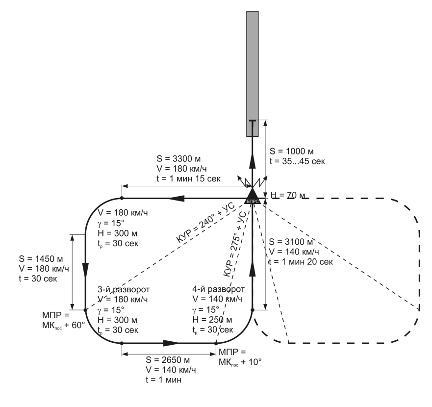

- S – расстояние;
- V – скорость;
- H – высота;
- γ - угол крена;
- t – время;
- t~р~ – время разворота;
- КУР – курсовой угол радиостанции;
- УС – угол сноса;
- МПР – магнитный пеленг радиостанции;
- МК~пос~ – магнитный курс посадочный.

### Заход и расчёт на посадку с прямой

При заходе на посадку с прямой отворотом на расчетный угол вывести вертолёт на
заданной высоте на БПРС. После пролета БПРС выполнить отворот вправо (влево)
на расчетный угол (РУ) с учетом УС и продолжать полет с этим курсом до разворота
в расчетной точке.

По истечении расчетного времени выполнить разворот на посадочный курс с креном 15° на скорости 140 км/ч по прибору, выпустить шасси и перевести вертолёт на
снижение.

Если полет до разворота в расчетной точке выполняется на высоте больше заданной, то разворот выполнять со снижением до заданной высоты.

После выхода из облаков визуально уточнить расчет и произвести посадку.

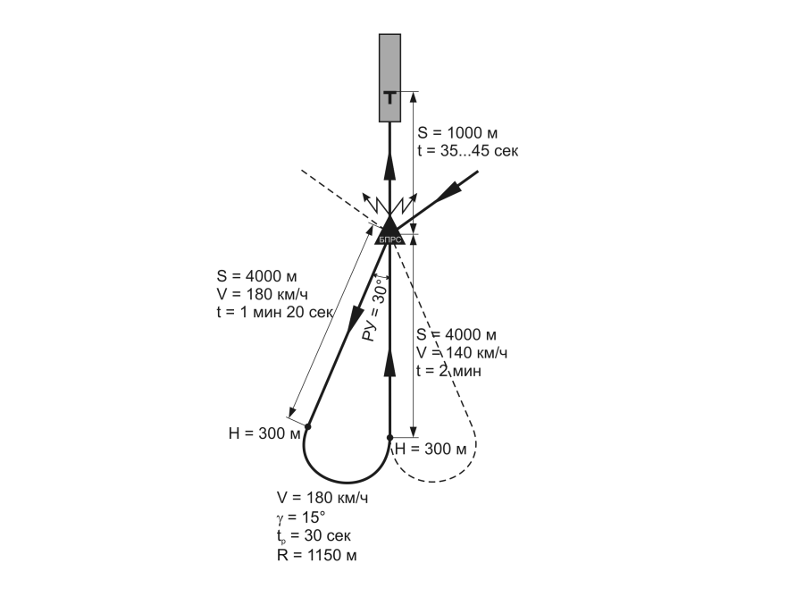

- S – расстояние;
- V – скорость;
- H – высота;
- R – радиус разворота;
- γ - угол крена;
- t – время;
- t~р~ – время разворота;
- РУ – расчетный угол.

### Заход и расчёт на посадку по ОСП

Выход на посадочный курс выполнить одним из вышеописанных способов, предварительно выставив стрелку ЗПУ на ПНП на посадочный курс.

Скорректировать курс с учетом УС, выдерживать скорость на планировании 140
км/ч и вертикальную скорость снижения 2…3 м/с.

Высоту полета на глиссаде снижения выдерживать в соответствии с формулой:

Где:

D – дальность до расчетной точки зависания (м);

H~вис~ – высота в расчетной точке зависания (м).

После пролета БПРС, на удалении 1000 м приступить к плавному уменьшению скорости полета, используя для контроля формулу:

Где:

D – дальность до расчетной точки зависания (м);

𝑈~𝑥~ – встречная составляющая скорости ветра.

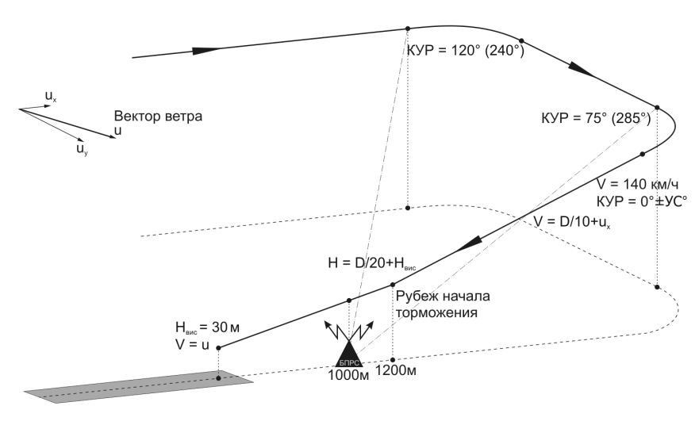

## Полет по маршруту

В главе описывается полет по маршруту, составленному в редакторе миссий. Необходимо помнить, что ПНК вертолёта оперирует только 6-ю введенными ППМ, поэтому для полета с использованием маршрутного режима автопилота следует учитывать ограничение по количеству пунктов маршрута при составлении миссии.
Маршруты, созданные в системе АБРИС, не могут быть введены в ПНК и не могут
использоваться в маршрутном режиме автопилота.

В период предполетной подготовки выполнить проверку ПНК и навигационного оборудования.

Перед взлетом:

- Установить стрелки высотомера на ноль [[RShift + -]] [[RShift + =]].
- Установить значение опасной высоты [[LShift + ,]] [[LShift + .]].
- Сличить показания курса на ПНП и КИ-13 с курсом взлета (ВПП).
- Проверить показания стрелки КУР на ПНП в направлении на выбранную
радиостанцию.
- Проверить установку галетного переключателя ПВИ в положение РАБ.
Проверить включение кнопки-табло ППМ и соответствующего номера ППМ
на табло.
- Проверить установку переключателя ЗПУ-ЗК АВТ – РУЧН [[CTRL + H]] в положение АВТ.
- Проверить установку переключателя ЗК-ЛЗП на ППР в положение, соответствующее заданию.
- Проверить на АБРИС положение вертолёта в точке старта с курсом на первый ППМ.
- Включить время полета [[RAlt + RCtrl + RShift + C]].

### Полет по заданному маршруту в автоматическом режиме

Полет выполнять при работе ИКВ в режиме ГПК. Переключатель ЗПУ-ЗК АВТ – РУЧН
в положение АВТ.

После взлета и стабилизации вертолёта по скорости и курсу - снять нагрузки кнопкой триммирования и включить режим ПОЛЕТ ПО МАРШРУТУ установкой переключателя МАРШРУТ-СНИЖЕН на рычаге ОШ в положение МАРШРУТ [[R]]; при этом
включается индикация МАРШРУТ ЗК (МАРШРУТ ЛЗП), вертолёт начинает автоматизированный разворот с креном до 15° на курс, соответствующий ЗПУ на первый
ППМ.

В соответствии с положением переключателя ЗК-ЛЗП на ППР вертолёт выполняет
автоматизированный полет в направлении ППМ из текущего места вертолёта или с
выводом и последующей стабилизацией вертолёта на линии заданного пути.

После набора заданной высоты установить переключатель стабилизации высоты
БАР-РВ на ППР в соответствующее заданию положение и нажать кнопку включения
канала стабилизации высоты автопилота - «В».

В подрежиме СТАБИЛИЗАЦИЯ РВ на ИЛС появляется шкала и счетчик геометрической высоты. В подрежиме СТАБИЛИЗАЦИЯ БАР на ИЛС индицируется счетчик барометрической высоты.

При подлете к очередному ППМ при маршрутном способе управления (ЛЗП) рассчитывается линейное упреждение разворота (ЛУР), на величину которого, не долетая
до ППМ, начинается автоматизированный разворот для вписывания в заданную линию пути очередного отрезка маршрута.

При путевом способе управления (ЗК) разворот начинается над ППМ.

Как при маршрутном, так и при путевом способах управления за несколько сот метров до начала разворота включается табло ППМ РАЗВОРОТ и начинается автоматизированный разворот с креном 15° на следующий ППМ.

В начале разворота текущие навигационные параметры маршрута заменяются на
параметры очередного этапа полета. За 5° до нового курса отключается табло ППМ
РАЗВОРОТ, автоматизировано подбирается курс с учетом фактического места вертолёта после разворота и угол сноса.

Порядок полета по следующим этапам маршрута аналогичен описанному выше.
За 250 м до конечного пункта маршрута (КПМ) включается табло КОНЕЦ
МАРШРУТА. При пролете КПМ на 2 км режим ПОЛЕТ ПО МАРШРУТУ отключается,
табло КОНЕЦ МАРШРУТА выключается, вертолёт стабилизируется на текущем
курсе.

В процессе полета необходимо контролировать положение символа вертолёта на
карте АБРИС, контролировать автоматический расчет навигационных элементов полета, сличать показания курса на ПНП и КИ-13.
В соответствии с планом полета производить переключение каналов АРК и использовать показания КУР для контроля полета.

### Полет с директорным управлением

При полете с директорным управлением задача летчика - выдерживать угловые положения вертолёта ручкой ППУ и высоту ручкой ОШ по директорам, индицирующимся на ИЛС и ИКП.

Подготовка и включение режима производятся так же, как и в случае полета по
маршруту в автоматическом режиме.

Для отключения автоматического режима и включения директорного управления
необходимо нажать кнопку ДИР УПР на пульте пилотажных режимов ППР-800. При
этом отключается контур автоматического управления по угловому положению вертолёта, но остается демпфирование по всем каналам.

На ИЛС появятся совмещенный директор тангаж-крен и директор управления по
высоте.

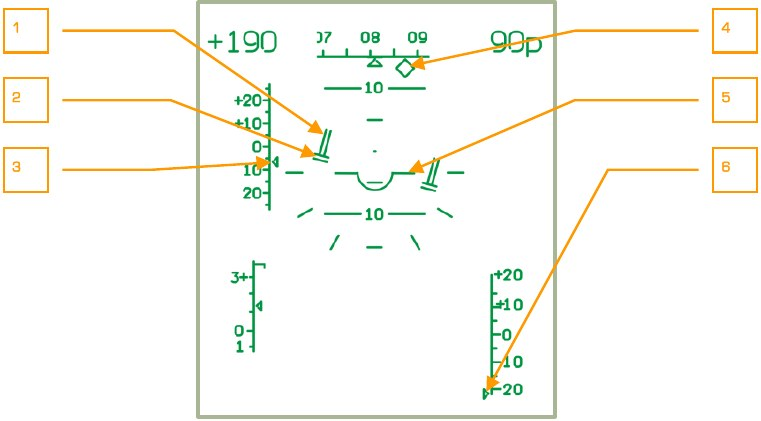

1.   Директор управления по высоте показывает необходимость увеличения
высоты.
2.   Директор управления по крену и тангажу показывает необходимость создания правого крена около 15° с небольшим отрицательным тангажом.
3.   Индекс отклонения от заданной приборной скорости показывает отклонение от заданной скорости -6 км/ч.
4.   Заданный курс показывает отклонение на 7° влево.
5.   Символ ЛА.
6.   Индекс отклонения от заданного значения геометрической высоты показывает отклонение от заданной высоты более чем на -20 м (индекс на нижнем упоре).

Заданная скорость поддерживается углом тангажа, а высота – режимом работы двигателей.

При полете с директорным управлением необходимо ручкой ППУ создать крен и
тангаж для совмещения символа ЛА с директором крена и тангажа, а с помощью
ручки ОШ добиться уменьшения директора высоты до минимального значения. Если
директор высоты «растет» вверх, необходимо увеличивать общий шаг, если вниз –
уменьшать общий шаг.

В данном примере летчику необходимо создать правый крен 15° с небольшим отрицательным тангажом (смотри 2) для набора заданной скорости (смотри 3, отклонение -6 км/ч) и увеличить общий шаг для набора заданной высоты (смотри 1 и 6, отклонение по высоте более чем -20 м).

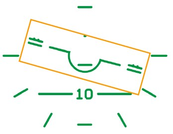

Для изменения заданной скорости и высоты необходимо, удерживая кнопку триммера, изменить скорость и высоту полета, затем отпустить кнопку; при этом текущие значения скорости и высоты будут запомнены как заданные.

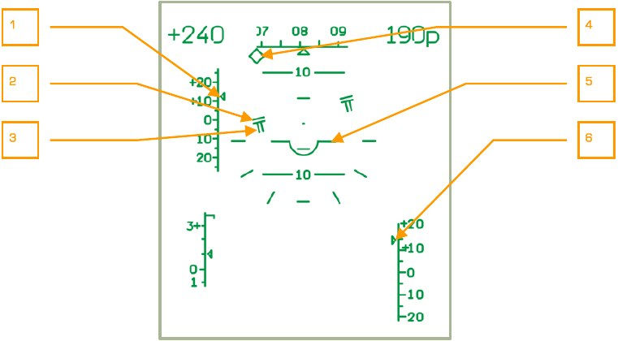

1.   Индекс отклонения от заданной приборной скорости показывает отклонение от заданной скорости +12 км/ч.
2.   Директор управления по крену и тангажу показывает необходимость создания левого крена около 15° с небольшим положительным тангажом.
3.   Директор управления по высоте показывает необходимость уменьшения
высоты.
4.   Заданный курс показывает отклонение более чем на 15° вправо.
5.   Символ ЛА.
6.   Индекс отклонения от заданного значения геометрической высоты показывает отклонение от заданной высоты на +15 м.

В данном примере летчику необходимо создать левый крен 15° с небольшим положительным тангажом (смотри 2) для снижения скорости до заданной (смотри 1, отклонение +12 км/ч) и уменьшить общий шаг для снижения до заданной высоты
(смотри 3 и 6, отклонение по высоте более чем +15 м).

При повторном нажатии кнопки ДИР УПР на пульте пилотажных режимов ППР-800
режим директорного управления отключается и включается режим автоматического
управления.

### Изменение порядка пролета ППМ в полете

При изменении очередности пролета ППМ, следует выполнить следующие действия:

- Отключить режим МАРШРУТ, установив переключатель МАРШРУТСНИЖЕНИЕ на рычаге ОШ в нейтральное положение.
- Отключить кнопку-табло ППМ на ПВИ, при этом отключится ее подсвет и
индикация номера ППМ на табло ПВИ.
- Включить кнопку-табло ППМ, при этом включается ее подсвет.
- На наборном поле ПВИ нажать кнопку с цифрой номера ППМ, выбранного
в качестве исходного пункта маршрута (ИПМ), при этом в ОИТ высвечивается номер ППМ.
- Нажать кнопку ВВОД, исходный (первый) пункт маршрута запоминается в
ЦВМ-Н ПНК.
- Повторить аналогичным способом ввод других ППМ (всего до 6 ППМ) в порядке очередности пролета.
- По окончании ввода очередности пролета последнего ППМ выключить
кнопку ППМ. Маршрут полета запоминается в ЦВМ-Н.
- Для активации нового маршрута снова нажать кнопку ППМ, при этом на
табло появляется индикация номера исходного пункта маршрута и навигационных параметров для полета на него. Оценить правильность направления полета на ИПМ нового маршрута.
- Включить режим МАРШРУТ, установив переключатель МАРШРУТСНИЖЕНИЕ на рычаге ОШ в положение МАРШРУТ, при этом в соответствии с выбранным подрежимом ЗК или ЛЗП включится табло МАРШРУТ
ЗК (МАРШРУТ ЛЗП), вертолёт начнет автоматизированный разворот для
полета по новому маршруту.

### Выход в оперативную точку

Выход в одну из 10 оперативных точек (ОТ), координаты которых введены в ЦВМ из
редактора миссий либо в полете, может быть выполнен автоматизировано из любой
точки маршрута по кратчайшему расстоянию в режиме МАРШРУТ со стабилизацией
направления полета в подрежимах ЗК или ЛЗП. Индикация навигационных параметров при этом такая же, как при полете на очередной ППМ.

Кроме этого, на ИЛС индицируется символ ОТ, курсовой угол цели и дальность до
ОТ (при дальности менее 100 км).

Порядок выхода:

- Отключить режим МАРШРУТ, установив переключатель МАРШРУТСНИЖЕНИЕ на рычаге ОШ в нейтральное положение, при этом выключится табло МАРШРУТ ЗК (МАРШРУТ ЛЗП).
- Отключить кнопку-табло ППМ на ПВИ, при этом выключится ее подсвет,
индикация очередного номера ППМ на табло ПВИ.
- Включить кнопку-табло ОТ на ПВИ, при этом включается ее подсвет.
- На наборном цифровом поле ПВИ нажать кнопку с номером ОТ, при этом
на табло индицируется этот номер и производится расчет навигационных
параметров автоматизированного полета в ОТ из текущего местоположения вертолёта с соответствующей их индикацией на ПНП, ПВИ и ИЛС.
- Включить режим МАРШРУТ, установив переключатель МАРШРУТСНИЖЕНИЕ на рычаге ОШ в положение МАРШРУТ, при этом вертолёт
начнет автоматизированный доворот для полета на ОТ.

При подлете к ОТ (цели) включается табло КОНЕЦ МАРШРУТА, а после пролета ОТ
на 2 км табло КОНЕЦ МАРШРУТА выключается, автоматизированное управление полетом прекращается, вертолёт стабилизируется на текущем курсе.

### Возврат на аэродром

Возврат на один из двух запрограммированных аэродромов может быть выполнен
автоматизированно из любой точки маршрута по кратчайшему расстоянию в режиме МАРШРУТ со стабилизацией направления полета в подрежимах ЗК или ЛЗП.

Индикация навигационных параметров при этом такая же, как и при полете на очередной ППМ.

Порядок выхода:

-   Выключить режим МАРШРУТ, установив переключатель МАРШРУТСНИЖЕНИЕ на рычаге ОШ в нейтральное положение, при этом выключается табло МАРШРУТ ЗК (МАРШРУТ ЛЗП).
-   Отключить кнопку-табло ППМ на ПВИ, при этом выключается ее подсвет,
индикация номера ППМ и навигационных параметров.
-   Включить кнопку-табло АЭР на ПВИ, при этом включается ее подсвет.
-   На наборном поле ПВИ нажать кнопку с номером, соответствующим номеру аэродрома возврата (1 или 2); на табло ИПВ индицируется этот номер и производится расчет навигационных параметров автоматизированного полета из текущего местоположения вертолёта на аэродром возврата
с соответствующей их индикацией на ПНП и ПВИ.
-   Включить режим МАРШРУТ, установив переключатель МАРШРУТСНИЖЕНИЕ на рычаге ОШ в положение МАРШРУТ, при этом вертолёт
начнет автоматизированный доворот для полета на аэродром возврата.

При подлете к аэродрому включается табло КОНЕЦ МАРШРУТА, а после пролета
расстояния 2 км табло КОНЕЦ МАРШРУТА выключается, также выключается индикация на ПВИ; автоматизированное управление полетом прекращается, вертолёт стабилизируется на текущем курсе.

## Полёт без задачи

В случае отсутствия навигационной задачи ПНК, когда на ПВИ не выбран ни один из
режимов ППМ, ОР, АЭР или ОТ возможно включение режима МАРШРУТ для поддержания текущих параметров полета. При этом в ПНК запоминаются и поддерживаются текущие параметры тангажа, крена, рыскания и высоты (при включенном канале высоты).

Для включения режима МАРШРУТ без задачи - отключить на пульте ПВИ все кнопки
задач: ППМ, ОР, АЭР, ОТ.

Положение переключателя ЗК-ЛЗП не влияет на режим навигации.
После установки и стабилизации требуемого режима полета включить режим
ПОЛЕТ ПО МАРШРУТУ установкой переключателя МАРШРУТ-СНИЖЕН на рычаге ОШ
в положение МАРШРУТ, при этом вертолёт будет поддерживать текущие параметры
полета.

Для смены режима полета необходимо:

-   На ручке ППУ нажать и удерживать кнопку ТРИММЕР.
-   Установить новый режим полета (курс, крен, тангаж).
-   Отпустить кнопку ТРИММЕР.

В процессе полета летчику необходимо контролировать положение символа вертолёта на карте АБРИС, сличать показания курса на ПНП и КИ-13.

В соответствии с планом полета производить переключение каналов АРК и использовать показания КУР для контроля полета.

## Висение и вертикальное снижение

Для висения в автоматическом режиме, после торможения и зависания над точкой,
включить режим ВИСЕНИЕ, для чего:

- Переключатель МАРШРУТ-СНИЖЕНИЕ установить в нейтральное положение.
- Включить кнопку ВИСЕНИЕ на ручке ППУ, при этом включается табло
ВИСЕНИЕ, происходит стабилизация вертолёта над точкой висения, включается канал стабилизации геометрической высоты автопилота, высвечивается табло Нрв СТАБ на верхнем пульте.

При отклонении от точки висения происходит автоматизированное управление вертолётом для возврата в заданную точку.

В режиме ВИСЕНИЕ и включенном директорном управлении индицируется:

- На ИКП – отклонение от заданной в момент включения режима ВИСЕНИЕ
высоты и боковое отклонение от точки висения, директорное отклонение
стрелок по крену и тангажу для возврата в точку висения.
- На ПНП – отклонение от точки висения в продольном и поперечном
направлении.
- На ИЛС – зона и символ висения, отклонение от заданной высоты висения,
директорные отклонения символа по крену, тангажу и высоте для возврата в точку и на заданную высоту висения, вектор путевой скорости
смещения от точки висения.

Для выключения режима висения - повторно нажать кнопку ВИСЕНИЕ на ручке ППУ,
при этом выключается табло ВИСЕНИЕ и соответствующая режиму индикация на
ПКП, ПНП и ИЛС.

### Вертикальное снижение

Если в режиме ВИСЕНИЕ потребовалось уменьшить высоту, следует применить режим ВЕРТИКАЛЬНОЕ СНИЖЕНИЕ, для чего нажать и удерживать нажатым переключатель МАРШРУТ-СНИЖЕНИЕ на рычаге ОШ в положении СНИЖЕН, при этом гаснет
табло ВИСЕНИЕ и Нрв СТАБ, включается табло СНИЖЕН.

Вертолёт начнет вертикальное снижение со скоростью не более 2 м/с при сохранении режима стабилизации над точкой висения и индикации в режиме ВИСЕНИЕ.

При достижении требуемой высоты висения, отпустить нажимной переключатель из
положения СНИЖЕН в нейтральное положение, при этом снижение прекращается,
выключается табло СНИЖЕН, включается табло ВИСЕНИЕ и Нрв СТАБ, выполняется
режим ВИСЕНИЕ на новой высоте.

При нажатом переключателе СНИЖЕН вертолёт снижается до истинной высоты 4 м,
после чего снижение прекращается.

## Коррекция координат ПНК

Инерциальная навигационная система имеет свойство накапливать ошибку с течением времени за счет неточности информации датчиков (гироскопов и акселерометров) и ошибок метода счисления. Суммарная ошибка в определении координат вертолёта может составлять до 4 км за час полета.

Ошибка в определении координат влияет на точность прохождения маршрута,
определения координат целей и целеуказания. Чтобы устранить ошибки счисления
координат необходимо проводить коррекцию координат одним из возможных способов.

При планировании маршрута в редакторе миссий для проведения коррекции необходимо определить координаты ориентиров коррекции (ОР, до 4-х). В качестве ориентиров коррекции рекомендуется выбирать хорошо заметные на местности точечные ориентиры – сооружения и природные объекты (вышки, отдельно стоящие сооружения, мосты, пересечения дорог, слияния рек и т.д.), расположенные вдоль
маршрута.

### Коррекция координат пролетом

При вхождении в зону радиусом 18 км от одного из запрограммированных ориентиров коррекции (ОР) на УСТ системы ЭКРАН выдается сигнал ПРОВЕДИ КОРРЕКЦ
КООРД.

Порядок коррекции:

- На ПВИ включить кнопку-табло ОР [[RAlt + E]], при этом включается ее подсвет.
- Нажать кнопку с номером, соответствующим номеру очередного ориентира коррекции, при этом на табло индицируется этот номер.
- Переключатель И-251В – ПРОЛ [[RCtrl + V]] установить в положение ПРОЛ.
- Визуально обнаружить ориентир коррекции, произвести точный выход на
него и в момент нахождения над ориентиром нажать кнопку ЦУ [[O]] на
ручке ППУ, при этом счисленные координаты в ПНК заменяются на координаты ОР.

По окончании коррекции отключится подсвет кнопки-табло ОР и индикация номера
ОР на табло.

### Коррекция координат по И-251В

Если запрограммированный ориентир коррекции находится в стороне от линии
пути, рекомендуется использовать коррекцию через И-251В Шквал.

Порядок коррекции:

-   На ПВИ включить кнопку-табло ОР [[RAlt + E]], при этом включается ее подсвет.
-   Нажать кнопку с номером, соответствующим номеру очередного ориентира коррекции, при этом на табло индицируется этот номер.
-   Переключатель И-251В – ПРОЛ [[RCtrl + V]] установить в положение И251В.
-   Визуально обнаружить ориентир коррекции.
-   Выключатель ИЗЛ – ОТКЛ [[RShift + O]] на ПВР установить в положение
ИЗЛ.
-   Нажать кнопку ЦУ [[O]] на ручке ППУ (разарретировать Шквал) и, с помощью кнюппеля джойстика или клавиш управления [[ ‘]], [[,]], [[.]], [[/]], совместить линию визирования с ОР по ИЛС.
-   На телевизионном индикаторе ИТ-23 опознать ориентир и скорректировать положение линии визирования.
-   На ИТ обрамить изображение ОР прицельной рамкой (переключателем
РАМКА на рычаге общего шага [[]], [[]]) и нажать кнопку АЗ [[Enter]].
-   При появлении на ИТ символа ТА (Телеавтомат) - повторно нажать кнопку
ЦУ [[O]] на ручке ППУ, при этом передаются и вводятся в ЦВМ значения
наклонной дальности, курсовой и вертикальный углы визирования.

По значению этих параметров и координатам ОР рассчитываются координаты вертолёта и вводятся в ПНК, заменяя счисленные. При этом на ИЛС индицируется разовая команда КОРР.

По окончании коррекции на ПВР - нажать кнопку СБРОС [[Backspace]], при этом отключается индикация разовой команды КОРР на ИЛС, подсвет кнопки-табло ОР на
ПВИ, индикация номера ОР на табло ПВИ; И-251В Шквал арретируется.

## Предельные режимы двигателя

Предельные режимы двигателя ТВ3-117 ограничиваются электронным регулятором
двигателя ЭРД-3ВМ, который, в частности, контролирует частоту вращения ротора
турбокомпрессора (ТК) и, совместно с регулятором температуры РТ-12-6, предельную температуру газа перед турбиной.

Превышение этих параметров резко снижает ресурс двигателя, увеличивает вероятность разрушения и деформации лопаток турбины ТК. Особенно опасным является
превышение температуры газа перед турбиной, в результате которого резко снижается сопротивление лопаток нагрузкам, что приводит к их пластическим деформациям и нарушению геометрии Деформация лопаток ведет в свою очередь к ухудшению параметров турбины. Возможно также разрушение лопаток.

В связи с этим при отказе ЭРД необходимо очень аккуратно управлять РОШ, не допуская загорания табло ОГРАН. РЕЖ. при работающем РТ-6-12 (без ЭРД работает
только в режиме индикации). В качестве резервного средства контроля, необходимо
ориентироваться на указатель режимов двигателя и приборы контроля двигателя, в
первую очередь на указатель температуры газа, не допуская превышения температуры выше 980 С.

## Обледенение

При выполнении полетов при отрицательных температурах и высокой влажности существует вероятность обледенения элементов вертолёта. Для сигнализации обледенения предназначен датчик обледенения.

### Принцип действия датчика обледенения

Чувствительность датчика – 0,3 мм льда. Как только слой льда превысит порог чувствительности, датчик включает сигнализацию, которая поступает в ЭКРАН с соответствующим сообщением «Обледенение». Выдается звуковое сообщение «Смотри
экран».

На 160 секунд включается противообледенительная система датчика для освобождения его от льда. По истечении этого времени сигнализация и ПОС датчика отключаются. Работа датчика не зависит от работы ПОС двигателей и винтов, поэтому
в условиях обледенения возникают периодические предупреждения когда датчик
покрывается льдом.

### Обледенение воздухозаборника

Обледенение воздухозаборника приводит к уменьшению его проходного сечения,
уменьшается расход воздуха, рабочая точка компрессора сдвигается ближе к границе газодинамической устойчивости (снижается запас устойчивости). Из-за уменьшения расхода воздуха падает мощность двигателя, для компенсации этого автоматика увеличивает расход топлива, растет температура газа перед турбиной, что
опять же уменьшает запас устойчивости компрессора.

При определенных условиях возможно возникновение помпажа и срыв горения в
камере сгорания. Как правило, это происходит при увеличении режима двигателя
(приемистости), когда увеличивается подача топлива в КС.

Условия для обледенения возникают при наличии в воздухе свободной влаги и температуре воздуха ниже нуля. Скорость обледенения зависит от скорости воздушного потока и водности (содержания влаги в воздухе).
Признаками начала обледенения служит повышение температуры газа перед турбиной.

Для исключения возникновения обледенения необходимо включать систему ПОС
двигателя в условиях, когда оно возможно.

### Обледенение винтов

Лед, нарастающий на лопастях НВ, приводит к ухудшению аэродинамических
свойств профиля, снижая тягу винта и увеличивая мощность, требуемую для его
вращения.

### Обледенение ПВД и ДУАС

Обледенение ПВД вызывает искажения показаний барометрических приборов (указателя приборной скорости, вариометра, высотомера) вплоть до полной их неработоспособности.

То же происходит и с ДУАС - при намерзании льда на флюгарки нарушается их свободное вращение.
При угрозе обледенения необходимо включать подогрев ПВД и ДУАС.

## Влияние пыли на двигатели

Работа двигателей в облаке пыли, поднятой несущими винтами, приводит к его повышенному износу. Для исключения этого необходимо при работе с пыльных площадок или вблизи земли включать систему ПЗУ двигателей. Количество пыли попадающей в двигатели, зависит как от расхода воздуха через него, так и от интенсивности пылевого облака, которое, в свою очередь, зависит от скорости отбрасываемого винтами воздуха, поэтому до взлета не допускается работа двигателей на режимах выше МГ.

## Пилотаж

### Общие указания

Полеты на пилотаж выполняются с целью отработки боевого маневрирования. Пилотаж разрешается выполнять в простых метеоусловиях.

Вертолёт обеспечивает выполнение следующих маневров:

-   Виражи, развороты, восьмерки, змейки.
-   Восходящие и нисходящие спирали.
-   Боевые и форсированные развороты.
-   Скольжения.
-   Горки и развороты на горке.
-   Разгоны и торможения.
-   Маневрирование на предельно малых высотах.
-   Плоские развороты.

Минимальная допустимая высота при пилотировании - не менее 10 м над рельефом
(препятствиями).

Текущие и максимально допустимые значения перегрузки отображаются на ИЛС на
шкале перегрузок. При достижении максимально допустимой перегрузки подвижный индекс текущей перегрузки совпадает с символом максимально допустимой перегрузки и переходит в мигающий режим. Кроме того, высвечивается табло САС
«ny». Текущая перегрузка также может контролироваться по указателю перегрузки
на левой приборной доске.

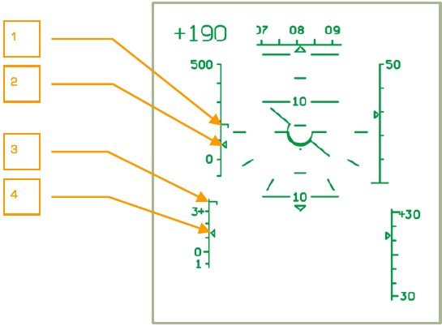

1.   Индекс максимально допустимой скорости.
2.   Индекс приборной скорости.
3.   Индекс максимально допустимой нормальной перегрузки.
4.   Индекс нормальной перегрузки.

Текущие и максимально допустимые значения скорости также отображаются на ИЛС
по шкале приборной скорости, при достижении максимально допустимой скорости
подвижный индекс текущей скорости совпадает с символом максимально допустимой скорости и переходит в мигающий режим. Высвечивается табло САС «V~max доп~».

Высвечивание табло «n~y~» и «V~max доп~» допускается кратковерменно. При высвечивании табло «ny» следует уменьшить общий шаг и несколько отдать ручку ППУ «от
себя» до выключения табло. При высвечивании табло «Vmax доп.» следует выполнить торможение установленным порядком до уменьшения скорости и выключения
табло.

!!! note "ПРИМЕЧАНИЕ"
    С увеличением высоты полета на каждые 1000 м максимально допустимые значения «n~y~» и «V~max доп~» уменьшаются на 0,3…0,4 единицы и на 30…40 км/ч соответственно.

### Виражи, развороты и спирали

Перед выполнением виража следует наметить ориентир для вывода или запомнить
курс вывода.

Ввод в правильный координированный вираж выполнять с заданным креном координированными отклонениями ручки ППУ и педалей в сторону виража с одновременным увеличением общего шага для сохранения заданной высоты и скорости полета.

За 20…30° до вывода из виража координированными отклонениями ручки ППУ и педалей в сторону, обратную развороту, начать вывод вертолёта из разворота с таким
расчетом, чтобы к моменту выхода на заданный ориентир (курс) крен убрать полностью.

Техника пилотирования при выполнении горизонтальных восьмерок и змеек аналогична технике пилотирования при выполнении виражей и разворотов. Перекладывание вертолёта из одного крена в другой выполнять непрерывными координированными движениями ручки ППУ и педалей.

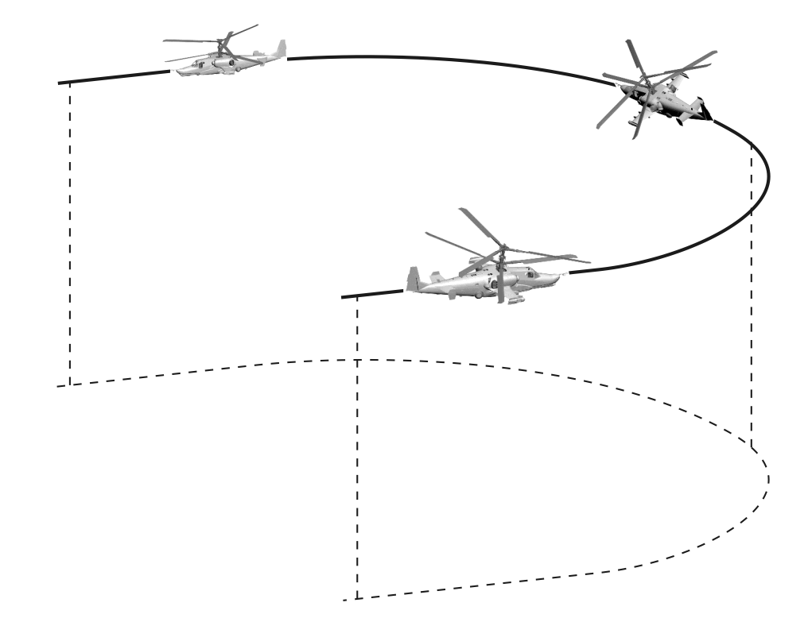

При выполнении виражей и разворотов на предельно малых высотах особое внимание уделять сохранению заданной высоты полета. Контроль за высотой производить визуально, с учетом высоты препятствий, с периодическим уточнением высоты
по показаниям радиовысотомера. Учитывать, что нарушение координации при разворотах (внешнее или внутреннее скольжение) приводит к изменению высоты полета.

Методика выполнения спирали аналогична методике выполнения виража с изменением высоты полета (набор или снижение).

### Боевой разворот

Ввод в разворот рекомендуется выполнять на скоростях 150…300 км/ч, с учетом
ограничения тангажа до 30° и крена до 45° на взлетной мощности, не допуская
превышения значений вертикальных перегрузок.

При достижении заданной скорости ввода отклонением ручки ППУ «на себя» и в
сторону разворота с одновременным отклонением педалей в ту же сторону и увеличением общего шага до взлетной мощности перевести вертолёт в набор высоты по
восходящей спирали с увеличением углов крена и тангажа.

За 20…30° до курса вывода координированными отклонениями педалей и ручки
ППУ в сторону, противоположную крену и «от себя», начать вывод вертолёта из
разворота с таким расчетом, чтобы к моменту разворота на 180° вертолёт вышел в
горизонтальный полет без крена и на скорости не менее 80 км/ч.

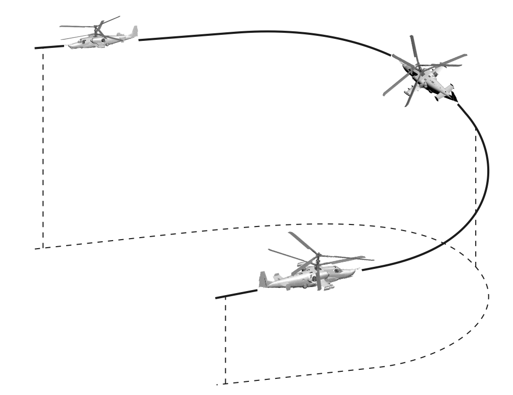

Высоту набора и время разворота регулировать изменением крена, тангажа и мощности двигателей.
Набор высоты за боевой разворот при рекомендованных значениях углов крена и
тангажа до барометрических высот 1000 м составляет:

- При вводе на скорости 150 км/ч – 50…100 м.
- При вводе на скорости 250 км/ч – 200…230 м.
- При вводе на скорости 300 км/ч – 230…290 м.

Время выполнения разворота на 180° составляет примерно 20 с.

Для ускорения разворота возможно создание глубоких скольжений во внешнюю к
развороту сторону.

### Форсированный разворот

Ввод в разворот выполнять энергичными координированными движениями ручки
ППУ и педалей в сторону разворота. Изменением общего шага выдерживать горизонтальную плоскость маневра.
При достижении крена 30°, продолжая движение педалью в сторону разворота (до
2/3 хода), ручку ППУ отклонять «на себя» с темпом, обеспечивающим удержание
вертолёта в горизонтальной плоскости, контролируя перегрузку. Чем больше крен и
меньше скорость – тем большее требуется отклонение ручки ППУ «на себя».

Разворот выполняется с внешним скольжением (шарик на упоре) и уменьшением
скорости.

За 15…20° до намеченного вывода из разворота начать вывод с одновременным
уменьшением общего шага для предотвращения набора высоты.

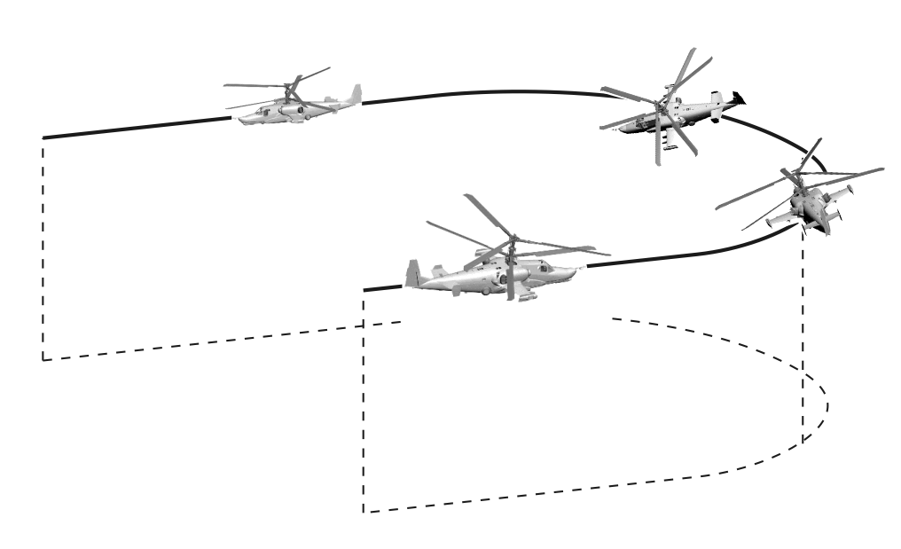

Скорость после вывода должна быть не менее 60 км/ч. Создание глубокого скольжения существенно увеличивает эффективность маневра.

Минимальное время разворота на 180° с креном 60° и вводом на скорости 250 км/ч
составляет 7 с.

### Горка

Ввод в горку выполнять отклонением ручки ППУ «на себя» на скорости более 150
км/ч с углами тангажа до 60°. Ввод и вывод из горки разрешается выполнять как
при постоянном значении общего шага, так и при переменном.

При достижении заданного угла тангажа незначительным отклонением ручки ППУ
«от себя» зафиксировать этот угол.

Вывод из горки производить отклонением ручки ППУ «от себя» с таким расчетом,
чтобы в процессе вывода скорость была не менее 50 км/ч выше статического потолка и до 0 км/ч на высотах ниже статического потолка. Перегрузка в процессе вывода рекомендуется не менее 0,1.

Набор высоты при выполнении горки у земли при угле тангажа 30°:

- Скорость ввода 300 км/ч – изменение высоты 400 м.
- Скорость ввода 270 км/ч – изменение высоты 350 м.
- Скорость ввода 250 км/ч – изменение высоты 200 м.
- Скорость ввода 200 км/ч – изменение высоты 100 м.

Высота набора может быть заметно увеличена при увеличении общего шага.

### Поворот на горке

Ввести вертолёт в горку, при достижении скорости 100 км/ч начать вывод из горки,
энергичными отклонениями ручки ППУ и педалей ввести вертолёт в разворот с креном 30…45°. После достижения заданного крена отклонениями ручки ППУ и педалей удерживать вертолёт в координированном развороте, не допуская уменьшения
скорости менее 60 км/ч.

За 20…30° до курса вывода координированными отклонениями ручки ППУ и педалей начать вывод вертолёта из разворота с таким расчетом, чтобы к моменту разворота на 180° вертолёт вышел в горизонтальный полет без крена и с заданным курсом.

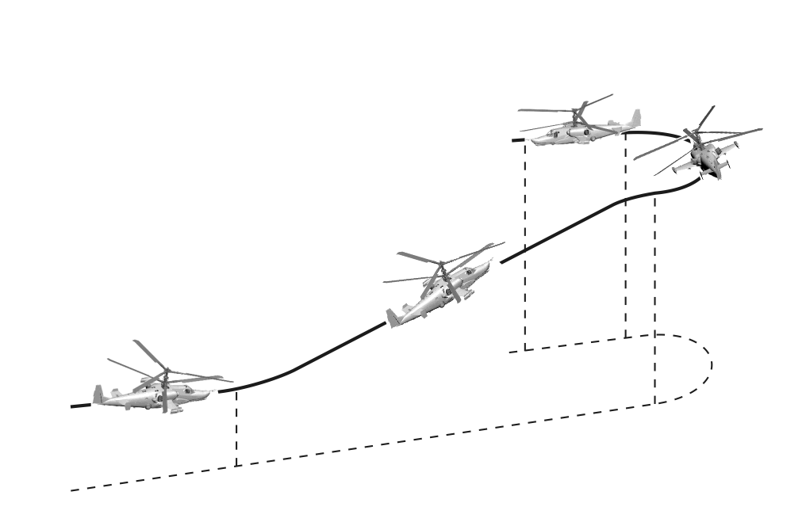

### Пикирование

Пикирование в зависимости от высоты полета и исходной скорости выполнять с углами, не превышающими 60°.
Ввод в пикирование выполнять с режима горизонтального полета или с разворота,
как при постоянном значении общего шага, так и при переменном – для уточнения
движения вертолёта по заданной траектории.

Ввод в пикирование с горизонтального полета выполнять отклонением ручки ППУ
«от себя», удерживая вертолёт от кренов и разворотов координированными отклонениями ручки ППУ и педалей.
При выполнении пикирования в конкретную точку на земле наклон заданной траектории удерживать соответствующими изменениями положения рычага ОШ и ручки
ППУ.

Вывод из пикирования выполнять отклонением ручки ППУ «на себя» и увеличением
общего шага, при этом взятие ручки должно быть с опережением к общему шагу.
При выводе из пикирования контролировать максимально допустимую величину
вертикальной перегрузки и скорости.

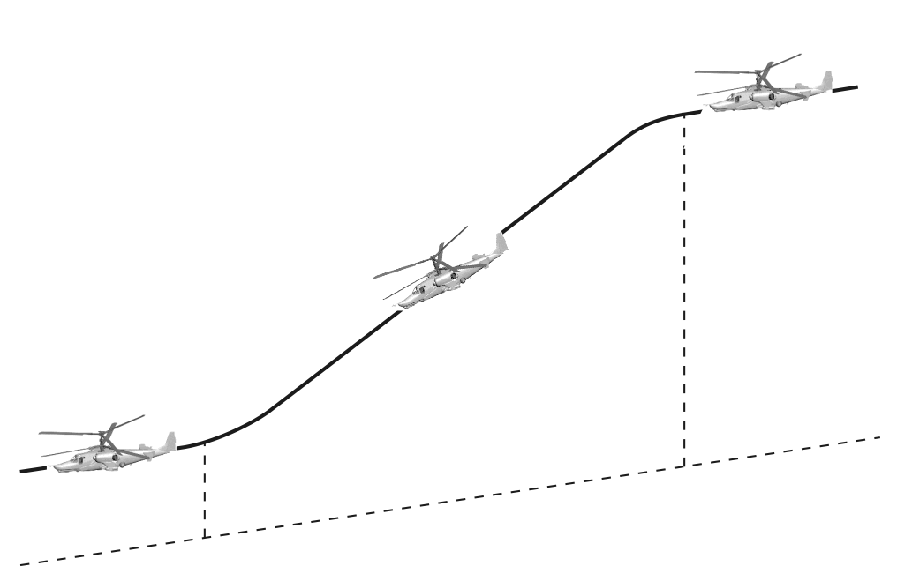

Потеря высоты на выводе будет минимальной, если вывод выполнять взятием ручки
ППУ «на себя» до создания тангажа на кабрирование до 5…10° с одновременным
увеличением общего шага.

На выводе из пикирования увеличение частоты вращения несущих винтов выше допустимых удерживать соразмерным увеличением общего шага. Высоту вывода выбирать с учетом просадки вертолёта.

### Плоский разворот

Плоский разворот – разворот вертолёта по курсу на величину до 90° в плоскости
движения с торможением, практически без крена. Выполнение плоских разворотов
разрешается до скорости 220 км/ч.

Ввод вертолёта в разворот выполнять путем энергичного отклонения педали на величину, соответствующую требуемому изменению курса, вплоть до упора. После
выдерживания заданного изменения курса отпусканием педали в обратную сторону,
не допуская «перехлеста» через нейтральное положение, вывести вертолёт из разворота.

В процессе выполнения разворотов следует парировать изменение крена, тангажа,
высоты, вертикальной скорости.

При плоском развороте скорость полета уменьшается. Величина, на которую уменьшается скорость полета, зависит, в основном, от скорости ввода, угла разворота и
времени его выдерживания.

### Разгон и торможение с максимальным темпом

Максимальные углы тангажа при разгоне и торможении не должны превышать
±30°.

Интенсивность разгона зависит от величины избытка мощности двигателей. Для
разгона с режима висения следует увеличить общий шаг до взлетной мощности с
одновременным наклоном вперед, не допуская снижения. По мере увеличения скорости (до 120 км/ч) возникающий избыток мощности можно использовать для большего наклона вперед и увеличения темпа разгона.

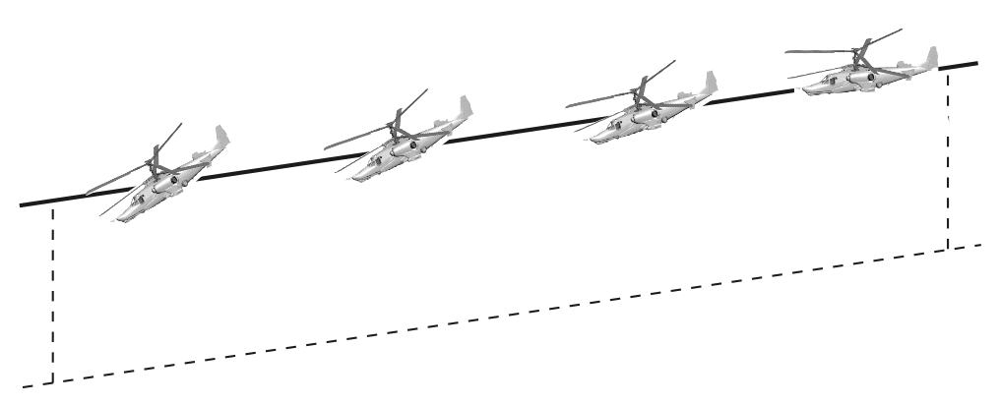

Интенсивное торможение в полете возможно с максимально разрешенными углами
тангажа. Ввод в режим торможения на большой скорости для предотвращения
взмывания должен сопровождаться значительным уменьшением общего шага и увеличением частоты вращения несущих винтов. Темп торможения зависит от величины угла тангажа.

При интенсивном торможении примерно за 5 с до зависания необходимо плавно
уменьшить тангаж до 10…15°, не допуская снижения увеличением общего шага.

При необходимости быстрого перелета в любом направлении с режима висения
против ветра необходимо отклонить ручку ППУ в сторону заданного направления и
создать необходимый темп разгона.

В процессе увеличения скорости вертолёт начинает разворот фюзеляжа по набегающему потоку за счет флюгерной устойчивости. Летчик может корректировать
направление движения вертолёта органами управления.

При подлете к точке зависания, в процессе гашения скорости вертолёт при
нейтральных педалях самостоятельно развернется носом против ветра.

При разгоне на хвост разворот вертолёта в сторону движения начинать вместе с
началом разгона плавной дачей педали.

При вводе вертолёта в режим торможения при строго попутном ветре, необходимо
взятием ручки ППУ на себя создать тангаж до 15° и при уменьшении скорости до
50…70 км/ч плавной дачей педали начать разворот на 180° (по ветру), одновременно увеличением общего шага удерживать вертолёт от вертикального снижения.

Техника пилотирования при разгонах и торможениях с боковым ветром аналогична
приведенной выше.

При висении с боковым ветром возможна постановка педали на упор. Для восстановления запасов управления необходимо довернуть вертолёт в сторону ветра или
начать перемещение по ветру.

### Маневрирование на предельно малых высотах

Боковые перемещения и разгоны вбок выполняются вплоть до постановки противоположной педали на упор. Скорость бокового перемещения при этом составляет до
90…100 км/ч. Дальнейшее увеличение скорости бокового перемещения приводит к
развороту вертолёта в сторону движения. Направление полета вбок выдерживать
дачей педали, противоположной направлению полета.

Разрешается разгон и полет на хвост без снижения до скоростей 90…100 км/ч. Возникновение самопроизвольного разворота по курсу свидетельствует о превышении
максимальной скорости полета на хвост, при этом:

- Если вертолёт самопроизвольно начал разворачиваться на 180°, этому не
препятствовать.
- Если ручка ППУ встала на задний упор или появилась тенденция к энергичному опусканию носа - не уменьшая общий шаг, развернуть вертолёт
на 180°.
- Если возникла необходимость затормозиться с большой скорости полета
назад, то необходимо сначала развернуть вертолёт в сторону движения и
далее тормозиться обычным способом.

Интенсивность вертикального маневрирования обеспечивается избытком располагаемой мощности двигателей. При маневрировании с уменьшением высоты полета, в
целях предупреждения попадания в режим вихревого кольца необходимо иметь в
виду, что при скоростях менее 50 км/ч вертикальная скорость снижения не должна
превышать 3 м/с ниже высоты 200 м и 5 м/с – выше 200 м.

## Особые случаи в полёте

В данном разделе приведены только случаи отказов оборудования или попадания
вертолёта в условия, которые могут привести к аварийным ситуациям. При других,
не описанных здесь нестандартных ситуациях, действия летчика, направленные на
сохранение жизни и вертолёта, определяются обстановкой, условиями полета и
временем, которым располагает летчик; решение по ним в каждом конкретном случае принимает летчик.

Для информирования летчика о возникновении в полете опасных режимов, неисправностей и отказов на вертолёте установлены системы: аварийной сигнализации
САС, встроенного контроля и предупреждения ЭКРАН, речевой информации и индикации предельных режимов полета.

При появлении речевой и светосигнальной информации летчику необходимо быстро
определить, в какой системе произошел отказ, принять решение о дальнейших действиях.

Одним из первых действий летчика, при любом изменении условий полета, должно
быть обращение внимания на частоту вращения несущих винтов:

-   Если частота вращения НВ находится в заданных пределах (87…90 %), то
летчик спокойно выясняет причину изменений условий полета.
-   Если частота вращения НВ выходит из заданных пределов или самопроизвольно изменяется, то необходимо немедленно энергичным движением
рычага ОШ в соответствующую сторону установить ее в заданных пределах и выяснить причину отклонения.
-   Если частота вращения упала ниже 75 % и полный сброс рычага ОШ с
уменьшением скорости полета до 120 км/ч не останавливает ее дельнейшее падение - следует покинуть вертолёт.

### Запуск двигателя в полёте

Разрешается производить в полете запуск двигателя, остановленного летчиком в
результате ошибочных действий.

Запуск в полете отказавшего двигателя запрещается.
Запуск двигателя в полете разрешается производить при частоте вращения турбокомпрессора на авторотации не выше 7 %, что соответствует приборной скорости
120 км/ч.

Для запуска двигателя необходимо:

-   Запустить ВСУ (горит сигнальное табло ВСУ ВКЛЮЧЕНА).
-   Убедиться, что РРУ запускаемого двигателя находится в положении МАЛ
ГАЗ (из положения АВТОМАТ два раза вниз [[RShift + Page Down]] или [[RAlt + Page Down ]], в зависимости от двигателя). СТОП-КРАН в положении
ЗАКРЫТО ([[RCtrl + Page Up]] или [[RCtrl + Page Down]], в зависимости от
двигателя).
-   Установить переключатель двигателя в положение запускаемого двигателя, а переключатель ЗАПУСК – ХОЛОДН ПРОКР в положение ЗАПУСК.
-   Нажать и отпустить кнопку ЗАПУСК.
-   По достижении оборотов турбокомпрессора более 10 % перевести рычаг
СТОП-КРАН запускаемого двигателя в положение ОТКРЫТО, при этом двигатель автоматически выходит на режим малого газа.
-   Проработать на этом режиме 1 минуту и установить РРУД в положение автомат (два раза [[RShift + Page Down]] или [[RAlt + Page Down]], в зависимости от двигателя).
-   После запуска проверить работу двигателя по показаниям приборов, после чего выключить ВСУ.

### Пожар на вертолёте

Во всех случаях возникновения пожара на земле или в воздухе необходимо принять
меры к ликвидации пожара.

В аварийных случаях двигатель останавливается переводом рычага СТОП-КРАН в
положение ЗАКРЫТО и немедленным закрытием перекрывного крана.

Признаки пожара в отсеке силовой установки:

-   Высвечивание в проблесковом режиме ЦСО и табло ПОЖАР на левой приборной доске.
-   Голосовое сообщение о возникновении пожара в одном из отсеков.
-   Высвечивание на правом бортовом пульте (панель СИСТЕМА
ПОЖАРОТУШЕНИЯ) светосигнализатора красного цвета с надписью, указывающей отсек, в котором возник пожар (ПОЖАР ЛЕВ ДВИГ, ПОЖАР ВСУ,
ПОЖАР ПРАВ ДВИГ, ПОЖАР ВЕНТИЛ).

Действия:

-   Проверить по высвечиванию табло желтого цвета «1» на правом боковом
пульте срабатывание автоматической системы пожаротушения первой
очереди. Если автоматическая система не сработала, включить эту
систему вручную нажатием соответствующей кнопки (ПОЖАР ЛЕВ ДВИГ,
ПОЖАР ВСУ, ПОЖАР ПРАВ ДВИГ, ПОЖАР ВЕНТИЛ) под горящим светосигнализатором.
- При возникновении пожара в отсеке одного из двигателей, выключить
двигатель, в отсеке которого возник пожар, для чего закрыть СТОП-КРАН
и перекрывной кран этого двигателя, перейти на полет с одним работающим двигателем.
- При возникновении пожара в отсеке ВСУ при ее работе - выключить ВСУ,
для чего нажать кнопку ОСТАНОВ ВСУ и установить выключатель ПЕРЕКР.
КРАН ВСУ в положение ЗАКРЫТО.
- Убедиться в ликвидации пожара по погасанию табло ПОЖАР и ЦСО. При
этом аварийный светосигнализатор пожара в отсеке и табло срабатывания
системы пожаротушения первой очереди «1» не гаснут.
- Если после срабатывания автоматической системы первой очереди табло
ПОЖАР и ЦСО не погасли, произвести включение второй очереди системы
пожаротушения, для чего переключатель БАЛЛОНЫ АВТ – РУЧН на правом
боковом пульте установить в положение РУЧН (второй баллон) и нажать
кнопку отсека, в котором возник пожар. При этом высветится табло желтого цвета «2», сигнализирующее о срабатывании второй очереди.

!!! attention "Внимание!"
	Быть предельно внимательным при работе со стоп-краном и перекрывным краном, чтобы не остановить исправный двигатель.

После ликвидации пожара запрещается запускать двигатель, в отсеке которого возник пожар.
Если пожар ликвидировать не удается - произвести экстренную посадку или покинуть вертолёт (по обстановке).

### Отказ одного двигателя в полете

Отказ одного двигателя в полете или автоматическое выключение одного двигателя
контуром СТ ЭРД при превышении частоты вращения свободной турбины двигателя
выше предельно допустимой.

Признаки:

- Падение частоты вращения несущих винтов и срабатывание лампы аварийной сигнализации «ЗЕБРА», при уменьшении частоты вращения несущих винтов ниже 85 %.
- Характерный звук останавливающегося двигателя.
- Самопроизвольное снижение вертолёта.
- Падение частоты вращения и температуры газов двигателя.
- Падение давления масла на входе в двигатель (по указателю давления).
- Увеличение частоты вращения турбокомпрессора работающего двигателя.

Действия летчика:

- Уменьшить общий шаг, не допуская снижения частоты вращения несущих
винтов ниже 85 %.
- Определить по показаниям приборов отказавший двигатель и закрыть его
СТОП-КРАН и перекрывной кран.
- Установить скорость полета 110…120 км/ч и перевести РРУ работающего
двигателя вверх до упора в максимальное положение для восстановления
частоты вращения несущих винтов.
- Убедиться в отсутствии пожара на вертолёте. Открыть кран кольцевания.
- Убедиться в нормальной работе оставшегося двигателя и возможности выполнения горизонтального полета.
- Принять решение о совершении вынужденной посадки или продолжении
полета.

В диапазоне скоростей, обеспечивающих однодвигательный полет, допускается, в
случае необходимости, работа на высоких режимах работы двигателей с частотой
вращения несущих винтов не ниже 83 %.

!!! attention "Внимание!"
	Минимальная приборная скорость полета вертолёта с одним работающим двигателем 70 км/ч.
    Запускать в полете отказавший двигатель запрещается.

### Посадка с одним работающим двигателем

Посадку с одним работающим двигателем на неподготовленную площадку выполнять по-вертолётному (без пробега), а на аэродром – по-самолетному (с коротким
пробегом).

По возможности, заход на посадку выполнять против ветра.

Для выполнения посадки по-вертолётному необходимо:

- К высоте 60 м обеспечить снижение вертолёта в расчетную точку на скорости 100…120 км/ч.
- На высоте 60 м начать торможение вертолёта, чтобы в процессе дальнейшего снижения в расчетную точку установилась скорость 50…70 км/ч.
- На высоте 8…10 м соразмерным увеличением угла тангажа до 15° и общего шага НВ окончательно погасить поступательную скорость.
- На высоте 2…3 м энергично увеличить общий шаг для гашения вертикальной скорости к моменту приземления до минимальной величины.
- Приземлить вертолёт на основные колеса и без задержки плавно опустить
рычаг ОШ вниз до упора.

Для выполнения посадки по-самолетному необходимо:

- Обеспечить снижение вертолёта в расчетную точку на скорости 100…120
км/ч.
- С высоты 50 м перевести взгляд на землю и выполнять снижение при постоянном визуальном контроле за высотой.
- На высоте 30 м начать плавное выравнивание вертолёта отклонением
ручки ППУ «на себя» с таким расчетом, чтобы на высоте 0,5…1 м вертолёт
имел посадочный угол тангажа с околонулевой вертикальной скоростью.
- На выдерживании, сохраняя посадочный угол тангажа, обеспечить плавное приземление вертолёта на основные колеса с поступательной скоростью 30…40 км/ч.
- Плавно уменьшить ОШ до упора.
- Опускание вертолёта на переднее колесо ручкой ППУ не парировать.

!!! attention "Внимание!"
	При приземлении не допускать боковой снос вертолёта, а если перед
    приземлением снос появился – педалью развернуть нос вертолёта по сносу
    (навстречу набегающей земле).

### Отказ одного двигателя на висении

При отказе двигателя на высоте около 10 м, ниже опасной зоны «высота-скорость»,
вертолёт к моменту приземления не успевает развить вертикальную скорость
больше безопасной величины 3,6 м/с.

Действия летчика:

- Выполнить сброс общего шага на 2…3° с одновременной отдачей ручки
ППУ от себя для придания вертолёту угла тангажа 20…25° на пикирование.
- С высоты 3…5 м энергичным увеличением общего шага на ¾ от полного
хода выполнить подрыв для уменьшения вертикальной скорости снижения, ручкой ППУ придать вертолёту посадочный угол тангажа (аналогичный углу тангажа на висении).
- По возможности плавно приземлить вертолёт на основные колеса, не допуская боковых перемещений.
- Убрать ОШ вниз до упора.
- Опускание вертолёта на переднее колесо ручкой ППУ не парировать.

При отказе двигателя в зоне опасных высот и скоростей (рис. 10-20) безопасная посадка не гарантируется, поэтому, по возможности, стоит избегать полетов в опасных зонах.

При отказе двигателя на верхней границе опасной зоны или выше ее запас высоты
обеспечивает выполнение разгона вертолёта:

- Энергично выполнить сброс общего шага приблизительно на 1/3 хода с
одновременной отдачей ручки ППУ от себя для придания вертолёту угла
тангажа 20…25° на пикирование.
- При достижении приборной скорости 40…50 км/ч увеличением общего
шага приступить к выводу вертолёта из режима снижения в горизонтальный полет.
- Закрыть СТОП-КРАН и перекрывной кран отказавшего двигателя.
- Установить скорость горизонтального полета 110…120 км/ч по прибору и,
в зависимости от обстановки, принять решение на выполнение посадки
или на продолжение полета с одним работающим двигателем.

### Отказ двух двигателей в полёте

Признаки:

- Резкое уменьшение частоты вращения несущих винтов. Загорание светосигнального табло «ЗЕБРА» и ЦСО.
- Характерный звук останавливающихся двигателей.
- Разбалансировка вертолёта в продольном отношении в полете с поступательной скоростью (изменение угла тангажа на пикирование).
- Изменение высоты полета и увеличение вертикальной скорости снижения.
- Быстрое падение частоты вращения и температуры газов двигателей, падение давление масла двигателей.

Действия летчика:

- Немедленно уменьшить общий шаг до минимального для обеспечения
поддержания частоты вращения несущих винтов.
- Ручкой ППУ установить заданную приборную скорость на режиме самовращения несущих винтов 100…180 км/ч.
- Закрыть стоп-краны и перекрывные краны двигателей.
- Произвести сброс грузов на подвесках.
- Снять нагрузки с органов управления.
- Выпустить шасси.
- Выбрать площадку и зайти на посадку, по возможности против ветра.

### Посадка на режиме самовращения несущих винтов

К высоте 50 м установить скорость 100…120 км/ч по прибору, частоту вращения несущих винтов 86±1 %, перевести взгляд на землю, выполняя дальнейшее снижение
при постоянном визуальном контроле высоты.

Дальнейшие действия зависят от выбранной точки посадки (аэродром или неподготовленная площадка).
Посадка на неподготовленную площадку выполняется по-вертолётному или с вынужденным коротким пробегом, скоротечна и требует от летчика энергичных, соразмерных действий органами управления.

Для выполнения посадки необходимо:

- Подвести вертолёт к высоте выравнивания (30 м) на скорости 100…120
км/ч.
- С высоты 30 м выполнить выравнивание, для чего энергичным отклонением ручки ППУ на себя создать угол тангажа до 25° с последующим энергичным взятием рычага ОШ на 2/3 полного хода. Тангаж удерживать до
полного торможения или до высоты не менее 3 м.
- С высоты 3 м энергичным отклонением ручки ППУ от себя придать вертолёту посадочный угол тангажа и одновременно по мере приближения вертолёта к земле произвести подрыв - увеличить общий шаг несущих винтов
до максимального.
- Приземление произвести на основные колеса, удерживая вертолёт ручкой
ППУ от энергичного опускания на переднее колесо.
- После касания земли передним колесом, ручку ППУ установить в
нейтральное положение и уменьшить общий шаг до минимального. При
необходимости применить тормоз колес.

Посадка на подготовленную площадку (аэродром) выполняется по-самолетному с
пробегом. Посадка с пробегом по сравнению с посадкой без пробега носит более
спокойный характер и позволяет контролировать ситуацию на любом этапе посадки.

Для выполнения посадки необходимо:

- Подвести вертолёт к высоте выравнивания на скорости 100…120 км/ч.
- С высоты 30…50 м начать плавное выравнивание вертолёта отклонением
ППУ «на себя» с последующим плавным увеличением общего шага несущих винтов. Действия ручкой ППУ и рычагом ОШ должны быть такими,
чтобы обеспечить плавный подвод вертолёта к земле на высоте 0,5…1 м с
посадочным углом тангажа.
- На выдерживании, сохраняя посадочный угол тангажа, соразмерно с приближением вертолёта к земле, увеличить общий шаг до максимального и
плавно приземлить вертолёт на основные колеса, удерживая его ручкой
ППУ от энергичного опускания на переднее колесо. Поступательная скорость приземления должна составлять 40…60 км/ч.
- После касания земли передним колесом ручку ППУ установить в нейтральное положение, уменьшить общий шаг до минимального и применить тормоза колес для сокращения пробега.

!!! attention "Внимание!"
	Допустимая скорость пробега на посадке по условиям предотвращения
    колебаний типа «шимми» не более 80 км/ч

### Отказ двух двигателей на висении

При отказе двигателей на рабочих высотах висения (25 м):

- Энергично уменьшить общий шаг, примерно на половину хода.
- С высоты 5…7 м энергично увеличить общий шаг до максимального (выполнить подрыв) для гашения вертикальной скорости снижения.
- Приземление произвести на основные колеса с последующим опусканием
вертолёта на переднее колесо.
- После приземления немедленно опустить рычаг ОШ вниз до упора.
- Закрыть стоп-краны и перекрывные краны обоих двигателей.
- Обесточить вертолёт.

### Режим вихревого кольца

Признаки:

- Самопроизвольное увеличение вертикальной скорости снижения и ухудшение управляемости вертолёта на режимах вертикальных снижений при
скоростях полета менее 50 км/ч.

Действия летчика:

- Энергично выполнить сброс общего шага несущих винтов (примерно на
1/3 хода) и одновременно отдать ручку ППУ «от себя» до придания вертолёту угла тангажа 20…25° на пикирование.
- При достижении поступательной скорости более 50 км/ч вывести вертолёт
из снижения.
-   При нехватке высоты для вывода из вихревого кольца - покинуть вертолёт.

### Отказ гидросистем

Отказ основной гидросистемы.

Признаки:

-   Загорание ЦСО в проблесковом режиме и появление на табло УСТ системы
ЭКРАН информации ОСНОВНАЯ ГИДРО.
-   Загорание табло КЛАПАН 1 ГИДРО и КЛАПАН 2 ГИДРО на пульте гидросистемы, что свидетельствует об автоматическом вступлении в работу общей гидросистемы.
-   Падение давления в основной гидросистеме (по манометру).
Действия летчика:
-   Выполнение задания прекратить, выполнить возврат на аэродром.
Отказ общей гидросистемы при работающей основной.
Признаки:
-   Загорание ЦСО в проблесковом режиме и появление на табло УСТ системы
ЭКРАН информации ОБЩАЯ ГИДРО.
-   Падение давления в общей гидросистеме (по манометру).
Действия летчика:
-   Выполнение задания прекратить, выполнить возврат на аэродром.

{!docs/ka50/abbr.md!}
{!dev-docs/ka50/abbr.md!}
