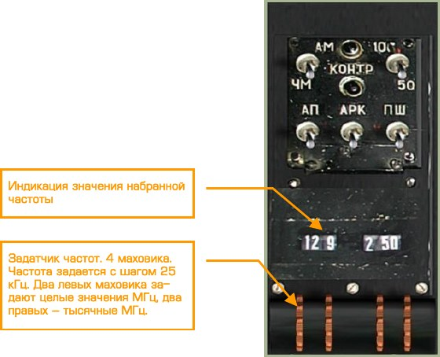
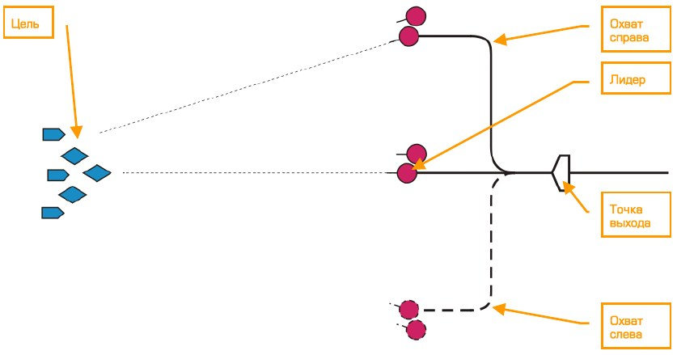
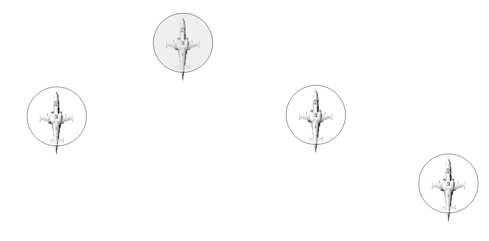
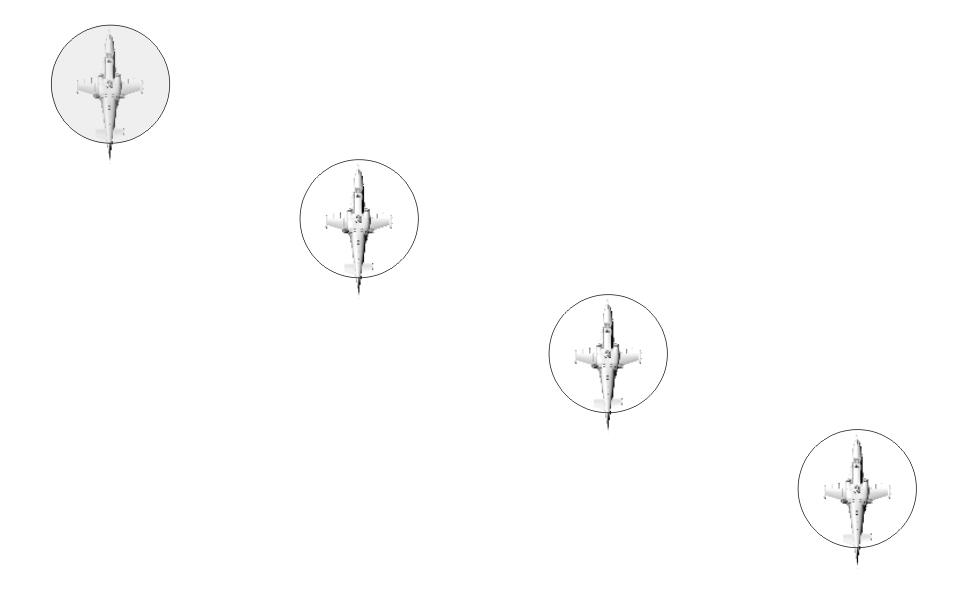
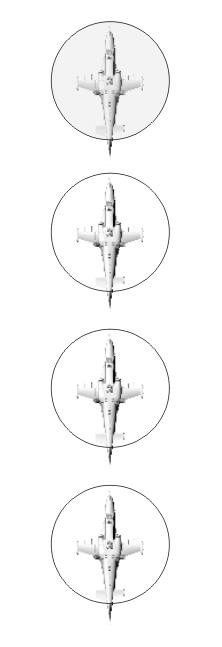
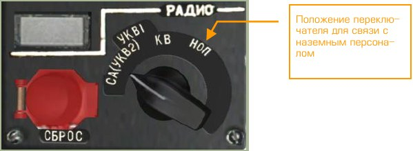
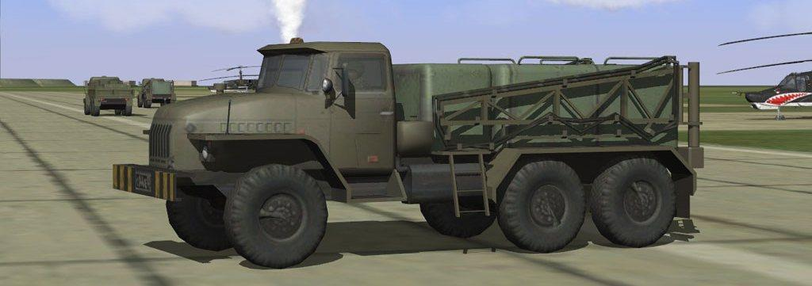
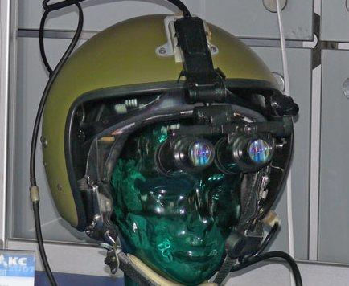

# Радиосообщения и взаимодействие

В игре доступны радиосообщения и радиокоманды для взаимодействия с объектами
виртуального мира: ведомыми вертолётами звена, наземным обслуживающим персоналом, службой управления полетами.

## Радиочастоты

Все доступные через меню радиосвязи сообщения и команды передаются и принимаются через радиостанции. Как в реальности, так и в игре для радиосвязи с любым абонентом необходимым условием является работа радиостанций на общей частоте. Если это условие не соблюдается, сообщение гарантированно не будет принято абонентом.

На вертолёте Ка-50 для связи между вертолётами и наземными службами используется командная УКВ радиостанция Р-800, работающая в метровом (100-149 МГц) и
дециметровом (220-400 МГц) диапазоне волн.

В игре радиосвязь между вертолётами звена ведется на счастоте звена, которая выставляется в редакторе мисси. Радиосвязь с руководителями полетов (РП) на всех
аэродромах ведется на частоте аэродрома. Частоты РП аэродромов указаны в таблице "Данные аэродромов" в главе ПРИЛОЖЕНИЯ.

В случае изменения предустановленных частот для связи с абонентом необходимо
использовать частоту данного абонента.

В реальной жизни УКВ радиосвязь устойчиво работает только в пределах прямой
видимости. В симуляторе также заложены алгоритмы просчета дальности и затенения радиогоризонта рельефом местности. Необходимым условием для передачи сообщения или команды абоненту является прямая видимость и дальность не более
100…150 км. В случае нахождения абонента за пределами дальности или за рельефом местности радиосообщение не будет принято.

Передача телекодовой информации системы внешнего целеуказания (ВЦУ) также
осуществляется через радиостанцию Р-800 с теми же ограничениями.

Передача телекодовой информации корректно работает только в составе звена из
4-х вертолётов с назначенными номерами вертолётов.

В одиночной игре все ведомые звена автоматически выставляют корректные номера, соответствующие положению в звене. В сетевой игре звену вертолётов (до 4х игроков) следует договориться о выделенной частоте в диапазоне станции Р-800 и
назначить номера вертолётов. Выбор частоты возможен с шагом 25 кГц (всего 9200
возможных значений).

!!! attention
    В сетевой игре для использования канала ВЦУ (до 4-х вертолётов) игроки должны
    выставить на радиостанции Р-800 единую частоту связи и распределить номера с
    помощью галетного переключателя КТО Я.

Появление дополнительных игроков на выбранной частоте приведет к некорректному отображению позиций вертолётов звена на дисплее АБРИС и ошибкам передачи данных ВЦУ.

## Наземные службы

К наземным службам в игре относится руководитель полетов (РП) и наземный обслуживающий персонал (НОП).

Необходимым условием функционирования наземных служб является наличие определенных наземных объектов ассоциированных с данными службами. Например,
для ответа на запросы игрока к РП, на аэродроме должна быть неповрежденная
вышка контрольно-диспетчерского пункта, а на вертолётной площадке передвижная машина СКП-11 для красной коалиции или машина M1025 HMMVW для синей
коалиции.

Ниже приводится список необходимых условий работы наземных служб в миссиях
игры.

Служба  | Необходимые объекты (красная коалиция) | Необходимые объекты (синяя коалиция) | Условия
--------|----------------------------------------|--------------------------------------|--------
Аэродром, РП | Здание КДП | Здание КДП | Неразрушено
Аэродром, НОП, перевооружение, дозаправка, электропитание, ремонт | Не требуется | Не требуется | Ремонт производится автоматически в течение 3-х минут после остановки винтов
Площадка, РП | СКП-11, Передовой КП | БМ M1025 HMMWV, Передовой КП | В радиусе 150 метров от центра площадки
Площадка, НОП, перевооружение | ГАЗ-3308, ГАЗ-66, КАМАЗ-43101, КрАЗ-6322, Урал-375 КУНГ, Урал-375, Урал-4320-09-31, Урал-4320T, Передовой склад БП | M818, Передовой склад БП | В радиусе 150 метров от центра площадки
Площадка, НОП, дозаправка | АТМЗ-5, АТЗ-10, Передовой пункт ГСМ | АТЗ М978 HEMTT, Передовой пункт ГСМ | В радиусе 150 метров от центра площадки
Площадка, НОП, электропитание| АПА-5Д, АПА-80 | M818 | В радиусе 150 метров от центра площадки
Площадка, ночное освещение| СКП-11 | БМ M1025 HMMWV | В радиусе 150 метров   от центра площадки
Площадка, Ремонт | УАЗ-469, Урал-4320-09-31, Урал-4320Т, ЗиЛ-131 КУНГ, КАМАЗ-43101, Передовое укрытие - палатка | M818, Передовое укрытие - палатка | В радиусе 150 метров от центра площадки. Ремонт производится автоматически в течение 3-х минут после остановки винтов

Если на аэродроме уничтожена вышка КДП, запросы игрока к РП останутся без ответа, но работа наземных служб по дозаправке и перевооружению возможна.

Если на вертолётной площадке нет объектов наземных служб или существующие
объекты уничтожены, любые запросы игрока останутся без ответа.

Запросы игрока к площадке противоположной коалиции также останутся без ответа.

Ремонт вертолёта игрока осуществляется в зоне аэродрома или площадки в течение
3-х минут после остановки винтов

## Меню команд

Вызов меню команд производится нажатием клавиши [[\]].

При этом игроку будет доступно меню команд:

- [[F1]] Звено…
- [[F2]] 2-й Ведомый…
- [[F3]] 3-й Ведомый…
- [[F4]] 4-й Ведомый…
- [[F5]] РП…
- [[F8]] Наземный персонал…

Пункты «Звено…», «2-й Ведомый…», «3-й Ведомый…», «4-й Ведомый…» позволяют
отдавать команды всему звену или каждому ведомому индивидуально. Пункт «РП…»
позволяет взаимодействовать с руководителем полетов. Пункт «Наземный персонал…» позволяет взаимодействовать с наземным обслуживающим персоналом.

Выход из меню команд осуществляется нажатием клавиши [[F12]] или [[ESC]].

Названия сообщений и команд меню отличаются от их произношения (звукового сообщения). Это связано со спецификой радиообмена и терминологии ВВС.

Описание команд и способы взаимодействия со всеми объектами приводятся ниже.

### Меню команд звена

Вызов меню команд производится последовательным нажатием клавиш:

- [[\]] Команды → [[F1]] Звено...

Группа команд звена:

- [[F1]] – Атаковать…
- [[F2]] – Охват…
- [[F3]] – Следуй…
- [[F4]] – Прикрой меня
- [[F5]] – Боевой порядок…
- [[F6]] – Держать позицию
- [[F7]] – Сбор
- [[F10]] – Подвески, сброс

### Меню команд ведомых

Вызов меню команд для ведомых производится последовательным нажатием клавиш:

- [[\]] Команды → [[F2]] 2-й Ведомый …
- [[\]] Команды → [[F3]] 3-й Ведомый …
- [[\]] Команды → [[F4]] 4-й Ведомый …

Меню команд ведомых в основном повторяет команды звена:

- [[F1]] – Атаковать…
- [[F2]] – Охват…
- [[F3]] – Следуй…
- [[F4]] – Прикрой меня
- [[F5]] – Разведка…
- [[F6]] – Держать позицию
- [[F7]] – Сбор
- [[F10]] – Подвески, сброс

### Атаковать

Группа команд «Атаковать» предназначена для боевого управления ведомыми вертолётами звена и руководства атаками различных целей. Команды можно отдавать
как всему звену, так и каждому ведомому индивидуально.

Группа радиокоманд, позволяющая отдать приказ на атаку всем ведомым звена, вызывается последовательным нажатием клавиш:

- [[\]] Команды → [[F1]] Звено → [[F1]] Атаковать…

Группа радиокоманд, позволяющая отдать приказ на атаку отдельным ведомым, вызывается последовательным нажатием клавиш:

- [[\]] Команды → [[F2]] 2-й Ведомый → [[F1]] Атаковать…
- [[\]] Команды → [[F3]] 3-й Ведомый → [[F1]] Атаковать…
- [[\]] Команды → [[F4]] 4-й Ведомый → [[F1]] Атаковать…

При этом игроку (лидеру группы) будет доступно меню команд атаки:

- [[F1]] – Мою цель
- [[F2]] – Моего противника
- [[F3]] – Воздушные цели
- [[F4]] – Объекты ПВО
- [[F5]] – Наземные цели
- [[F6]] – Выполнить задачу и сбор
- [[F7]] – Выполнить задачу и возврат на точку
- [[F8]] – Цель ВЦУ...

#### Атаковать мою цель

По команде «Атаковать мою цель» ведомые прекращают выполнение текущей задачи и начинают атаку цели игрока. Целью игрока считается цель, находящаяся в
падлоке игрока или захвате комплексом Шквал вертолёта игрока.

Следовательно, на момент отдачи команды «Атаковать мою цель» лидер группы
(игрок) должен иметь цель, захваченную в падлок, или цель, захваченную собственным прицельным комплексом.

#### Атаковать моего противника

По команде «Атаковать моего противника» ведомые прекращают выполнение текущей задачи и начинают атаку противника, угрожающего вертолёту игрока (ЛА противника, ПВО противника).

При этом ведомые анализируют обстановку и начинают атаку наиболее угрожающего вертолёту игрока объекта противника.

#### Атаковать воздушные цели

По команде «Атаковать воздушные цели» ведомые прекращают выполнение текущей задачи и начинают поиск и атаку воздушных целей – вертолётов противника в
пределах визуальной видимости в соответствии с условиями обнаружения целей.

Дальность и вероятность обнаружения воздушных целей зависит от условий видимости и уровня подготовки ведомых. При определенных условиях ведомые не способны обнаружить цель, в этом случае они докладывают о невозможности выполнения приказа.

#### Атаковать объекты ПВО

По команде «Атаковать объекты ПВО» ведомые прекращают выполнение текущей
задачи и начинают вести поиск и атаку средств ПВО противника в пределах визуальной видимости в соответствии с условиями обнаружения целей.

После получения команды и при наличии запаса ПТУР вертолёты ИИ будут атаковать радиолокационные средства стационарных комплексов ПВО (С-300, Бук, Куб,
Patriot, Hawk), а также мобильные войсковые комплексы и машины ПВО (Тор,
Стрела, Оса, Avenger, Linebacker и др.) с максимально возможной дальности.
В случае отсутствия ПТУР вертолёты ИИ не будут атаковать ракетные комплексы
ПВО, но смогут атаковать ствольную зенитную артиллерию (Шилка, Вулкан, ЗУ-23)
с помощью НАР.

Расчеты ПЗРК обнаруживаются вертолётами ИИ только по факту пуска ракеты.

#### Атаковать наземные цели

По команде «Атаковать наземные цели» ведомые прекращают выполнение текущей
задачи и начинают вести поиск и атаку наземных целей противника в пределах визуальной видимости в соответствии с условиями обнаружения целей.

В категорию наземных целей входит подвижная и неподвижная техника противника.
После получения команды вертолёты ИИ будут атаковать технику противника в соответствии с приоритетом. Большим приоритетом пользуются средства ПВО и боевая техника, меньшим – невооруженная техника.

В случае отсутствия ПТУР и НАР вертолёты ИИ будут атаковать технику противника,
используя пушечные и пулеметные стрелковые установки, но только при отсутствии
в зоне действия средств ПВО противника.

#### Выполнить задачу и сбор

По команде «Выполнить задачу и сбор» ведомые прекращают выполнение текущей
задачи и выполняют атаку цели миссии. После выполнения задачи ведомые возвращаются в боевой порядок.

#### Выполнить задачу и возврат на точку

По команде «Выполнить задачу и возврат на точку» ведомые прекращают выполнение текущей задачи и выполняют атаку цели миссии. После выполнения задачи ведомые самостоятельно возвращаются на аэродром посадки.

#### Атаковать цель ВЦУ

Группа команд «Атаковать цель ВЦУ» предназначена для атаки различных целей
распределенных между вертолётами звена по каналам системы внешнего целеуказания. Команды можно отдавать как всему звену, так и каждому ведомому индивидуально.

Группа радиокоманд, позволяющая отдать приказ на атаку всем ведомым звена, вызывается последовательным нажатием клавиш:

- [[\]] Команды → [[F1]] Звено → [[F1]] Атаковать → [[F8]] Цель ВЦУ…

Группа радиокоманд, позволяющая отдать приказ на атаку отдельным ведомым, вызывается последовательным нажатием клавиш:

- [[\]] Команды → [[F2]] 2-й Ведомый → [[F1]] Атаковать → [[F8]] Цель ВЦУ…
- [[\]] Команды → [[F3]] 3-й Ведомый → [[F1]] Атаковать → [[F8]] Цель ВЦУ…
- [[\]] Команды → [[F4]] 4-й Ведомый → [[F1]] Атаковать → [[F8]] Цель ВЦУ…

При этом игроку (лидеру группы) будет доступно меню команд атаки:

- [[F1]] – Цель
- [[F2]] – Цели
- [[F3]] – Цель по типу
- [[F4]] – Цели по типу

1.   По команде «Цель ВЦУ - Цель» ведомые прекращают выполнение текущей
задачи и выполняют атаку ближайшей цели (группы) к переданной точке.
2.   По команде «Цель ВЦУ - Цели» ведомые прекращают выполнение текущей
задачи и выполняют атаку всех целей в радиусе 3 км от переданной
точки.
3.   По команде «Цель ВЦУ – Цель по типу» ведомые прекращают выполнение
текущей задачи и выполняют атаку ближайшей цели (группы) к переданной точке в соответствии с переданным типом цели (ПВО, техника, другие).
4.   По команде «Цель ВЦУ – Цель по типу» ведомые прекращают выполнение
текущей задачи и выполняют атаку целей в радиусе 3 км от переданной
точки в соответствии с переданным типом цели (ПВО, техника, другие).

После выполнения задачи ведомые возвращаются в боевой порядок.

## Условия обнаружения целей

Для летательных аппаратов, находящихся под управлением ИИ, в симуляторе разработана новая модель визуального обнаружения целей, учитывающая следующие
факторы:

- Геометрия кабины ЛА. Обнаружение целей происходит в секторах, видимых через остекление кабины. Например, ЛА типа Су-25 или Ка-50 из-за
особенностей остекления имеют меньший сектор обнаружения в задней
полусфере, чем ЛА с каплевидным фонарем (например, А-10 или Су-27).
- Угловой размер цели. Дальность обнаружения цели зависит от ее углового
размера. Чем больше или чем ближе цель, тем быстрее она будет обнаружена. Например, корабль вдалеке будет обнаружен одновременно с танком на близком расстоянии, т.к. они будут иметь одинаковые угловые размеры.
- Освещенность солнцем (без учета закрытия солнца кучевыми облаками).
Днем освещенность солнца выше, соответственно выше дальность и
меньше время обнаружения цели. Ночью цели визуально не обнаруживаются.
- Закрытие цели объектами. Проверяется закрытие цели объектами мира
(рельеф, сооружения). Если цель закрыта объектом мира - она не обнаруживается.
- Туман. Проверяется наличие и плотность тумана, закрывающего цель. От
этого зависит дальность и время обнаружения цели. В плотном тумане
цель не обнаруживается.
- Сплошная облачность. Проверяется наличие сплошной облачности на линии визирования цели. Если цель находится под облачным слоем - она не
обнаруживается.
- Группы целей. Если рядом с обнаруженной целью находятся другие цели,
время их обнаружения уменьшается. Групповая цель обнаруживается
быстрее одиночной.

Максимальная дальность обнаружения объекта типа «танк» составляет около 7 км.

Дальность «мгновенного» обнаружения составляет около 2,5 км. Чем меньше скорость ЛА, тем выше вероятность обнаружить цель.

## Манёвр охвата

Манёвр охвата может использоваться для атаки цели с разных направлений. В симуляторе для группы вертолётов используются две команды охвата: «охват справа»
и «охват слева».

Манёвр охвата целесообразно производить после пролета точки выхода на цель в
соответствии с типом цели и боевой обстановкой, на дальности, превышающей
дальность обнаружения средств ПВО противника. В общем случае, при выходе к
цели на малых и сверхмалых высотах, дальность начала манёвра охвата от точки
цели может составлять 8-15 км.

При необходимости можно отдать команды на охват цели с обеих сторон. Например,
третьему ведомому отдать команду «охват справа», четвертому – «охват слева», а
самому атаковать цель с прямого курса вместе со вторым ведомым.

После подтверждения ведомыми начала выполнения маневра охвата лидеру группы
целесообразно снизить скорость и подождать завершения маневра, после чего дать
приказ на атаку.

Группа радиокоманд, позволяющая отдать приказ на охват всем ведомым звена, вызывается последовательным нажатием клавиш:

- [[\]] Команды → [[F1]] Звено → [[F2]] Охват…

Группа радиокоманд, позволяющая отдать приказ на охват отдельным ведомым, вызывается последовательным нажатием клавиш:

- [[\]] Команды → [[F2]] 2-й Ведомый → [[F2]] Охват…
- [[\]] Команды → [[F3]] 3-й Ведомый → [[F2]] Охват…
- [[\]] Команды → [[F4]] 4-й Ведомый → [[F2]] Охват…

При этом игроку (лидеру группы) будет доступно меню команд охвата:

- [[F1]] – Справа
- [[F2]] – Слева

#### Охват справа

По команде «охват справа» ведомые производят отворот из боевого порядка на 90°
вправо, затем, достигнув удаления 3 км от точки отворота, разворачиваются влево
на начальный курс.

#### Охват слева

По команде «охват слева» ведомые производят отворот из боевого порядка на 90°
влево, затем, достигнув удаления 3 км от точки отворота, разворачиваются вправо
на начальный курс.

## Команды следования

Команды следования используются для указания пути следования и руководства
действиями ведомых вертолётов звена.

Группа радиокоманд, позволяющая отдать приказ на следование всем ведомым
звена, вызывается последовательным нажатием клавиш:

- [[\]] Команды → [[F1]] Звено → [[F3]] Следуй…

Группа радиокоманд, позволяющая отдать приказ на следование отдельным ведомым, вызывается последовательным нажатием клавиш:

- [[\]] Команды → [[F2]] 2-й Ведомый → [[F3]] Следуй…
- [[\]] Команды → [[F3]] 3-й Ведомый → [[F3]] Следуй…
- [[\]] Команды → [[F4]] 4-й Ведомый → [[F3]] Следуй…

При этом игроку (лидеру группы) будет доступно меню команд следования:

- [[F1]] – Возврат на точку
- [[F2]] – По маршруту
- [[F3]] – Точка ВЦУ

#### Следуй возврат на точку

По команде «Следуй возврат на точку» ведомые прекращают выполнение текущей
задачи и выполняют возврат на аэродром посадки. В российской военной авиационной терминологии понятие «точка» обозначает аэродром.

#### Следуй по маршруту

По команде «Следуй по маршруту» ведомые прекращают выполнение текущей задачи и следуют по текущему маршруту до аэродрома посадки.

#### Следуй на точку ВЦУ

По команде «Следуй на точку ВЦУ» ведомые прекращают выполнение текущей задачи и следуют на точку, переданную через канал внешнего целеуказания (ВЦУ).

При достижении точки ВЦУ ведомые переходят в режим висения и ожидают дальнейших указаний.

## Прикрой меня

Команда «Прикрой меня» используется в боевой обстановке в случае наличия
угрозы вертолёту игрока со стороны ЛА противника.

После получения этой команды ведомые вертолёты звена игрока прекращают выполнение текущей задачи и осуществляют прикрытие игрока. В случае обнаружения
ЛА противника, угрожающего вертолёту игрока, ведомые без отдельной команды
начинают его атаку.

Группа радиокоманд, позволяющая отдать приказ на прикрытие всем ведомым
звена, вызывается последовательным нажатием клавиш:

- [[\]] Команды → [[F1]] Звено → [[F4]] Прикрой меня

Группа радиокоманд, позволяющая отдать приказ на прикрытие отдельным ведомым, вызывается последовательным нажатием клавиш:

- [[\]] Команды → [[F2]] 2-й Ведомый → [[F4]] Прикрой меня
- [[\]] Команды → [[F3]] 3-й Ведомый → [[F4]] Прикрой меня
- [[\]] Команды → [[F4]] 4-й Ведомый → [[F4]] Прикрой меня

## Разведка

Проведение разведки необходимо перед атакой в случае отсутствия точной информации о целях.

В симуляторе лидеру группы (игроку) доступен ряд команд, предназначенных для
организации разведки силами ведомых вертолётов. Приказы отдаются каждому ведомому индивидуально.

Разведка заключается в полете по заданному курсу на заданную глубину или полете в заданную через ВЦУ точку. После получения команды вертолёт-разведчик
следует на малой высоте в режиме сканирования местности прицельным комплексом Шквал. Сканирование производится в секторе ±35° от оси вертолёта. При обнаружении объекта противника разведчик производит опознавание типа объекта и
определение координат, после чего передает координаты и тип цели по каналу ВЦУ
лидеру группы (игроку).

После достижения заданной глубины разведки ведомый докладывает о выполнении
задачи и возвращается в боевой порядок.

Дальность обнаружения целей зависит от уровня подготовки вертолёта-разведчика:

-   Превосходный - дальность обнаружения до 8 км.
-   Высокий - дальность обнаружения до 6 км.
-   Средний - дальность обнаружения до 4 км.

Стоит учитывать, что с уменьшением уровня подготовки ведомого возрастает вероятность пропуска цели.

Как и в реальной жизни, выполнение задачи «разведка» не гарантирует обнаружение всех целей в районе.

Группа радиокоманд, позволяющая отдать приказ на разведку отдельным ведомым,
вызывается последовательным нажатием клавиш:

- [[\]] Команды → [[F2]] 2-й Ведомый → [[F5]] Разведка…
- [[\]] Команды → [[F3]] 3-й Ведомый → [[F5]] Разведка…
- [[\]] Команды → [[F4]] 4-й Ведомый → [[F5]] Разведка…

При этом игроку (лидеру группы) будет доступно меню задания глубины разведки:

- [[F1]] – На глубину 1 км
- [[F2]] – На глубину 2 км
- [[F3]] – На глубину 3 км
- [[F4]] – На глубину 5 км
- [[F5]] – На глубину 8 км
- [[F6]] – На глубину 10 км
- [[F7]] – К точке ВЦУ

#### Разведка на глубину

После получения команды вертолёт-разведчик начнет двигаться на малой высоте
по заданному курсу в режиме сканирования местности на указанную глубину (1, 2,
3, 5, 8, 10 км). Заданный курс определяется по текущему курсу лидера группы (игрока) в момент получения команды ведомым.

#### Разведка к точке ВЦУ

После получения команды вертолёт-разведчик начнет двигаться на малой высоте в
режиме сканирования местности по прямой в последнюю переданную по ВЦУ точку.

Точкой может являться цель, оперативная точка или точка выхода.

## Боевой порядок группы вертолётов

Боевой порядок группы является тактическим построением группы на различных
этапах полета и ведения боевых действий.

Боевой порядок строится с учётом выполняемой задачи, способа действий, применяемых средств поражения, ожидаемого противодействия ПВО противника и уровня
подготовки экипажей. Боевой порядок имеет три измерения: дистанция, интервал и
высота. В зависимости от значений этих параметров боевой порядок может быть сомкнутым и разомкнутым. В сомкнутом боевом порядке экипажи выполняют полет на
минимально допустимых по условиям безопасности интервалах и дистанциях, в
разомкнутом — на увеличенных дистанциях и интервалах в пределах визуальной
видимости.

Группа радиокоманд, позволяющая управлять боевым порядком группы, вызывается последовательным нажатием клавиш:

- [[\]] Команды → [[F1]] Звено → [[F5]] Боевой порядок…

В каждой момент доступны только те команды боевых порядков, которые применимы в данной ситуации. Например, если полёт выполняется в строю Клин, то
команда Клин будет отсутствовать в меню. Также, если порядок сомкнутый, то соответствующая команда также будет отсутствовать.

Полное меню команд управления боевым порядком:

- [[F1]] – Клин
- [[F2]] – Пеленг
- [[F3]] – Фронт
- [[F4]] – Колонна
- [[F5]] – Замыкающему назад, 1500
- [[F6]] – Слева
- [[F7]] – Справа
- [[F8]] – Парадный
- [[F9]] – Сомкнутый
- [[F10]] – Разомкнутый

С помощью приведенных выше команд игрок может сформировать каждый из трех
боевых порядков звена «клин», «пеленг», «фронт» в правом или левом построении
и трех вариантах плотности: «парадный», «сомкнутый», «разомкнутый».
Для боевого порядка «колонна» применяются только команды плотности: «парадный», «сомкнутый», «разомкнутый».

#### Боевой порядок «Клин»

Боевой порядок «парадный правый клин» используется в симуляторе по умолчанию.
Лидер группы (игрок) находится впереди, слева от него - второй ведомый, справа –
третий ведомый, далее - четвертый ведомый.

#### Боевой порядок «Пеленг»

В боевом порядке «правый пеленг» лидер группы (игрок) находится впереди с левого края, правее и сзади находится второй, а далее - третий и четвертый ведомые.

Боевой порядок «пеленг» применяется для быстрого и скрытного полета. В разомкнутом порядке ведомые имеют хороший обзор, свободу маневра и обеспечивают
оборону своего ведущего.

#### Боевой порядок «Фронт»

В боевом порядке «правый фронт» лидер группы находится с левого края, правее
находится второй, а далее - третий и четвертый ведомые.

Боевой порядок «фронт» применяется в бою для свободы маневра каждого вертолёта и максимальной концентрации огневого воздействия на противника. Секторы
обзора и ведения огня вертолётов перекрываются, что позволяет сосредоточить
удар на наиболее приоритетных целях.

#### Боевой порядок «Колонна»

В боевом порядке «колонна» лидер группы (игрок) находится впереди, сзади от
него последовательно выстраиваются второй, третий и четвертый ведомые.

Боевой порядок «колонна» применяется при быстром и скрытном перемещении в
холмистой и гористой местности для уменьшения риска столкновения с землёй ведомых вертолётов.

#### Назначение замыкающего вертолёта наблюдателем

С помощью радиокоманды «Замыкающему назад, 1500» лидер группы (игрок) может назначить наблюдателем крайнего ведомого в группе. После получения команды ведомый занимает место позади группы на удалении 1500 метров.
Вертолёт-наблюдатель имеет хороший обзор своей группы и окружающей местности, что позволяет ему своевременно предупреждать вертолёты группы об обнаруженных угрозах.

#### Левые и правые боевые порядки

Боевые порядки «клин», «пеленг» и «фронт» могут строиться в правую и левую
сторону от лидера (игрока). В зависимости от стороны построения они называются
правыми или левыми.

Например: боевой порядок «левый фронт» образуется при последовательном построении ведомых по левую руку от лидера.
В симуляторе по умолчанию приняты правые боевые порядки.

#### Плотность боевых порядков

В реальной жизни боевые порядки звена могут быть сомкнутыми и разомкнутыми. В
симуляторе введен дополнительный, максимально плотный боевой порядок – парадный.

-   Парадный боевой порядок. Вертолёты расположены с минимально допустимыми дистанциями и интервалами. Расстояние между вертолётами около 50 м.
-   Сомкнутый боевой порядок. Используется для скрытного перемещения
на маршруте. Расстояние между вертолётами - около 100 м.
-   Разомкнутый боевой порядок. Используется в бою для свободы маневра и применения оружия. Расстояние между вертолётами - около 200
м.

### Восстановление боевого порядка

При ведении боевых действий боевой порядок группы распадается, ведомые атакуют выявленные цели и выполняют оборонительные маневры. При необходимости
восстановить боевой порядок лидер группы (игрок) может воспользоваться командой «Сбор».

- [[\]] Команды → [[F1]] Звено → [[F7]] Сбор

После получения команды «Сбор» ведомые подтверждают получение приказа, прекращают выполнение текущих задач и возвращаются в боевой порядок. После занятия своего места в боевом порядке ведомый докладывает: «2-й (3-й, 4-й) справа
(слева) на месте».

## Держать позицию 

По команде «Держать позицию» ведомые прекращают выполнение текущей задачи
и встают в пологий вираж над указанной точкой до дальнейших указаний.
Группа команд, позволяющая отдать приказ «Держать позицию» всем ведомым
звена, вызывается последовательным нажатием клавиш:

- [[\]] Команды → [[F1]] Звено… → [[F6]] Держать позицию

Группа команд, позволяющая отдать приказ «Держать позицию» отдельным ведомым, вызывается последовательным нажатием клавиш:

- [[\]] Команды → [[F2]] 2-й Ведомый → [[F6]] Держать позицию
- [[\]] Команды → [[F3]] 3-й Ведомый → [[F6]] Держать позицию
- [[\]] Команды → [[F4]] 4-й Ведомый → [[F6]] Держать позицию

## Сброс подвесок

При получении команды «Сброс подвесок» ведомые вертолёты производят сброс
всех наружных подвесок.

Сброс подвесок позволяет облегчить вертолёт для улучшения маневренности, повышения запаса по тяге, уменьшения лобового сопротивления и повышения дальности
полета.

Сброс подвесок применяют в аварийных и экстренных ситуациях. Например, в случае выполнения экстренных противозенитных маневров, при повреждениях вертолёта и потере тяги двигателей, нехватке топлива.
После сброса всего оружия на подвесках ведомые, как правило, не имеют возможности продолжать выполнение боевой задачи, т.к. из вооружения у них остается
только встроенная пушка.

Группа радиокоманд, позволяющая отдать приказ на сброс подвесок всем ведомым
звена, вызывается последовательным нажатием клавиш:

- [[\]] Команды → [[F1]] Звено → [[F10]] Сброс подвесок

Группа радиокоманд, позволяющая отдать приказ на сброс подвесок отдельным ведомым, вызывается последовательным нажатием клавиш:

- [[\]] Команды → [[F2]] 2-й Ведомый → [[F10]] Сброс подвесок
- [[\]] Команды → [[F3]] 3-й Ведомый → [[F10]] Сброс подвесок
- [[\]] Команды → [[F4]] 4-й Ведомый → [[F10]] Сброс подвесок

## Руководство полётами

Группа радиосообщений, относящаяся к взаимодействию с руководителем полетов
(РП), включает в себя меню запросов на выполнение запуска двигателей, руления,
взлета и возврата на аэродром.

Группа сообщений-запросов к руководителю полетов вызывается последовательным
нажатием клавиш:

- [[\]] Команды → [[F5]] РП…

После этого появится меню с позывными РП 10-ти ближайших аэродромов и вертолётных площадок F1…F10. После выбора требуемого РП будет доступны соответсвующие запросы уместные в текущей ситуации.

!!! attention "Внимание!"
	НЕ ВСЕ КОМАНДЫ И ЗАПРОСЫ ДОСТУПНЫ В ЛЮБОЙ
    МОМЕНТ ВРЕМЕНИ, ТОЛЬКО ИМЕЮЩИЕ СМЫСЛ

Например, если ваша группа в воздухе, то в меню отсуствуют запросы на запуск и
взлет, но есть запросы на возврат и посадку.

- Полный список команд:
- Запрос на запуск
- Запрос на руление
- Запрос на контрольное висение
- Запрос на взлет
- Возврат на точку
- Запрос на посадку
- Прибой

#### Запрос на запуск

Игрок запрашивает у руководителя полетов (РП) разрешение на запуск двигателей.
Если погодные условия не превышают ограничение на запуск двигателя, РП дает
разрешение на запуск. Максимальная скорость ветра, при которой разрешается запуск двигателей, составляет 20 м/с для встречного и 10 м/с для бокового и попутного ветров.

#### Запрос на руление

Игрок запрашивает у руководителя полетов (РП) разрешение на выруливание. Если
погодные условия не превышают ограничение на руление, РП дает разрешение на
выруливание. Максимальная скорость ветра, при которой разрешается руление, составляет 20 м/с для встречного и 10 м/с для бокового и попутного ветров.

#### Запрос на контрольное висение

Игрок запрашивает у руководителя полетов (РП) разрешение на контрольное висение. Если погодные условия не превышают ограничение на взлет, РП дает разрешение на контрольное висение. Максимальная скорость ветров бокового и попутного
направлений, при которой разрешается взлет, составляет 10 м/с.

#### Запрос на взлёт

Игрок запрашивает руководителя полётов (РП) разрешение на взлет. При отсутствии других ЛА в зоне взлёта и допустимых погодных условиях, РП даёт разрешение на взлет. Максимальная скорость ветров бокового и попутного направлений,
при которой разрешается взлет, составляет 10 м/с.

#### Возврат на точку

Игрок запрашивает у руководителя полетов (РП) информацию для возврата на
аэродром (площадку). РП сообщает игроку курс (в градусах), удаление до точки (в
километрах), давление полосы или площадки в миллиметрах ртутного столба и рекомендует занять высоту круга. Высота круга на каждом аэродроме может устанавливаться индивидуально согласно схеме, но в общем случае можно принять стандартную высоту вертолётного круга, равную 300 м.

#### Запрос на посадку

При подходе к точке с рубежа 5 км у игрока появляется возможность запросить у
руководителя полетов (РП) разрешение на посадку. В случае, если полоса свободна,
РП дает разрешение и сообщает посадочный курс, а также направление и скорость
ветра у земли. Если полоса или площадка занята, РП запрещает посадку и дает указание уходить на второй круг. После освобождения полосы, РП без запроса дает
разрешение на посадку.

Если игрок не произвел запрос на посадку, на удалении 1 км РП сообщает о возможности посадки и параметры ветра.

#### Прибой

Запрос «прибой» подается автоматическому радиопеленгатору аэродрома при потере ориентировки в полете.
В реальности запрос «прибой» подается в случае потери ориентировки в полете
при отказе навигационного оборудования, сложных метеоусловиях или ночью. Запрос принимается автоматическим радиопеленгатором (АРП) на аэродроме, после
чего оператор АРП сообщает прямой курс на аэродром.
В игре, в случае потери ориентировки игрок может запросить «прибой». После запроса ему будет сообщен «прибой» - прямой курс на ближайший аэродром или площадку. Для выхода на аэродром требуется направить вертолёт по указанному курсу.

## Наземная подготовка - НОП
Группа команд, относящаяся к наземному обслуживающему персоналу (НОП), включает в себя меню подвески вооружения, заправки топливом, выбора источника
электроснабжения, выбора нашлемного устройства и подключения ВСУ к турбоприводу.

В реальной жизни все виды подготовки выполняет наземный обслуживающий персонал, связь с которым поддерживается через вертолётное переговорное устройство (СПУ) и абонентский аппарат персонала (радиотелефонная гарнитура, подключаемая к СПУ соединительным шнуром) при установке галетного переключателя на
левом пульте в положение НОП.

На «холодном» вертолёте летчик поддерживает связь с наземным персоналом голосом через открытую дверь кабины.

По аналогии с реальной жизнью в симуляторе реализовано два метода связи с
наземным персоналом:

- Связь через СПУ и абонентский аппарат. Доступна при установке галетного переключателя на панели радио левого пульта в положение НОП и
включенном переключателе АВСК на боковой панели.
- Связь голосом на «холодном» вертолёте при открытой двери кабины. При
этом двигатели вертолёта, ВСУ и винты должны быть остановлены.

На аэродромах связь с наземным персоналом обеспечивается только на бетонном
покрытии. На вертолётных площадках – на всей территории площадки.

После получения команды наземный персонал должен выдать квитанцию - подтверждение приема фразой: «Принял». В случае отсутствия подтверждения команда
считается не принятой абонентом. При этом стоит обратить внимание на установку
галетного переключателя на панели радио, либо на факторы, мешающие прохождению голосовой команды: закрытая дверь, шум от двигателей, ВСУ или винтов вертолёта.

Время выполнения команды зависит от операции и составляет от 1 до 3-х минут.

Группа команд, относящаяся к наземной подготовке, вызывается последовательным
нажатием клавиш:

- [[\]] Команды → [[F8]] Наземный персонал…

При этом игроку будет доступны следующие подгруппы команд:

- [[F1]] – Перезарядка и заправка
- [[F2]] – Наземное электропитание...
- [[F3]] – Запрашиваю ремонт
- [[F4]] – Сменить нашлемное устройство...
- [[F5]] – Подключение турбопривода...

### Перезарядка и заправка

Вызов окна перевооружения производится последовательным нажатием клавиш:

- [[\]] Команды → [[F8]] Наземный персонал… → [[F1]] Перезарядка и заправка

Из имеющихся в симуляторе схем подвесок вооружения игрок может выбрать подвеску вооружения, соответствующую задаче вылета:

- По заданию
- Противотанковые
- Перегоночный вариант
- Облегчённые
- Дальний удар
- Авиационная поддержка

#### Схема по заданию

Схема вооружения по заданию определена в миссии и подвешена по умолчанию.

#### Противотанковые задачи

Группа схем подвески для выполнения задач по уничтожению бронетанковой техники. Схемы оптимизированы для достижения максимальных противотанковых возможностей вертолёта.

- 12*9А4172; 2*УПК-23; 2А42 (12 ПТУР «Вихрь», 2 подвесных пушечных контейнера УПК-23, боекомплект пушки).
- 12*9А4172; 2*КМГУ (ПТАБ); 2А42 (12 ПТУР «Вихрь», 2 КМГУ с противотанковыми бомбами ПТАБ-2,5, боекомплект пушки).
- 12*9А4172; 10*С-13; 2А42 (12 ПТУР «Вихрь», 10 НАР С-13, боекомплект
пушки).
- 12*9А4172; 40*С-8КОМ; 2А42 (12 ПТУР «Вихрь», 40 НАР С-8КОМ, боекомплект пушки).

#### Перегоночный вариант

Группа схем подвески для перегонки, перебазирования и дальних перелетов. Схемы
оптимизированы для достижения максимальной дальности полёта без подвесного
оружия.

- 2*ПТБ (2 ПТБ по 440 кг).
- 4*ПТБ (4 ПТБ по 440 кг).

#### Облегчённые схемы

Группа схем подвески для выполнения задач в условиях высокогорья и жаркого
климата. Схемы оптимизированы для использования в условиях повышенных температур и при действии с высокогорных площадок.

При действиях в высокогорье и при повышенной температуре воздухе тяга двигателей падает, в этих условиях используются более лёгкие варианты подвесок оружия,
для наличия достаточного запаса тяги при выполнении взлёта по-вертолётному.

- 10*С-13; 2А42 (10 НАР С-13, боекомплект пушки).
- 12*9А4172; 2А42 (12 ПТУР «Вихрь», боекомплект пушки).
- 2*УПК-23; 2А42 (2 подвесных пушечных контейнера УПК-23, боекомплект
пушки).
- 40*С-8КОМ; 2А42 (40 НАР С-8КОМ, боекомплект пушки).
- 6*9А4172; 2А42 (6 ПТУР «Вихрь», боекомплект пушки).

#### Дальний удар

Группа схем подвески для выполнения ударных задач на максимальных дальностях
действия. Схемы оптимизированы для достижения повышенной дальности полета с
двумя подвесными баками и оружием на двух внешних точках подвески.

- 2*ПТБ; 2*КМГУ (ПТАБ); 2А42 (2 ПТБ по 440 кг, 2 КМГУ с противотанковыми
бомбами ПТАБ-2,5, боекомплект пушки).
- 2*ПТБ; 2*КМГУ (АО); 2А42 (2 ПТБ по 440 кг, 2 КМГУ с осколочными бомбами
АО-2,5, боекомплект пушки).
- 2*ПТБ; 10*С-13; 2А42 (2 ПТБ по 440 кг, 10 НАР С-13, боекомплект пушки).
- 2*ПТБ; 12*9А4172; 2А42 (2 ПТБ по 440 кг, 12 ПТУР «Вихрь», боекомплект
пушки).
- 2*ПТБ; 2*УПК-23; 2А42 (2 ПТБ по 440 кг, 2 подвесных пушечных контейнера
УПК-23, боекомплект пушки).
- 2*ПТБ; 2*ФАБ-250; 2А42 (2 ПТБ по 440 кг, 2 ФАБ-250, боекомплект пушки).
- 2*ПТБ; 2*ФАБ-500; 2А42 (2 ПТБ по 440 кг, 2 ФАБ-500, боекомплект пушки).
- 2*ПТБ; 40*С-8КОМ; 2А42 (2 ПТБ по 440 кг, 40 НАР С-8КОМ, боекомплект
пушки).

#### Авиационная поддержка

Группа схем подвески для выполнения задач по непосредственной авиационной
поддержке сухопутных частей на поле боя. Схемы оптимизированы для уничтожения различных типов целей на поле боя: бронированной и небронированной техники, позиций артиллерии, огневых точек и живой силы противника.

- 10*С-13; 2А42 (10 НАР С-13, боекомплект пушки).
- 4*УПК-23; 2А42 (4 подвесных пушечных контейнера УПК-23, боекомплект
пушки).
- 4*КМГУ (АО); 2А42 (4 КМГУ с осколочными бомбами АО-2,5, боекомплект
пушки).
- 4*КМГУ (ПТАБ); 2А42 (4 КМГУ с противотанковыми бомбами ПТАБ-2,5, боекомплект пушки).
- 4*ФАБ-250; 2А42 (4 бомбы ФАБ-250, боекомплект пушки).
- 4*ФАБ-500; 2А42 (4 бомбы ФАБ-500, боекомплект пушки).
- 80*С-80КОМ; 2А42 (80 НАР С-8КОМ, боекомплект пушки).

### Наземное электропитание

В штатной ситуации запуск вертолёта на аэродромах и площадках производится от
внешнего источника электроэнергии – аэродромного подвижного электроагрегата
(АПА). Проверка оборудования и запуск двигателей от бортовых аккумуляторов допускается только в нештатной ситуации или в боевой обстановке при отсутствии
АПА.

Аэродромный подвижной электроагрегат АПА предназначен для питания бортового
оборудования и аппаратуры летательных аппаратов при обслуживании их в наземных условиях, а также для электростартерного запуска авиационных двигателей.

Вызов меню команд подключения наземного электропитания производится последовательным нажатием клавиш:

- [[\]] Команды → [[F8]] Наземный персонал… → [[F2]] Наземное электропитание…

Группа команд наземного источника электропитания:

- [[F1]] – Подключить
- [[F2]] – Отключить

По умолчанию, при «холодном» старте вертолёта в начале миссии, наземное электропитание подключено к вертолёту и необходимости в подаче команды на подключение нет.

Подавать команду на подключение наземного электропитания необходимо в случае
промежуточной посадки вертолёта с выключением двигателей в процессе миссии. В
этом случае следует подать команду на подключение голосом при открытой двери
кабины.

Возможность подключить наземное электропитание существует на всех аэродромах
и вертолётных площадках. При посадке вне аэродромов и площадок наземное электропитание недоступно.

### Ремонт

Вызов команды ремонта производится последовательным нажатием клавиш:

- [[\]] Команды → [[F8]] Наземный персонал… → [[F3]] Запрашиваю ремонт

Ремонт вертолёта игрока осуществляется в зоне аэродрома или площадки в течение
3-х минут после остановки винтов.

### Нашлемное устройство

В составе оборудования вертолёта Ка-50 летчик может использовать два вида
нашлемных устройств. Это нашлемная система целеуказания (НСЦУ) и очки ночного
видения (ОВН-1).

Нашлемная система целеуказания Щель-3УМ предназначена для определения угловых координат линии визирования наблюдаемой цели (сопровождаемой с помощью
поворота головы летчика) и выдачи сигналов целеуказания в ПрПНК для наведения
оптико-телевизионной системы И-251В Шквал на цель.

Вертолётные очки ночного видения ОВН-1 «Скосок» предназначены для наблюдения закабинного пространства вертолёта в темное время суток с целью обеспечения возможности взлета, пилотирования на предельно малых высотах, поиска и обнаружения объектов, а также для осуществления посадки на неосвещенные площадки.

В зависимости от полетного задания и условий освещения игрок может дать команду наземному персоналу на замену текущего нашлемного устройства.

Стандартным нашлемным устройством является НСЦУ, позволяющая вести боевое
применение в соответствии со штатными возможностями вертолёта, но при необходимости выполнения маловысотных ночных полетов необходимо использовать очки
ночного видения.

Вызов меню команд смены нашлемного устройства производится последовательным
нажатием клавиш:

- [[\]] Команды → [[F8]] Наземный персонал… → [[F4]] Нашлемное устройство…

Группа команд выбора нашлемного устройства:

- [[F1]] – Установить НСЦУ
- [[F2]] – Установить ОВН

### Подключение турбопривода

Для выполнения контрольных проверок агрегатов и оборудования без запуска основных двигателей вертолёта используется турбопривод, который питается сжатым
воздухом от ВСУ. Турбопривод обеспечивает привод генератора переменного тока и
гидронасоса.

В реальности запуск турбопривода обеспечивается наземным персоналом путем
установки в соответствующее положение рычага на корпусе редуктора вертолёта.
При этом в кабине на верхнем пульте высвечивается светосигнальное табло МУФТА
ОТКЛ и отключаются цепи запуска основных двигателей.

Вызов меню команд подключения турбопривода производится последовательным
нажатием клавиш:

- [[\]] Команды → [[F8]] Наземный персонал… → [[F5]] Подключение турбопривода…

Группа команд наземного подключения турбопривода:

- [[F1]] – Подключить турбопривод.
- [[F2]] – Отключить турбопривод.

По умолчанию на вертолёте турбопривод отключён.

Для подключения турбопривода к коробке приводов и его запуска необходимо:

- Подать команду наземному персоналу на подключение турбопривода к коробке приводов и убедиться в её выполнении по высвечиванию табло
МУФТА ОТКЛ.
- [[\]] Команды → [[F8]] НОП → [[F5]] Подключение турбопривода → [[F1]] Подключить
- Запустить и прогреть ВСУ установленным порядком.
- Перевести переключатель двигателей ВСУ – ДВИГ ЛЕВ – ДВИГ ПРАВ –
ТУРБОПРИВОД [[E]] в положение ТУРБОПРИВОД (панель управления запуском двигателей на левом пульте).
- Включить генераторы и, по необходимости, другие системы.
Отключение турбопривода перед запуском основных двигателей производится в обратном порядке.

## F10. Другие

Разработчик миссии через панель триггеров может задать собственные радиокоманды требуемые в миссии. Эти триггерные радиокоманды будут отображаться в
меню F10 Другие.

## Команды и сообщения

Все радиосообщения и команды строятся по определенному принципу:
позывной «кому», позывной «от кого», сообщение.

- Позывной «кому» - указывает, кому предназначено сообщение.
- Позывной «от кого» - указывает, от кого исходит сообщение.
- Сообщение - содержит передаваемую информацию.

Пример 1:

> Майкоп, 251, удаление 5, полосу наблюдаю, шасси выпустил, к посадке готов.

Это сообщение передано руководителю полетов (РП) с позывным «Майкоп» (аэродром Майкоп) от борта с позывным «251». Летчик борта сообщает РП, что находится на удалении 5 км от взлетно-посадочной полосы, полосу наблюдает визуально, шасси выпустил и подготовился к посадке.

Пример 2:

> Второй, пуск ЗРК, 3 часа, выполняю оборонительный маневр.

При взаимодействии внутри звена все сообщения ведомых адресованы командиру
звена (игроку), поэтому позывной игрока в начале сообщения опускается.

В данном сообщении второй ведомый сообщает игроку, что обнаружил пуск ракеты
ЗРК в направлении «3 часа» и начинает выполнение оборонительного маневра с целью уклонения от ракеты.

Определение направления по часам получило широкое распространение в военновоздушных силах стран антигитлеровской коалиции во время второй мировой
войны. Способ очень прост: летчик представляет свое положение в плане (на
карте) в центре циферблата часов. Направление полета (нос самолета) указывает
на 12 часов, хвост на 6 часов, справа – 3 часа, слева – 9 часов.

Принимая указание типа «цель ниже, 4 часа» летчик понимает, что цель находится ниже его ЛА направлением направо и чуть назад.

Радиосообщения должны быть короткими и понятными.

{!docs/ka50/abbr.md!}
{!dev-docs/ka50/abbr.md!}
